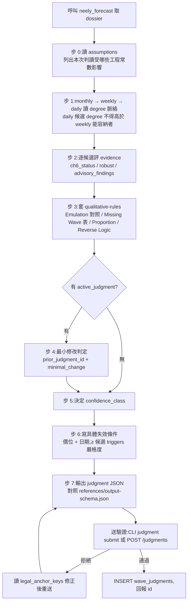

# neely-judgment

## 何時使用

- user 要求「判讀 <stock_id> 波浪」「neely judgment」「這檔的波浪計數怎麼看」
- J2 diff 後 active 判讀變 `invalidated`/`absorbed`/`vanished`,需要重判
- **不要**用於:自由畫浪(判讀限定 dossier 候選集)、回測歷史判讀準確率(forward-only)

## 核心原則

1. **引擎交證據、你交決定**:候選集 = `neely_forecast` dossier 的 `candidates[].anchor_key`;集外計數一律不可發明
2. **`no_fit` 是合法輸出**:沒有候選成立就說沒有 + 缺什麼(累積 = 引擎缺口清單),嚴禁為避免 no_fit 硬選
3. **每個判讀決定都要 rule_refs**:引擎規則結果(evidence 區)+ `references/qualitative-rules.md` 的人工規則,禁用「感覺」
4. **最小修改**:有 `active_judgment` 時先做 intact/absorbed 脈絡判定,不得無理由整棵換(Localized Change 原則)
5. **失效條件必須具體**:價位/日期,且與候選 `invalidation_triggers` 一致或更嚴;省略 = 驗證拒絕

## 產生流程

| 步 | 動作 | 產物 |
|---|---|---|
| 0 | 讀 `assumptions`(E1):REVERSAL_ATR 等 8 常數如何影響本次候選 | `rationale.notes` 第一段 |
| 1 | monthly → weekly → daily degree 脈絡;daily 候選 degree 不得高於 weekly 能容納者;`cross_timeframe.notes` 有「資料窗不足」→ degree 脈絡不可用要註明 | `degree_read` |
| 2 | 逐 live-edge 候選:`ch6_status`(Confirmed > Pending > Deferred)/ `robust`(false 且 ambiguity 中有 robust 替代 → 降權;null = 未知非 false)/ `advisory_findings` 逐條評 | 候選評註 |
| 3 | 套 `references/qualitative-rules.md`:Emulation 7 型對照(候選是否為另一型的模仿)、Missing Wave 最少資料點表(引擎未實作,人工套)、Proportion(刻度誤讀?)、Reverse Logic 人類語意(多完美計數 → 市場在中段,剔除「即將完成」解讀後餘幾個) | `rationale.emulation_considered[]` |
| 4 | 有 `active_judgment`:最小修改判定(原錨定是否已成更大形態的第一段?)不得無理由整棵換 | `prior_judgment_id`, `minimal_change` |
| 5 | 決定:`single`(1 preferred,且其 robust ≠ false)/ `contested`(1 preferred + ≥1 alternate)/ `no_fit`(accepted=[] + `no_fit_reason` 寫缺什麼) | `accepted`, `confidence_class` |
| 6 | 失效條件:具體價位(含語意,如「W4 低點,跌破 Impulse 失效」)+ 時限 bar;與候選 `forward.invalidation_triggers` 一致或更嚴 | `invalidation` |
| 7 | 輸出 JSON(`references/output-schema.json`)→ `python src/main.py judgment submit --file j.json` 或 `POST /judgments` | judgment 落庫 |

## 禁止

- 發明 dossier 候選集外的計數(驗證會拒,但也不要先寫出來)
- 用「感覺」「盤感」替代 rule_refs
- 為避免 `no_fit` 硬選最不差的候選
- 把 `robust=false` 候選當 `single`(驗證會拒;`robust=null` 是未知,不在此限)
- 省略 `invalidation`(價位/日期至少一項)
- `as_of` 晚於 dossier `snapshot_ref.snapshot_date`(看了盤中 → 拒絕)

## references/

- `qualitative-rules.md` — 不可程式化規則判讀清單(步 3 的完整對照表)
- `dossier-reading.md` — dossier 欄位怎麼讀(robust=false / ch6=Deferred / ambiguity 的含意)
- `output-schema.json` — judgment JSON schema(與 wave_judgments 欄位一一對應)
