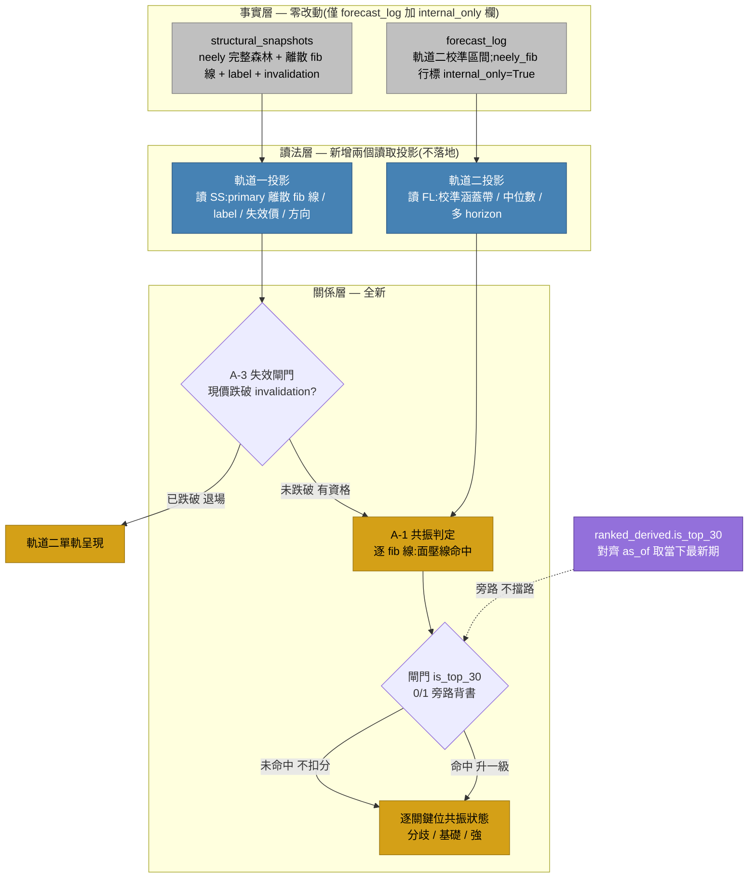
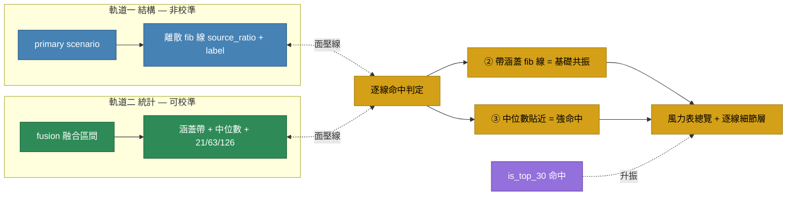

# 雙軌共振決策層 — 設計規格

> 範圍:StockHelper4me 個股「會怎麼走」的判斷呈現層。
> 原則:**事實不動,讀法可加,關係疊在讀法之上。** 三表 + forecast_log 為已收斂事實層,本設計僅新增讀法層與關係層,事實層改動僅 forecast_log 加一欄。

---

## 一、三層平面與流程



---

## 二、雙軌本質

兩條軌道是**不同認識論的解讀**,非兩個資料來源:

| | 軌道一 結構 | 軌道二 統計 |
|---|---|---|
| 來源 | neely_core scenario | kalman_cqr / log_channel /(未來)chip·macro·fundamental → fusion |
| 區間語意 | 離散 fib 線(**邊界**才是關鍵位)| 涵蓋帶(**內部**機率質量)|
| 可否宣稱機率 | 否(`calibrated=False`)| 是(校準、涵蓋率有效)|
| 條件性 | 條件式,黏失效價,跌破即作廢 | 無條件估計 |

> 共振的價值正在於兩種**不同種類的主張**同向,資訊量大於同軌內同類主張一致。
> 軌道二現況「名義多源、實質單源(kalman 主導,其餘 price-based 誤差相關)」;**非價格源(chip/macro/fundamental)全進才算真多源**,屆時獨立性才完全兌現。MVP 共振照上,規格標註此限。
> cross_stock 為**正交選股軸**(回答「看哪幾檔」),非第三條預測軌,僅作旁路背書。

---

## 三、共振判定流程(逐關鍵位)



**判定框架 = 面壓線**(非面疊面):軌道二的涵蓋面去壓軌道一的離散 fib 線。FibZone 為「單一 fib 比例 ± 容差」窄帶,線位取 `source_ratio` 對應價(實作上取 FibZone `low/high` 中點)。

**三級共振(逐 fib 線,非整體開關):**

| 級 | 條件 |
|---|---|
| 分歧 | 軌道二帶未涵蓋該 fib 線 → 兩軌該線各自呈現,不合成 |
| 基礎共振 | ② 軌道二涵蓋帶包含該 fib 線 |
| 強共振 | 基礎共振 + ③ 軌道二中位數貼近該線 + 閘門 is_top_30 命中 |

**防呆**:軌道二帶過寬(寬度/現價 > 閾值)時抑制判定,避免一次掃中多條的假共振。

---

## 四、閘門與失效(兩個閘門,角色不同)

**A-3 失效閘門(前置、軌道一資格)**:現價跌破 primary scenario 的 `invalidation_triggers` → 軌道一退場,直接走軌道二單軌,不顯示共振。失效價**不參與**共振計算,只當資格開關。

**cross_stock 閘門(旁路、升振)**:`is_top_30` 布林(0/1)。**並聯不擋路**(全檔照跑雙軌)、**命中升振、未命中不扣分**、**只在基礎共振已成立時疊加、不仲裁分歧**。其誤差與雙軌幾乎不相關(看橫斷面排名,非本檔價格),是含金量最高的獨立確認票。
時效:對齊預測 as_of,取 `date <= as_of` 之當下最新期(`ranked_derived` PK 含 date,天然留歷史,無 lookahead)。

---

## 五、時間維度(不失真方案)

時間**不做軸對齊**(波級時間本質不精確,換算成天數=假精確)。改用**反向標註**:借軌道二的精確時間,描述軌道一的價格命中。

| 方案 | 內容 | 狀態 |
|---|---|---|
| C-7 做法三 | 共振判定純比價格,時間不進判定 | 採用 |
| T1 | 命中時標軌道二 horizon(「該線預估 N 天內涵蓋」)| 採用 |
| T2 | 逐 fib 線 × 多 horizon(21/63/126)命中剖面 | 採用(幾乎免費,資料已在)|
| T3 | 軌道一只用 fib 觸及「順序」(不用時長)| **擱置** — neely_core 未輸出觸及順序,補它須動 Rust 事實層 |

---

## 六、neely 失真處理(補法 A)

forecast_log 的 `neely_fib` 行為「一行一外包絡」,壓掉了離散 fib 線 / label / 失效價 / 次要 scenario。**處理:不靠那行。**
- 軌道一上畫面/共振的一切,一律讀 `structural_snapshots`(完整未壓縮)。現況 `neely_wave` / `overlays` / `key_levels` 已讀原件,無失真上畫面。
- forecast_log `neely_fib` 行降級為 internal-only 對齊影子(audit / 軌道二對比錨點),**禁止上畫面與 MCP 輸出**。

---

## 七、事實層改動(唯一一處)

| 對象 | 改動 |
|---|---|
| `forecast_log` | 加 `internal_only BOOLEAN DEFAULT FALSE`;emit `neely_fib` 時標 `True`;所有對外查詢(UI/MCP/共振)過濾 `internal_only = FALSE`(B-4 機制丙)|

> 三表、Rust cores、Silver/Bronze 全程零改動。讀法層為新增讀取投影(不落地),關係層為全新模組。

### 7.1 受影響的 forecast_log 查詢點(B-4 機制丙落點)

下列查詢都套 `WHERE internal_only = FALSE` 過濾(內部對齊 audit 走獨立 helper):

| 模組 | 函式 | 用途 |
|---|---|---|
| `forecast._db` | `fetch_unresolved` | settlement 結算未到期 |
| `forecast._db` | `fetch_resolved` | scorer 算 pinball / coverage |
| `forecast.fusion` | `eligible_cores` + 各 mean_pinball | 校準 core 名單篩選 |
| `forecast.calibration` | `_fetch_raw_forecast` / `_fetch_calibration_set` | CQR 校準輸入 |
| `forecast.fusion` | `_fetch_eligible_forecasts` | fusion 拿 per-core 區間 |
| `fusion.dual_track.track2` | 自有 helper | 軌道二讀取(本層唯一新增 query)|

### 7.2 emit 端

`forecast.neely_emitter.emit_neely_fib` 寫入時帶 `internal_only=True`。其他 emitter(baseline / log_channel / kalman_* / chip_forecast_core / macro_forecast_core / fundamental_forecast_core / manual / fusion)維持 `internal_only=False`(預設)。

---

## 八、模組落地對應

```
src/fusion/dual_track/
├── __init__.py         — 公開 API:resonance()
├── track1.py           — 軌道一讀法(structural_snapshots → 離散 fib 線清單)
├── track2.py           — 軌道二讀法(forecast_log filtered → 涵蓋帶 + 多 horizon)
├── resonance.py        — 關係層:A-3 閘門 + A-1 三級判定 + cross_stock 升振 + T1/T2
└── _shared.py          — 共用 dataclass(FibLine / Track2Band / ResonanceFinding)
```

MCP 工具:`mcp_server.tools.data.dual_track_resonance(stock_id, date)` thin wrapper。

---

## 九、視覺(待判定邏輯落地後細化)

- **風力表**:總覽層摘要(整體 conviction + 方向),**不可為唯一視覺**(會重蹈壓縮失訊)。
- **逐 fib 線細節層**:每條線各自標 分歧/基礎/強,為真相層。
- **配色**:共振 = 兩軌交集,用琥珀系(沿用 PALETTE `neely_fib_zone`);基礎=琥珀,強=琥珀加亮/邊框,分歧=兩軌各自原色不合成。
- 狀態:**暫掛**,待 A-1/C-7/C-8 判定輸出定死後再細化(視覺為判定結果的呈現)。

---

## 十、未決 / 前置追蹤

| 項 | 狀態 |
|---|---|
| Phase 8 排程是否逐日回填 ranked_derived | 待實務確認(表結構支援,排程問題非設計)|
| A-1 帶寬防呆閾值、③ 貼近容差 | 待 backtest 校準 |
| T3(fib 觸及順序) | 需 neely_core 新增輸出,未來 PR |
| 視覺細化(C-9) | 暫掛至判定邏輯落地 |

---

## 十一、實作預設值(MVP)

對齊 §十「待 backtest 校準」標記,首版用以下預設:

| 參數 | 預設值 | 理由 |
|---|---|---|
| Track 2 涵蓋判定 confidence | `0.80` | 對齊 fusion / kalman_cqr 主要校準點(M8 verify 用) |
| Track 2 涵蓋判定 horizon | `63`(中期)| 對齊 neely Minute degree 中位映射 |
| 帶寬上限(`band_width_ratio` 防呆)| `0.30`(寬/現價)| 寬於 30% 視為過寬,抑制共振 |
| 中位數貼近容差(③)| `0.02`(中位 vs fib 價 / 現價)| 2% 內視為貼近 |
| cross_stock 來源表 | `magic_formula_ranked_derived` | 首版唯一 builder;後續 monthly_screen / quarterly_screen 接入 |

T2 多 horizon 剖面同時呈現 21/63/126;主判定走 63。

---

## 修訂歷史

- **v1.0**(2026-05-25)立稿(user spec verbatim + §7.1 / §8 / §11 實作對應補強)。
