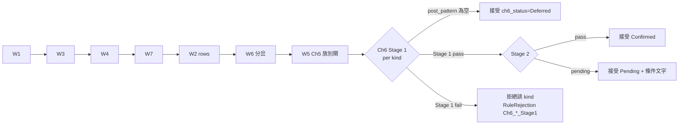

# neely_core 1.2.0 — Ch6 確認閘接回 ladder + Running 判準修正

> 兩項 serving-forest 語意修正合併一次 DELETE + neely_only 重跑。建議落位 `m3Spec/`;拍版前不動 Rust。

**上位文件**:`m3Spec/neely_compaction_v2.md` r5(§3.3 D2、§4、§7、§9.2)、`m3Spec/neely_rules.md` §Ch6(1763-1797 行)
**基線**:neely_core 1.1.1(2026-08-28 收案,facts 84,370)

## 背景

- spec §3.3 D2 要求 Stage 6 Post-Constructive 收編為「W6 之後、接受之前」聚合門檻;切換 PR `c652d34` 刪掉 `lib.rs` 的 `scenarios.retain(post_validate(..).pattern_complete)` 後未接進 `try_ladder`。`post_validator/`(815 行)現為零呼叫死碼,1.1.1 forest 全數未經市場確認。
- `flat_classifier::is_running_correction` 用 `b > a && c < a` 當 proxy;Running 定義是 c 未退回 a 起點 ⇔ **B > A + C**(changelog「Q1 收案」附帶發現,production 16 筆偽 Running 持 ±3 評級)。

## 目標 / 非目標

| 目標 | 非目標 |
|---|---|
| Ch6 Stage 1 成為視窗接受硬閘;Stage 2 / live-edge 保留為狀態不拒絕 | 漸進收攏(settlement)— 另案,本案只產它需要的 `ch6_status` 訊號 |
| `RuleId::Ch6_*` 開始 emit(passed / rejections),beam 鍵 2 反映 Ch6 | Ch9 / Ch12 advisory 升硬閘 |
| Running 判準改 B > A + C,Level-0 / Level-N 同源 | Running 的時間條件(rules Rule 2a/4/5 的 m(-1) ≥ 161.8% 脈絡)— 屬 Pre-Constructive,不進 classifier |
| 版本 1.1.1 → **1.2.0**,全市場重生 + gate | wire contract 破壞性改動(只允許 additive) |

## 架構:Ch6 在階梯中的位置



## 介面契約

```rust
// post_validator/mod.rs — 端點泛化(鏡射 G2.2 W5 作法):不再吃 &Scenario
pub struct WaveView<'a> {
    pub pattern_type: &'a NeelyPatternType,
    pub initial_direction: MonowaveDirection,
    pub waves: &'a [ClassifiedMonowave],   // synth_window 產物(3/5 段;Triangle 5 段)
}
pub enum Ch6Status { Confirmed, Pending, Deferred }
pub struct Ch6Report {
    pub status: Ch6Status,
    pub stage1_pass: Option<bool>,          // None = Deferred
    pub pending_conditions: Vec<String>,
    pub rule_id: RuleId,                    // Ch6_Impulse_Stage1 / Ch6_Correction_*_Stage1 / Ch6_Triangle_*_Stage1
}
pub fn post_validate_window(view: &WaveView, post_pattern: &[ClassifiedMonowave]) -> Ch6Report;

// round_engine.rs — try_ladder 新增 post-window 輸入
fn try_ladder(window: &[Rc<CompactionNode>], classified: &[ClassifiedMonowave],
              counters: &mut LadderCounters) -> LadderOutcome;
// post_pattern = classified 中 start_bar > window.last().end_bar 的葉序列(全域,非 tiling 後繼節點)

// output.rs — Scenario additive 欄(ts-rs 重生)
pub ch6_status: Ch6Status,                  // 1.1.1 舊 snapshot 讀取端缺欄 → 視為 Deferred
```

| 判定 | 動作 | 記錄 |
|---|---|---|
| `post_pattern.is_empty()`(live edge) | 接受 | `ch6_status = Deferred`;不入 passed |
| Stage 1 pass | 續 Stage 2 | `passed_rules += Ch6_*_Stage1` |
| Stage 1 fail | **該 kind 拒絕**;同視窗其他 kind 各自跑 Ch6 | `counters.ch6_rejected_kinds += 1`;`RuleRejection{rule_id: Ch6_*_Stage1, gap: 超時 bars / 未破線}` 入 `w5_rejection_records`(同上限 64) |
| Stage 2 pass | 接受 | `Confirmed` |
| Stage 2 pending | 接受 | `Pending` + `pending_conditions` |
| Stage 2 `Fail` 變體 | 維持現狀不啟用(rules 1771-1775 只寫「應」回測) | — |

## Running 判準

```rust
// classifier/flat_classifier.rs
pub fn is_running_correction(a: f64, b: f64, c: f64) -> bool {
    a > 0.0 && b > a + c   // c 終點未回到 a 起點;蘊含 b > a
}
```

| (a, b, c) | 1.1.1 | 1.2.0 | 說明 |
|---|---|---|---|
| (100, 120, 80) | true | **false** | c 已跌破 a 起點 20 → Flat Irregular*(現有 test 需翻轉) |
| (100, 125, 20) | false | **true** | 原判準 c<a 不成立而漏判 |
| (100, 85, 50) | false | false | b 未超 a |

`classify_3wave` / `classify_3wave_mags`(W2/W6)同一函式,Level-N 自動同源。

## 關鍵決策

| 決策 | 取捨 | Rationale |
|---|---|---|
| Ch6 post_pattern 取全域葉序列,不取 tiling 後繼節點 | 後繼節點(同級語意)/ 葉(最細解析度) | Stage 1 的「≤ wave-5 時間內破 2-4 線」需要 bar 級路徑;葉與 Level-0 舊路徑同源;canonical key 含 `end_bar` → memo 位置相依成立,不需改 key |
| Stage 1 拒絕、Stage 2 不拒絕 | 全硬閘 / 全 advisory | rules 1769 Stage 1 是否定性判準(超時 = Terminal 或 wave-4 未完);Stage 2 是回測「應」達區間,證據弱 |
| live edge 不拒絕 | 拒絕未確認 / 保留 | 拒絕 = 尾端永遠空 forest;`Deferred` 正是 settlement S1 判準 2 的訊號來源 |
| `ch6_status` 走結構化欄,不塞 advisory 字串 | 欄位 / 字串 | Q6 教訓:下游不得 parse 字串 |
| Ch9 Exception 容差不適用 Ch6 | 一致套用 / 排除 | Ch9 只豁免建構規則(Ch5);Ch6 為確認規則,rules 無豁免條款 |
| 兩修正合併重跑 | 分批 / 合併 | 都改 serving forest;全市場 wall 時間單位為小時,分批 = 雙倍 gate 成本 |

## 驗收條件

單元(`cargo test --workspace` 全綠,基線 660):
- [ ] 給定 5-窗 Impulse、post 葉在 ≤ W5 duration 內破 2-4 線,當 try_ladder,則接受且 `passed_rules ∋ Ch6_Impulse_Stage1`
- [ ] 給定同視窗、破線耗時 > W5 duration,當 try_ladder,則 Impulse kind 拒絕、`w5_rejection_records` 含 `Ch6_Impulse_Stage1`;同視窗 Terminal(Diagonal)kind 不受 Impulse 判定牽連
- [ ] 給定 post 葉為空,當 try_ladder,則接受、`ch6_status = Deferred`、`passed_rules` 不含 Ch6
- [ ] 給定同一視窗被兩條 tiling 分支共用,當 round,則 Ch6 只評估一次(memo 命中,counters 不重計)
- [ ] `is_running_correction` 三組向量如上表;`flat_classifier.rs:198/204/210` 既有 test 對齊
- [ ] `frontend/src/contracts/` 重生 diff 僅 +`ch6_status`;`verify_mcp_toolkit_v4_29.py` PASS

全市場 gate(§9.2 全項 + 新增):
- [ ] inv / w1 = 0;overflow = 0;凍結側 p99 ≤ 100;Terminal `:5` 樣本存在
- [ ] `sample_level1_impulse.py` R7 / Overlap 全過
- [ ] 新增 `scripts/verify_running_correction.py`(鏡射 sample_level1 反查法):全體 `RunningCorrection` scenario 以 wave_tree children 端點算 (a,b,c),**b > a + c 100% 成立**,不一致 = exit 1
- [ ] Ch6 分布入 gate 報告:per-kind Stage 1 拒絕數、Deferred 比例、forest p50/p95/p99 vs 1.1.1(26/53/68)— 預期下降,上升即紅燈
- [ ] `structural_snapshots` 最新 daily row `source_version = '1.2.0'` 覆蓋率 = 100%;facts_new 記錄

## 重跑 runbook(本機 PowerShell)

```powershell
git pull
cd rust_compute; cargo test --workspace; cargo build --release -p tw_cores; cd ..
# 1 清舊敘述(勿用 Set-Content -Encoding UTF8 寫 .sql:PS 5.1 帶 BOM,PG 報 syntax error)
psql $env:DATABASE_URL -c "DELETE FROM facts WHERE source_core = 'neely_core';"
# 2 單核重生(1.1.1 實測 wall ~2 min / 6573 ok)
.\rust_compute\target\release\tw_cores.exe run-all --write --workflow workflows/neely_only.toml
# 3 stats 維護 + gate + 抽驗
python scripts/run_sql_file.py scripts/maintain_facts_stats.sql
python scripts/verify_compaction_v2_gate.py
python scripts/sample_level1_impulse.py --show 20
python scripts/verify_running_correction.py
python scripts/verify_mcp_toolkit_v4_29.py
# 4 版本覆蓋
psql $env:DATABASE_URL -c "SELECT source_version, count(*) FROM structural_snapshots WHERE core_name='neely_core' AND timeframe='daily' GROUP BY 1;"
```

## 邊界 / 例外

- Triangle Expanding:非確認邏輯(完全回測 e-wave 不可發生)→ 只產 Pending,不拒絕
- Combination / RunningCorrection:現行 post_validator 恆 `pattern_complete = true` → 映為 Pending,不拒絕;Ch8 advisory 續掛 pending_conditions
- 合成葉(bridging leaf)出現在 post_pattern 時視同一般葉(true_range 已含)
- 舊 snapshot(1.1.1 及以前)缺 `ch6_status` → serving 端預設 Deferred,不回填

## 待議

1. Deferred 視窗的 W5 `rules_passed_count` 是否加權降序(live edge 節點 beam 排序公平性)— 建議先觀測 Deferred 比例再定
2. `is_running_correction` 是否同步要求 b ≥ 1.0×a 之外的 Neely 幅度條件(rules 1050-1057 x-wave 場景)— 留 Pre-Constructive
3. 本案 `ch6_status` 與 settlement S1 判準 2 的量化銜接(另案)
