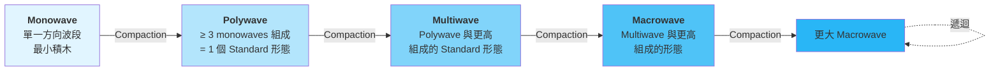
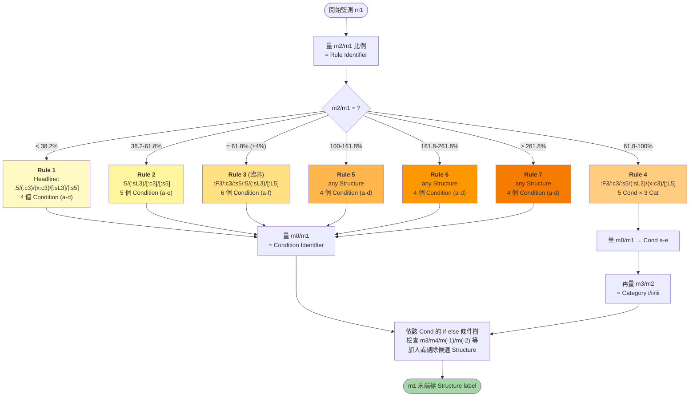
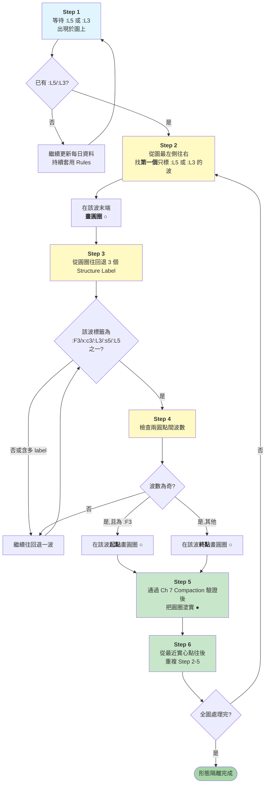
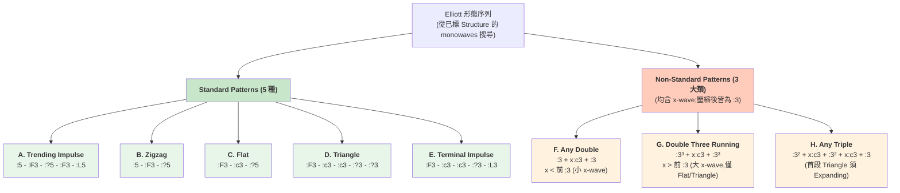
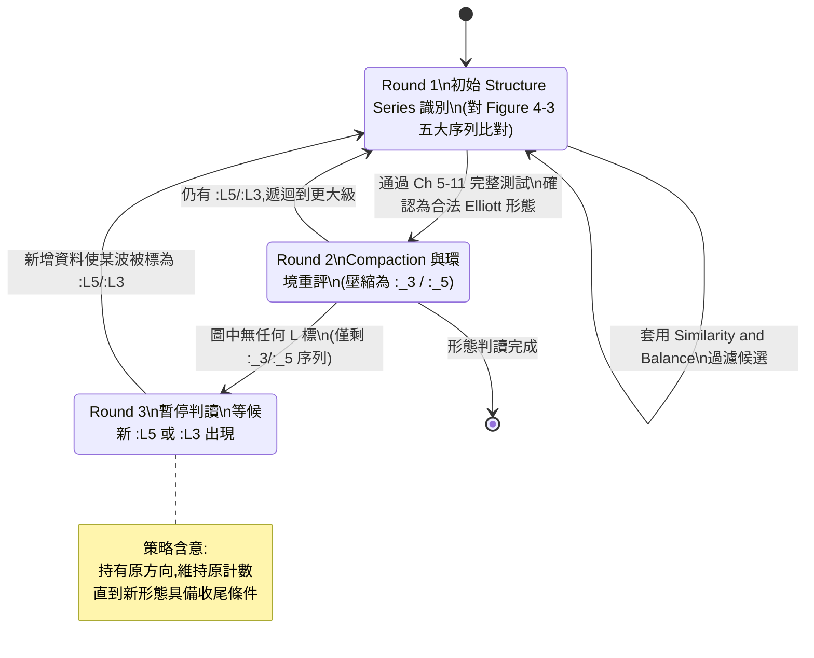
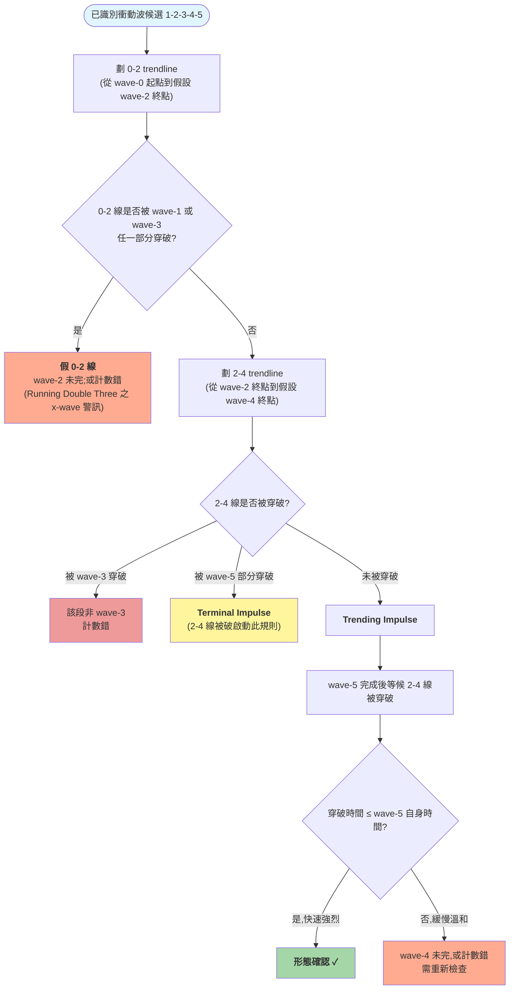
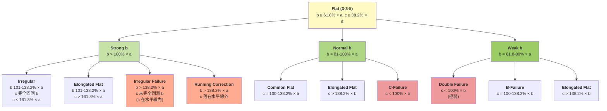
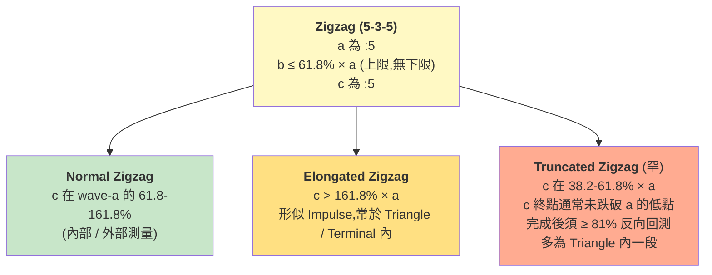
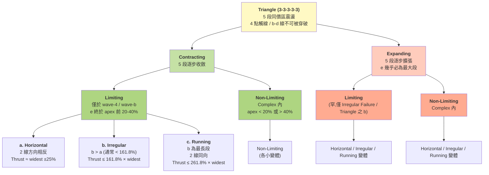
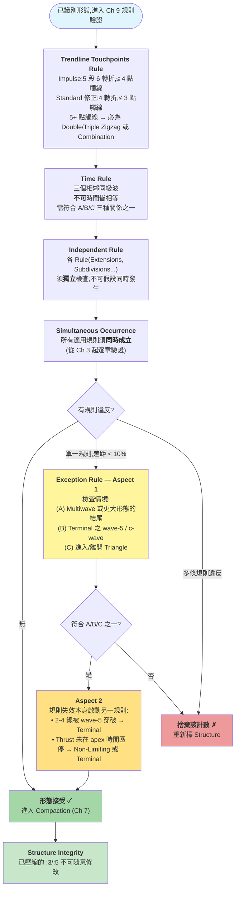

# Mastering Elliott Wave — Glenn Neely (1990, Version 2.0) 濃縮筆記

> **Neely Core 規則層定位(r5 採用)**:本筆記為 `tw_stock_mcp` v2.0 架構下 **Neely Core 的規則層文件**(`neely_rules.md`),與架構層 `neely_core_architecture.md`(r5)構成「規則 / 工程」分離的雙層設計。本筆記不含工程決策,僅保留與原書 Ch1-Ch12 同構的規則內容。Pipeline 設計、Output 結構、護欄機制等工程議題請參考 architecture.md。

> 本書是 Glenn Neely 將 R.N. Elliott 原理論「科學化、客觀化」的成果,涵蓋從監測單一單波 (monowave) 到組裝多年級複雜形態的完整流程。本筆記保留全部核心規則、定義、辨識準則與 Fibonacci 比率,並標明哪些屬於 Neely 對 Elliott 原作的擴展 (Neely Extensions)。

> **版本紀錄**
> - v1.0:初版濃縮
> - v1.1(對齊原書二次校對):修正 Retracement Rules Condition 結構、Power Ratings Irregular 評級、Limiting Triangle 20–40% 歸屬、Strong B-wave 條件分支、Non-Standard Patterns 公式註腳
> - v1.2(遺漏盤點補完):
>   - **Ch 3 大幅擴充**:新增 `:s5` / `:sL3` / `:sL5` 三個 Neely 特殊 Structure Labels 完整定義;補上 Pre-Constructive Rules of Logic 全部七條 Rules × 各自 Conditions × Rule 4 Categories 的 Structure 候選對照表(共 5 個總表);補上 Pattern Isolation Procedures 完整六步驟;補上 Special Circumstances(壓縮形態超出自身起點時強制為 :3)
>   - **Ch 11 大幅擴充**:完整補上 Trending Impulse / Terminal Impulse 各 wave 1-5 在 1st/3rd/5th Extended 與 Non-Extended 各情境下的精確規則(含 1-5 Trendline、5th Wave Failure 細節、與 Expanding Running Triangle 的辨識差異);完整補上 Flat 全部 8 個變體(B-Failure / C-Failure / Common / Double Failure / Elongated / Irregular / Irregular Failure / Running)的 wave-a/b/c 精確規則 + 各自出現位置清單;補上 Zigzag wave-a/b/c 進階限制;補上 Triangle 各變體(Contracting Limiting 三型 / Contracting Non-Limiting / Expanding)的 wave-a/b/c/d/e 完整規則,含 Non-Limiting Triangle 六個出現位置清單
>   - **Ch 8 擴充**:補上 X-wave 內部結構限制表(允許/禁止的 Standard 形態);補上 Table B(大 X-wave 組合)全部 6 種 Non-Standard 變體,以及 Running Double Three Combination 的辨識欺騙性
>   - **Ch 6 擴充**:補上 Expanding Triangle 的「非確認」邏輯詳細(兩種失敗模式 + 兩種成立條件)
>   - **Ch 2 擴充**:補上 24 小時市場處理細節(Neely 親測的多種拼接方式比較)與 Cash Index 開盤前 10–15 分鐘失真原理
> - v1.3(深層細化補完 — 對應原書 p.3-34 ~ p.3-60、Ch 4 Three Rounds 教學、Ch 5 圖示文字化):
>   - **Ch 3 深層 if-else 條件樹完整展開**:每個 Rule × Condition(× Category for Rule 4)的所有具體 if-then 細化分支(全書 200+ 個分支)逐條列出。每條規則以「IF [量化條件組] THEN [Structure label 操作]」格式表達,涵蓋 m3/m4/m5/m(-1)/m(-2)/m(-3) 的長度、時間、垂直性、價區共享、回測速度、突破連線等所有相關量度。實作判讀引擎可直接依此節編碼決策樹
>   - **Ch 3 額外規則補完**:Exception Rule(60% 視為符合 61.8% 的 4% 容差);時間計算的「plus one time unit」(嚴格計時)規則;Compacted pattern 的特殊處理;Zigzag DETOUR Test(避免誤把 Impulse 末三段當成 Zigzag);Position Indicator 句構基礎(雙加號 / 單破折號 區隔)
>   - **Ch 4 Three Rounds 範例補完**:Round 1(初始 Series 識別)、Round 2(Compaction 後重評)、Round 3(等候新 `:L5/:L3` 出現)的完整教學流程
>   - **Ch 5 Realistic Representations — Impulsions 完整圖示文字化**:六個 Extension 場景(1st Ext Trending / 1st Ext Terminal / 3rd Ext Trending / 3rd Ext Terminal / 5th Ext Trending / 5th Ext Terminal)在「典型外觀」與「5th-Wave Failure」變體下的形狀、輪廓走向、各 wave 內部結構、與通道行為的精確文字描述
>   - **Ch 5 Realistic Representations — Corrections 完整圖示文字化**:Flats(Common / B-Failure / C-Failure / Elongated / Irregular / Running)在「向上修正」與「向下修正」兩方向下的 wave-a/b/c 結構、結束高低位、breaks-out 行為;Zigzag(Normal / Elongated / Truncated)在 a/b/c 三段比例下的典型形狀;Contracting Limiting Triangle / Contracting Non-Limiting Triangle / Expanding Limiting / Expanding Non-Limiting 在「Simple」與「Complex Combination」兩種 e-wave 變體下的外觀
>   - **Ch 11 加入 Realistic Representations 對應索引**:在 Ch 11 開頭加入引用區塊,將該章每個 wave-by-wave 規則對應到 Ch 5 已文字化的形態外觀(Impulsions 六場景、Flats 6 變體、Zigzag 3 變體、Triangle 8~16 變體),使「規則表」與「形態長相」可雙向對照。原書 Ch 11 大量依賴圖示的部分本筆記改以「Ch 5 圖示文字化 + Ch 11 wave 規則表」雙層結構替代
> - v1.4(全面對照原書 PDF 的精度修正):
>   - **Retracement Rules — Rule 2 Condition 範圍修正**(嚴重錯誤):原誤寫成與 Rule 4 相同範圍。正確為 2a: m0 < 38.2%、2b: 38.2-61.8%、2c: 61.8-100%、2d: 100-161.8%(含)、2e: m0 > 161.8%
>   - **Pre-Constructive Logic — Rule 5 Headline 修正**:原誤寫 `{:F3/:c3/:5/:L5/(:L3)}`,正確為 `{any Structure possible;條件不符時改用 Position Indicator Sequences}`(原書 p.3-53;m2 ≥ 100% 完全回測 m1 後,m1 結構未確定,所有 Structure 都有可能)
>   - **Ch 11 Trending Impulse 1st Wave Extended — wave-2 規則修正**(嚴重錯誤):原誤寫 ≤ 61.8% × wave-1(該數值為 Terminal 1st Ext 之規則),Trending 1st Ext 正確為 **≤ 38.2% × wave-1**;同時補上 wave-2 不可為 Zigzag/Running 與 wave-5 必為三段中最短的剛性條件
>   - **Ch 11 5th Wave Failure — 補完出現條件三選一**:原僅有「wave-5 < wave-4」定義,補完 A. 本 Impulse 為更大 5th wave;B. 本 Impulse 為更大 Correction 之 c-wave;C. 極罕之更大 3rd wave 出現 5th wave Failure(需 Multiwave 級重要頂底)
>   - **Ch 11 Trending Impulse 5th Wave Extended 規則精確化**:去除錯誤的「wave-3 ≤ 161.8% × wave-1」剛性限制(原書 Ch 12 規則僅為典型 Fibonacci 比例);精確化 wave-5 範圍為「≥ 1-3 全長 added to wave-4 end、≤ 261.8% × 1-3 全長 added to wave-3 end」
>   - **Ch 5 Flat — Irregular 與 Irregular Failure 條件精確化**:Irregular 範圍從 b: 101-123.6% × a 擴展為 b: 101-138.2% × a,並細分 101-123.6%(c 易完全回測 b)與 123.6-138.2%(c 仍可能完全回測 b)兩子型;Irregular Failure 明確 **b > 138.2% × a**
>   - **Ch 5 Zigzag — Elongated 判別補完時間順序**:補入「在 wave-c 終點被超越之前必須先回測 ≥ 61.8% × wave-c」的時間限定,以正確區分 Elongated Zigzag 與 Impulse 1-2-3 段
>   - **Ch 5 5th Wave Extension Trending — 通道描述精確化**:原「反方向擴張」改為「0-2 線(連 wave-0 與 wave-2 低點)與 1-3 線(連 wave-1 與 wave-3 高點)向外發散擴張」,避免歧義
>   - **Ch 8 Table B(大 X-wave 場景)修正**:原誤列 6 個變體(含 Zigzag 開頭 / 收尾、Triangle 開頭),正確為 4 個變體 — 大 X-wave 場景中所有構成段**只能是 Flat (3-3-5) 或 Contracting Triangle**,任何位置都不可出現 Zigzag(5-3-5)
>   - **Ch 11 Terminal 1st Wave Extended 規則描述修正**:原寫「規則同 Trending 1st Ext」並列 wave-2 ≤ 61.8%,但 Trending 1st Ext 已修正為 ≤ 38.2%(兩者不同);改為各自獨立描述,明確 Terminal 1st Ext 之 wave-2 ≤ 61.8% × wave-1(寬於 Trending 之 38.2%)
>   - **Ch 8 X-wave 內部結構限制段落標題修正**:原誤標「Table B 適用於小 X-wave 場景」,實際 Table B 為大 X-wave 場景(已正確列於同章下方);此段應對應小 X-wave 場景(即 Table A 的 X-wave 內部結構)
>   - **總計修正 11 處**,其中 3 處屬嚴重錯誤(Rule 2 範圍、Rule 5 Headline、Trending 1st Ext wave-2 規則),其餘為精度提升;第三輪驗證新增 2 處修正
> - v1.6(全書 169 頁完整逐章節對齊 — 修正 v1.5 誤判 + 補完 Rule 4 重大遺漏):
>   - **Rule 3 Condition 3a 規則 3 回補**:v1.5 將原書真實存在的「m3 100-161.8% m1 → `:F3/:5/:s5`」誤判為錯誤添加並移除;v1.6 對照 PDF p.3-40 確認該規則確實存在於 Condition 3a(不同於 Condition 3b 的 `:5/:s5/:c3`),已回補。同時加註「**共通 [:L5] add 條件**(套用於 Condition 3a 每一條子規則):若 m1 為 m(-1)/m1/m(-3) 中最長 AND m2 在 ≤ m1 時間內突破 m(-2)/m0 連線 → add `[:L5]`」並將 Cond 3a 序 3「m3 < m1 + m3 快回測」結論從 `:5` 補正為 `:5/:F3`
>   - **Rule 3 Condition 3b 移除錯誤的 [:L5] 規則**:v1.5 序 7「上述任一 AND m1 最長 AND m2 突破連線 → add `[:L5]`」並非原書 p.3-41 內容(該 [:L5] trendline 突破規則僅在 Condition 3a 出現,Condition 3b 各子規則並無此條件)
>   - **Rule 3 Condition 3d 序 2 重大修正**(嚴重錯誤):原書 p.3-42 Cond 3d 序 2 為 `:c3/:sL3/:5`(C-Failure 中 / Contracting Triangle 倒二 / Zigzag 首)+ 四組複雜的「m(-1) 與 m0、m1 與 m(-3)~m0」比較條件 + m(-1) 61.8-161.8% m0 → drop `:c3` + m4 < 61.8% m0 → `:5` 加括號;v1.5 錯置為 Cond 3e 的「`:5/:c3` with missing x-wave in m0」內容
>   - **Rule 4 Condition 4d Cat i & ii 完整重寫**(嚴重錯誤):原 md 6 條規則中,僅序 1 與序 4 屬於 Cond 4d 內容,序 2、3、5、6 全部誤抄自 Cond 4e。v1.6 對照 PDF p.3-48 重建為 5 條(序 1 含 m0 中心 4-marker 互相依存標記、序 2「m2 慢被回測 → `:F3/:c3`」、序 3「m3 同/快回測 → 只 `:F3`」、序 4「m3 61.8-100% 回測 → 只 `:F3`」、序 5「m3 < 61.8% → `:F3` + Terminal / Complex Double Flat 場景」)
>   - **Rule 4 Condition 4d Cat iii 修正並補完**:原 md 序 1 內容實為 Cond 4e Cat iii;v1.6 重建 Cond 4d Cat iii 為 2 條(序 1「m3 ≤ m1 時間 + m2 快回測 → m0 中心 missing x-wave + `add :c3` (非 x:c3) + 條件式 `add :F3`」、序 2「m3 > m1 時間 → `add :F3/:c3` + 突破標記」)
>   - **Rule 4 Condition 4e Cat i & ii 補完 5 條規則**:原 md 只有 2 條;v1.6 對照 PDF p.3-49 補上 5 條(序 3「m2 快回測 + m(-1) ≤ 61.8% m0 場景 + dot 標記」、序 4「m2 慢回測 + 類似條件」、序 5「m2 慢回測 → 只 `:F3`」、序 6「m0 polywave/missing wave → x:c3」、序 7「m(-1) ≤ 61.8% m0 → x:c3」)
>   - **Rule 4 Condition 4e Cat iii 補上整個段落**:原 md 缺整節;v1.6 補上「m3 ≤ m1 時間 + m2 快回測 → missing x-wave + `add x:c3` + 條件 `add :F3` (Elongated Flat 首段)」
>   - **Rule 4 Condition 4b Cat i 補上 fallback rule**:原 md 4 條規則,缺第 5 條「上述四條皆不適用」的 fallback(`add :F3/:c3/:sL3/:s5` + 完整 [:L5] / drop 條件鏈)
>   - **修正總計 8 處**,其中 4 處屬嚴重錯誤(Cond 3a 誤刪、Cond 3d 序 2 兩處誤抄、Cond 4d 整節誤抄、Cond 4e 整節遺漏)。Rule 4 整體精度顯著提升
> - v1.7(深度補完 — 對應原書 p.3-50 ~ p.3-60 Rule 5/6/7 完整展開、Ch 5 Corrections 構造規則、Ch 11 Double Failure 完整化):
>   - **Rule 5 Condition 5a 完整展開**:原 md 僅 2 條(A 分支)+ 13 條(B 分支,含部分誤增規則);v1.7 對照 PDF p.3-50 ~ p.3-52 重寫為 (A) 12 條 + (B) 5 條:(A) 涵蓋 missing x/b-wave 場景、3rd Ext Terminal、Running Correction、Contracting Triangle、severe C-Failure Flat、Complex x-wave、Irregular Failure Flat、fallback :F3、以及「首 3 monowaves 回測 > 61.8% m1 → :F3/:5」分支;(B) 涵蓋 m2 被 m3 回測 < / ≥ 61.8%、Trending Impulse、Terminal Impulse(含 x-wave 場景)、Complex Correction 的 Flat wave-a 場景
>   - **Rule 5 Condition 5b 雙分支重寫**:原 md 9 條合併條件;v1.7 對照 PDF p.3-54 ~ p.3-55 拆為 (A) m3 > 3 monowaves 的 2 條 + (B) m3 ≤ 3 monowaves 的 7 條,包含 Expanding Triangle、Contracting Triangle 完成、Elongated Flat、Trending Impulse、5th Ext Terminal 等完整場景
>   - **Rule 5 Condition 5c 補完**:原 md 7 條(含部分誤合);v1.7 對照 PDF p.3-55 重整為 4 條:預設 :F3、Contracting Triangle/severe C-Failure、Terminal 完成於 m2、罕見 Expanding Triangle
>   - **Rule 5 Condition 5d 清理**:原 md 10 條(rules 4-10 為錯置內容);v1.7 對照 PDF p.3-56 簡化為 3 條原書真實規則
>   - **Rule 6 Condition 6c 補完**:原 md 4 條;v1.7 對照 PDF p.3-58 擴充為 5 條,補上 Irregular Failure Flat、Expanding Terminal Impulse、Running Correction 場景
>   - **Rule 6 Condition 6d 大幅補完**:原 md 2 條;v1.7 對照 PDF p.3-59 ~ p.3-60 擴充為 8 條:Zigzag/Impulse 場景、Double Zigzag x-wave、Complex Flat-起 x-wave、Complex Double Zigzag(含 missing x in m0)、Running Correction(同時終結多個 Degree)、Contracting Triangle / Irregular Flat、Complex Corrective x-wave、Terminal 完成於 m2
>   - **Ch 5 Conditional Construction Rules for Corrections 新增整節**:原 md 僅有 Impulse 的 Construction Rules;v1.7 對照 PDF p.5-34 ~ p.5-36 新增「Corrections 的 Alternation Price/Time 應用差異」、「0-B trendline + 平行線 c-wave 不可觸碰規則」、「B-D trendline」、Flat/Zigzag 內部 Fibonacci 關係
>   - **Ch 11 Double Failure 完整化**:原 md 3 條極簡描述;v1.7 對照 PDF p.11-12 補完 a-wave 構成限制(Double Combination 含 Horizontal Triangle / Triple Combination)、c-wave 價目標(61.8% × a 或自 a 起點反減 61.8%)、Emulation 假象警示、與 Horizontal Triangle 的區辨關鍵(c-wave 為 Impulse vs Corrective)、4 個出現位置
>   - **總計補完 ~80 條深層規則**,Pre-Constructive Logic 從 v1.6 的「結構正確但 Rule 5/6/7 深度不足」提升為「Rule 1-7 全展開,每 Condition 平均 5-12 條子規則,對應 PDF 每段落」
> - v1.8(Mermaid 視覺化補強 — 對「邏輯/分類/流程」型內容加入流程圖):
>   - **新增 10 個 Mermaid 圖示**,鎖定 v1.7 評估中「Mermaid 預估改進:高 / 中」的區塊;所有圖示可在 Claude Desktop / Obsidian / GitHub / VS Code 等多數 markdown 渲染器直接顯示:
>     - 🟢 高:**Pre-Constructive Logic Rule 1-7 Router**(Ch 3)— flowchart TD 呈現 m2/m1 → Rule(7 條)→ Condition(a-f)→ Category(i/ii/iii) 的決策路由,並標示各 Rule 的 Headline 候選 Structure list
>     - 🟢 高:**Three Rounds 狀態圖**(Ch 4)— stateDiagram-v2 呈現 Round 1 → Round 2(可遞迴回 Round 1)→ Round 3(暫停等候新 L 標)的轉移邏輯,含 Round 3 策略含意註記
>     - 🟢 高:**Pattern Isolation 6 步驟流程**(Ch 3)— flowchart TD 完整呈現從等待 :L5/:L3 → 畫圓圈 → 退 3 個 label 檢查 → 波數奇偶判斷 → Compaction 確認塗實 → 遞迴下一段的完整步驟
>     - 🟡 中:**Pattern Hierarchy 階層圖**(Ch 2)— flowchart LR 以漸進深藍色階呈現 Monowave → Polywave → Multiwave → Macrowave 的 Compaction 遞迴關係
>     - 🟡 中:**Figure 4-3 Standard/Non-Standard Series 分類**(Ch 4)— graph TD 完整呈現 5 Standard(Trending Impulse / Zigzag / Flat / Triangle / Terminal Impulse)+ 3 Non-Standard(Any Double / Double Three Running / Any Triple)及其 Structure Series
>     - 🟡 中:**Flat 8 變體分類樹**(Ch 5)— graph TD Strong b / Normal b / Weak b 三大分支 × 各 c/a 比例 → Irregular / Elongated / Irregular Failure / Running / Common / C-Failure / Double Failure / B-Failure
>     - 🟡 中:**Zigzag 3 變體分類**(Ch 5)— graph TD Normal / Elongated / Truncated 及其各自 c/a 比例條件
>     - 🟡 中:**Triangle 變體完整分類**(Ch 5)— graph TB Contracting/Expanding × Limiting/Non-Limiting × Horizontal/Irregular/Running 三層樹,含 thrust 限制
>     - 🟡 中:**Channeling 檢測流程**(Ch 5)— flowchart TD 0-2 線 → 2-4 線檢查 → Terminal/Trending 分支 → wave-5 後 2-4 線穿破速度判斷
>     - 🟡 中:**Ch 9 規則應用順序**(Ch 9)— flowchart TD Trendline Touchpoints → Time Rule → Independent Rule → Simultaneous Occurrence → Exception Rule(Aspect 1 / Aspect 2)→ Structure Integrity 的完整審查流程
>   - **未加 Mermaid 的區塊**(Mermaid 無法表達 2D 幾何):Ch 5 Realistic Representations 六大 Impulse + Flat 6 變體 + Triangle 8-16 變體外觀;Ch 11 wave-by-wave 形態圖示;Channeling 實際通道幾何圖。這些保留 v1.3 的「文字化形態描述」,日後若需精度可投資手寫 SVG
>   - 約 +220 行 markdown(全部為 Mermaid 程式碼,中文 label 以雙引號包裹,bold 用 `<b>` HTML 標籤以避免 markdown 衝突);上色採用配對的同色系(Standard 形態綠色系、Non-Standard/警告紅橙色系、Rule 1-7 漸進黃→橙)
> - **v1.9(r5 規則層分離 — Gap 5 原書二次核實後續補強)**:
>   - **Neely Core 定位段新增**:檔頭加入 r5 雙層架構說明,本筆記為規則層文件(`neely_rules.md`),與架構層 `neely_core_architecture.md` 分離
>   - **Ch3 Pre-Constructive Logic 主段加 Meta-Rule 提取(E 項)**:在「Rule × Condition × Structure 候選對照表」開頭新增「**跨 Rule [:L5] add 共通條件**」段落,提取 5th-of-5th Extension 識別模式為單一共通函數 `is_fifth_of_fifth_extension(context)`,被 Rule 3 / Rule 4b / Rule 7 部分 Cond 引用;Gap 5 核實確認 Rule 4b 並未漏列 [:L5] add(各 Cat 子規則已分散包含),但跨 Rule meta-rule 的提取明示有助於實作層重構
>   - **Ch5 Zigzag 最小要求修正錯誤規則(r5 額外稽核)**:刪除 v1.8 規格的兩條錯誤條目 ——
>     - 「**wave-b 至少回測 1% × wave-a**」屬精華版自加,原書無下限;改為「wave-b ≤ 61.8% × wave-a(上限,無下限)」
>     - 「**wave-c 必須超越 wave-a 終點(哪怕一點點)**」屬 Prechter 派傳統規則,**不是 Neely 派規則**;Neely 體系明確規定 Truncated Zigzag 的 c **不必**超越 a 終點(原書 Ch5 Truncated Zigzag 段),刪除此錯誤規則。Mermaid 圖同步修正
>   - **Ch11 Wave-c (Zigzag) 在 Triangle 內例外完整改寫(F 項)**:
>     - 補入「下限亦可破」事實(原書原文:`c-wave can exceed those limits` —「limits」指 61.8%-161.8% 區間,可破任一方向)
>     - 補入「c 超出區間 = Triangle 形成的強烈訊號」副作用語義(原書原文:`one of the better indications of Triangular formation`)
>   - **Gap 5 核實狀態**:6 項核實項中
>     - C(Triangle wave-e 例外)、D(Wave-2 不可為 Running)精華版已對齊原書,無需修改
>     - A(Strong b-wave 三層分流)精華版 v1.4 已修正(Ch5 行 1416-1432 完整),無需再補
>     - E(PCRL [:L5] add)、F(Zigzag c 在 Triangle 內)經 v1.9 補強
>     - B(Exception Rule「a small distance」)原書無量化依據,精華版本身無誤標,r4 spec 的 10% 數字屬詮釋,改由 architecture.md §4.4 處理
>   - **總計修正 4 處 + 新增 1 段 meta-rule 提取**;規則層自此與原書全面對齊,P0 開發可直接以本筆記為實作規範

> - v1.5(第四輪深度挖掘 — 對照 Ch 3 深層 if-else 條件樹原書逐條 — *舊版本記錄,部分判斷被 v1.6 糾正*):
>   - **Rule 1 Condition 1c 補上漏掉的 missing x-wave 規則**:原書 p.3-35 包含「m0 與 m2 價時相等(或 61.8%)AND m3 < 161.8% m1 AND m3 在自身時間內完全回測」→ m1 可能是 Complex Correction 含 x-wave,在 m0 終點加 `x:c3?`,圈 m1 中心、左 `:s5`、右 `x:c3?`;若 m(-2) > m(-1) → x-wave 不在 m0 終點;若 m3 < 61.8% m1 → x-wave 大機率在 m1 中心
>   - **Rule 2 Condition 2a 補上漏掉的 3 條規則**:原書 p.3-37 包含三條 Condition 2a 已有對應的細化規則(原 md 只列了 3 條,實際應為 6 條),分別補上:(a) Running Correction with `[:c3]`(m0/m2 61.8% 相關 + m(-1) ≥ 161.8% m1);(b) Complex Correction with x-wave(m0/m2 時間接近 + m3 < 161.8% m1);(c) Terminal Impulse wave-3 with `:c3`(m(-1) > m0 AND m0 < m1 + m3 完全回測)
>   - **Rule 3 Condition 3a 移除錯誤條目**:原 md 序 3 寫「m3 在 100-161.8% × m1 → `:F3/:5/:s5`」是錯誤添加 — 原書 Condition 3a(m0 < 38.2%)**沒有**這個 m3 範圍的規則;同時 Structure label `:F3/:5/:s5` 也錯了(此規則屬於 Condition 3b,且應為 `:5/:s5/:c3`);已移除錯誤條目並重新整理為原書真實存在的 5 條規則
>   - **Rule 3 Condition 3d 序 2 修正**:Structure list 從 `:5/:c3/(:sL3)` 修正為 `:5/:c3`(原書 p.3-42),並加入 m0 中心的 missing x-wave 標記(`x:c3?` 右側、`:s5?` 左側);細化條件改為 m2 慢被回測 → drop `:c3`、m3 > 161.8% m1 → drop `:5`(去除原本誤合自序 1 的條件)
>   - **第四輪驗證新增 4 處修正**;Rule 3 深層條件樹精度顯著提升;Rule 4/5/6/7 深層條件樹經抽樣驗證主要分支正確

---

> **驗證涵蓋範圍**(對照 PDF 原書 169 頁全文):
> - ✓ Retracement Rules 1-7 範圍與所有 Conditions
> - ✓ Pre-Constructive Logic 對照表(Rule 1-7 Headline)
> - ✓ Figure 4-3 Standard / Non-Standard Pattern Series(5 + 3 條)
> - ✓ Three Rounds 範例 Chrono 編號
> - ✓ Flat 全部 8 變體分類條件
> - ✓ Zigzag 3 變體 + Truncated 81% 反向回測
> - ✓ Triangle Contracting / Expanding × Limiting / Non-Limiting 全變體
> - ✓ Triangle thrust 距離(75-125% / 至 261.8% Running)
> - ✓ Limiting / Non-Limiting apex 時間定位(20-40% / < 20% / > 40%)
> - ✓ Ch 6 Stage 1 / Stage 2 Pattern Confirmation
> - ✓ Ch 8 Standard / Non-Standard Polywave 識別條件
> - ✓ Ch 8 Table A 小 x-wave 8 變體
> - ✓ Ch 8 Table B 大 x-wave 4 變體(已修正)
> - ✓ Ch 9 Trendline Touchpoints / Time Rule
> - ✓ Ch 10 Power Ratings 全表(+3 ~ -3)與回測限制
> - ✓ Ch 11 Trending / Terminal Impulse × 各 wave × Extended / Non-Extended
> - ✓ Ch 12 Advanced Fibonacci 1st / 3rd / 5th Ext Internal 關係
> - ✓ Ch 12 Channeling(0-2、2-4、0-B trendlines、Triangular / Terminal 早期警訊)

---

## 第 1 章 — Elementary Discussions (基礎觀念)

### 何謂 Elliott Wave Theory
- 市場價格走勢是「群眾心理」的圖形化呈現。
- Elliott 把看似隨機的價格起伏,組織成可辨識、可預測的形態,源自心理進展的自然規律。
- 自然、非週期性現象:時間可有彈性,但結構優先於時間。
- 預測信心最高的時刻,是形態剛完成之後。

### 為什麼學 Elliott
1. 可適應新科技與基本面變化。
2. 涵蓋全部可能的市場行為。
3. 動態演進、非機械重複。
- 多領域適用(股市、期貨、不動產等只要資料一致即可)。
- 訊號頻率低但可靠;停損明確客觀。

### 為什麼具爭議性
- 複雜;一般人難投入時間。
- 公眾思維與 Elliott 思維相反(逆向操作)。
- 掌握需要多年實戰;規則繁多;頻繁出現「不確定期」。
- 在轉折點之前,常有多套合理計數並存(這是 Reverse Logic Rule 的伏筆)。

### Neely 體系的獨特性
- 完整視角(任何時間框架皆可分析,並可同時看多框架)。
- 群眾心理的數學量化。
- 詳細分類與大幅簡化(所有尺度的發展邏輯相同 → 分形)。
- 「同一套規則」也適用於最複雜的市場。

### 學習方法
- 從短期開始、一次只追蹤一個市場直到熟記基本規則。
- 從局部小波建立,而非先看長期圖。
- 嚴守、開放、不帶預設立場(計數是結果,不是起點)。

---

## 第 2 章 — General Concepts (一般概念)

### 什麼是「波」(Wave)
- **Monowave(單波)**:從一個價格方向變化點到下一個價格方向變化點之間的走勢。是所有形態的最小積木。
- 完全垂直的走勢不可能(必須消耗時間單位)。
- 完整定義(到第 7 章補完):**Wave = 兩個同級 Progress Label 之間的距離**。

### 為什麼會有波 — 為什麼重要
- 買賣力量短暫一邊倒就產生方向變化,啟動新波。
- 對交易者:可掌握經濟條件、心理氛圍與形態三層。

### 波的分類

| Class | 結構 | 性質 |
|---|---|---|
| Impulsion(衝動波,Trending / Terminal) | 一般 5 段 | 與大趨勢同向 |
| Correction(修正波) | 一般 3 段 | 逆大趨勢,常為盤整 |

### Degree(級數)
- 相對概念,**不可用絕對的「天/週/月/美元」定義**。
- 由 Sub-Micro / Micro / Sub-Minuette / Minuette / Minute / Minor / Intermediate / Primary / Cycle / Supercycle / Grand Supercycle 共 11 級(Sub-Micro 與 Micro 為 Neely 新增)。

### 標籤系統
- **Structure Label(結構標)**:`:5` 為衝動性,`:3` 為修正性。冒號是為了區隔後續的 Progress 標。
- **Progress Label(進度標)**:在標準形態內的位置 — 衝動波用 1,2,3,4,5;修正波用 a,b,c,d,e,x。
- Progress 標應在後段才使用,過早使用反而混淆。

### 該用什麼資料
- **嚴禁只用收盤價**:收盤剛好落在轉折點的機率近乎零。
- **不建議用線形 bar chart**:同時含高低兩值,無法做唯一比較。
- **不建議用期貨**:有「衰減偏差」並易被人為操縱。
- **首選:現貨/現金 (Cash) 資料**:單日一筆價(或 (高+低)/2、或依次序記錄當日高低)。

### 24 小時市場處理(Gold、Silver、外匯等繞地球連續交易)
Neely 親自實驗過多種拼接方式(包含按地區時區分段、平均世界各市場、把 24 小時等分為地區時段串接):結論是這些方式都會破壞 Elliott 形態的可讀性。**正確做法**:
- 為每個 24 小時市場**只追蹤一個國家的交易時段**(通常選你所在國的時段),用該時段的開盤/收盤/最高/最低作為單日資料
- 用你所在國的收盤時刻作為每個 24 小時週期的結束點;該國市場收盤的那一刻,下一個交易日就開始
- 期貨市場使用「夜盤停損」(overnight stops)防止 gap 風險;若無法做到 → 只做日內(不留倉)或中長線(可承受 gap)
- 此處理方式即使在「環繞地球反應(技術面與基本面在不同國家輪流體現)」的市場上仍最可靠

### Cash Index 即時計算的開盤前失真
針對即時計算的現金股票指數(S&P、NYSE、Dow Industrials cash index 等),指數計算公式需要全部成分股的即時報價。**但**:
- 每日開盤前 10–15 分鐘內,並非全部成分股都已開盤
- 系統會用「前一日收盤價」代入尚未開盤的股票
- 結果:Index 開盤的「真實高低」會出現**水平延伸的假象**(因為一部分成分股仍是昨收價)
- **實務處理**:每日捨棄開盤前 10–15 分鐘的 Cash Index 資料,從全部成分股都開盤後才開始記錄當日真實高低
- 對比期貨 Index(S&P 500 Futures 等):期貨開盤即可即時反映,沒有此問題,但有衰減偏差問題

### 繪圖
- 每個資料點放在所代表時間單位的中央,直線連接。
- 每個市場至少準備日/週/月三張圖。

### 複雜度層級(由 Monowave 往上)
- Monowave → Polywave → Multiwave → Macrowave → 更大仍稱 Macrowave。

---

## 第 3 章 — Preliminary Analysis (初步分析)

> 此章是整本書最長、最關鍵的一章。Neely 把監測單波的所有客觀程序集中於此。

### 圖表準備與資料管理
1. 先畫一年的月線高低圖,選位於價格區間中央(避開歷史轉折)的月份。
2. 再畫該月起始的日線圖,約 60 個資料點、橫向約 8 吋。
3. 從重要高/低點再放大一倍細節,做為主分析圖。

### Monowave 的辨識
- 從最早最低點開始,逐點向前;一旦下一點低於上一點,前一段即為一個 monowave,於該段端點打點。
- 重複至最後形成所有點。
- 必要時依 Rule of Neutrality 修正端點。

### Rule of Proportion(比例規則)— **Neely Extension**
- 圖表比例必須適應「目前正在形成的形態」。
- **Directional Action(方向性)**:平均而言創造市場價值增/減的一連串 monowaves。第一個 monowave 通常被回測不超過 61.8%;當某個沿中央振盪線方向的 monowave 被回測超過 100% 時,Directional 通常結束。
- **Non-Directional Action(非方向性,價值停滯)**:第一個 monowave 一定被回測超過 61.8%。當價格超出整個非方向期區間 161.8% 時通常結束。
- 繪圖目標:
  - Directional:資料以約 45° 角從一角到對角(允許 ±25% 偏差)。
  - Non-Directional:橫向期約佔完美正方形的 50%。

### Rule of Neutrality(中性規則)— **Neely Extension**
- 處理「近水平」價格動作的端點歸屬。
- 用 45° 線判斷是否啟用:價走在 45° 線的「水平側」就考慮使用此規則。
- **Aspect 1**:水平段分隔兩個相反方向波 — 將前一波端點移至水平段最右端。若 mO 回測小於 61.8% 後又突破前 mO 端點,**不可**套用 Aspect 1。
- **Aspect 2**:水平段分隔兩個同向波 — 可忽略水平段(視為單一較大 monowave),或將其當作中段拆成三段 monowaves。當水平段超過一個時間單位且分隔同向波時,**必須**用 Aspect 2 切成三段。
- 應用判斷:若 Aspect-2 能改善 Alternation 的 Intricacy、調整 Complexity Level、或消除 Missing Wave,則採用;若反而破壞,則忽略。
- 終點超出該 monowave 38.2% 時,不要套用 Aspect-1。

### Chronology(編號)
- 由最左邊的 monowave 開始,依序編 Chrono-1, Chrono-2,...。
- 若使用 Aspect-2 切割,水平段亦先編號再決定是否切。

### Rules of Observation(觀察規則 — m0/m1/m2)
- 將「目前正在分析的 monowave」心理上設為 **m1**,之前為 **m0** (+前者 m(-1), m(-2)),之後為 **m2** (+m3, m4)。
- m2 確認完成的條件:由 m1 高/低開始往前,直到第一次反向突破 m1 的低/高;m2 的端點在這兩點之間找出最大反向處。
- m0 同理由 m1 端點往回推。
- m1 必定為 monowave(或壓縮後的 Elliott 形態);m0/m2 可由 1、3、5...個 monowaves 組成(稱為 monowave group, mgO / mg2)。

### Retracement Rules(回測比例規則)
量測 m2 對 m1 的回測百分比,得 **Rule Identifier**;再量 m0 對 m1,得 **Condition Identifier**;Rule 4 還要量 m3 對 m2 得 **Category Identifier**。

| 條件(m2/m1) | Rule |
|---|---|
| < 38.2% | **Rule 1** |
| 38.2%–61.8%(不含 61.8%) | **Rule 2** |
| 恰 61.8% | **Rule 3**(最難判斷,介於修正/衝動的臨界) |
| 61.8%–100%(不含) | **Rule 4**(再用 m3/m2 分 Category i/ii/iii) |
| 100%–161.8%(不含) | **Rule 5** |
| 161.8%–261.8%(含) | **Rule 6** |
| > 261.8% | **Rule 7** |

**每條 Rule 的 Condition 數量與 breakpoints 各不相同**(由 m0/m1 比決定),不可一概而論:

**Rule 1**(m2 < 38.2%)— 4 個 Condition:
- a: m0 < 61.8%
- b: 61.8% ≤ m0 < 100%
- c: 100% ≤ m0 ≤ 161.8%(含)
- d: m0 > 161.8%

**Rule 2**(38.2% ≤ m2 < 61.8%)— 5 個 Condition:
- a: m0 < 38.2%
- b: 38.2% ≤ m0 < 61.8%
- c: 61.8% ≤ m0 < 100%
- d: 100% ≤ m0 ≤ 161.8%(含)
- e: m0 > 161.8%

**Rule 3**(m2 = 61.8% 整數)— 6 個 Condition(臨界,差異最細):
- a: m0 < 38.2%
- b: 38.2% ≤ m0 < 61.8%
- c: 61.8% ≤ m0 < 100%
- d: 100% ≤ m0 < 161.8%
- e: 161.8% ≤ m0 ≤ 261.8%(含)
- f: m0 > 261.8%

**Rule 4**(61.8% < m2 < 100%)— 5 個 Condition(a~e),且**額外**用 m3/m2 比決定 Category:
- Condition: a: m0 < 38.2%;b: 38.2% ≤ m0 < 100%;c: 100% ≤ m0 < 161.8%;d: 161.8% ≤ m0 ≤ 261.8%;e: m0 > 261.8%
- Category: i: 100% ≤ m3 < 161.8%;ii: 161.8% ≤ m3 ≤ 261.8%;iii: m3 > 261.8%

**Rule 5**(100% ≤ m2 < 161.8%)— 4 個 Condition(a~d):
- a: m0 < 100%
- b: 100% ≤ m0 < 161.8%
- c: 161.8% ≤ m0 ≤ 261.8%
- d: m0 > 261.8%

**Rule 6**(161.8% ≤ m2 ≤ 261.8%)— 4 個 Condition(a~d),breakpoints 同 Rule 5。

**Rule 7**(m2 > 261.8%)— 4 個 Condition(a~d),breakpoints 同 Rule 5。

### Structure Labels 完整清單(含 Neely 特殊標籤)

**Position Indicators**:
- `F` = First(結構序列首段)
- `L` = Last(結構序列末段)
- `c` = center(序列中段)
- `?` = 位置未定(可為 F/L/c)
- `x` = X-wave(分隔兩個 Standard 修正的修正波)
- `b` = Flat 中的 b-wave 標記(`b:c3`)

**Structure Labels — 基礎**:
- `:5` = 衝動五段(暗示 5 細分)
- `:3` = 修正三段(暗示 3 細分)

**Structure Labels — 含 Position 組合**:
- `:F3`, `:c3`, `:L3`, `:?3` = 修正序列的首/中/末/未定段
- `:F5`, `:L5`, `:?5` = 衝動序列的首/末/未定段
- `x:c3`, `b:c3` = X-wave 的 c3 / Flat 中的 b-wave c3

**Structure Labels — Neely 特殊標籤**:
- **`:s5`(special five)**:可替代 `:L5` 但**不需反轉確認**。常出現於複雜 Elliott 形態。在特定條件下亦可作為 Trending Impulse with 5th Failure 或 5th Extension 的 wave-3。前置序列必須為 `5-F3-:s5` 或 `F3-c3-:s5`。
- **`:sL3`(special last three)**:Triangle 倒數第二段(:s5 之前)的特殊修正標,出現於 Limiting/Non-Limiting Contracting Triangle 的 wave-d 位置,或 Terminal Impulse 中特定 wave 位置。
- **`:sL5`(special last five)**:罕用,功能類似 `:L5` 的弱形式。

**封裝慣例**:
- 不加封裝 = 主要選項(機率最高)
- `()` 圓括 = 可能但機率較低
- `[]` 方括 = 罕見,僅在極特定條件成立時才考量

### Pre-Constructive Rules of Logic — 完整 Rule × Condition × Structure 候選對照表

> **跨 Rule Meta-Rule 提取(r5/Gap 5 E 項補強)**:[:L5] add 「5th-of-5th Extension」識別模式
>
> 在 Pre-Constructive Logic 中,「**m1 may be the 5th wave of a 5th Extension pattern**」是一個跨 Rule 的識別模式。凡符合下列**共通條件組**的子規則,**必然**附 `add [:L5]` 動作:
>
> | 共通條件組(任一達成觸發 [:L5] add) |
> |---|
> | m1 為 m(-1) / m1 / m(-3) 中**最長** AND m2 在 ≤ m1 時間內突破 **m(-2) / m0 連線**(2-4 trendline 早突破) |
> | m1 端點被 m2 突破(m1 為 5th Ext 的 5th wave 場景) |
> | m1 為某「m1 為 5th Ext 第 5 波」場景(各 Cond 內具體判定) |
>
> **此 meta-rule 在以下位置重複出現**(分散在各 Rule/Condition 的子規則中):
>
> | Rule × Condition | [:L5] add 是否存在 | 備註 |
> |---|---|---|
> | Rule 3 全部 Condition(3a-3f) | **✓ 多處**(共通條件僅在 Cond 3a 集中列出) | 詳見 Cond 3a 起頭的「共通 [:L5] add 條件」段 |
> | Rule 4a | ✗ | 無 |
> | **Rule 4b 全部 Cat(4b-i / 4b-ii / 4b-iii)** | **✓ 多處** | 分散在每條子規則,共 7+ 處 `add [:L5]` |
> | Rule 4c / 4d / 4e | ✗ | 無 |
> | Rule 5 | 不適用 | `:L5` 為主標籤(Headline 即含) |
> | Rule 6 | 個案 | 部分子規則有 `(:L3)/[:L5]` |
> | Rule 7 | ✓ 部分 Cond | 個別子規則出現 |
>
> **實作意涵**:`structure_labeler/decision_tree.rs` 編碼時,應將「5th-of-5th Extension 識別」抽出為**單一共通函數** `is_fifth_of_fifth_extension(context)`,於 Rule 3 / Rule 4b / Rule 7 對應子規則中呼叫。可避免在 ~200 分支 if-else 中重複編寫相同檢測邏輯,並使精華版「[:L5] add 在多處出現」的事實在程式碼中明示。
>
> 詳見 `architecture.md` §9.3 RuleId 與 Appendix A.3 跨 Rule 共通函數。

> 上圖為 Pre-Constructive Logic 的「router」總覽。下方表格列出每個 Rule × Condition 的 Structure 候選清單,深層 if-else 條件樹見後文。

說明:每個 Rule 的 Condition 都有一份 Structure 候選清單(headline list)。每個 Condition 內,再依 m3、m4、m5、m(-1)、m(-2)、m(-3) 等的長度、時間、價格區間關係,執行多層 if-else 細化,逐步**加入或剔除**候選。本對照表列出 headline candidate 與**最主要的細化分支結論**(每個分支對應一個 Elliott 形態判讀)。

#### Rule 1 — m2 < 38.2% × m1
**Headline**: `{:5/(:c3)/(x:c3)/[:sL3]/[:s5]}`

| Cond | m0 / m1 | 主要 Structure 結論 | 主要對應形態 |
|---|---|---|---|
| 1a | < 61.8% | `:5` 為主,加 `:s5` (Flat-x-wave)、`[:c3]` (Running Correction) | Trending Impulse wave 中段、Running Correction 的 b-wave / x-wave |
| 1b | 61.8 ≤ m0 < 100% | `:5` 為主,可能加 `:s5` (Flat with x:c3)、`:sL3` (Terminal 中段)、`:c3` (5th Ext Terminal) | 多場景並存 |
| 1c | 100% ≤ m0 ≤ 161.8% | `:5` 為主,可能加 `[:c3]` (Running C-Failure)、`[:sL3]` (Contracting Triangle 倒二) | Triangle 倒二段或 Running C-Failure 罕見 |
| 1d | m0 > 161.8% | 僅 `:5` | 純衝動,單一可能 |

#### Rule 2 — 38.2% ≤ m2 < 61.8% × m1
**Headline**: `{:5/(:sL3)/[:c3]/[:s5]}`

| Cond | m0 / m1 | 主要 Structure 結論 |
|---|---|---|
| 2a | < 38.2% | `:5`;加 `[:c3]`、`:s5` (Complex Correction with x-wave) |
| 2b | 38.2 ≤ m0 < 61.8% | `:5`;加 `[:c3]` (Running)、`:s5`、`x:c3?` (Complex with missing x in m0 / m2 / m1 center) |
| 2c | 61.8 ≤ m0 < 100% | `:5`;加 `:s5` (Flat in Running/Irregular Failure)、`:sL3` (Running Triangle 終結於 m2)、`:c3` (Terminal 含 m3 / Irregular Failure 含 m2) |
| 2d | 100% ≤ m0 ≤ 161.8% | `:5`;加 `:c3` (severe C-Failure Flat)、`(:sL3)` (Contracting Triangle 倒二) |
| 2e | m0 > 161.8% | `:5`;極少數加 `:c3` (Complex with missing x in middle of m0) |

#### Rule 3 — m2 ≈ 61.8% × m1(臨界,容許 ±4%)
**Headline**: `{:F3/:c3/:s5/:5/(:sL3)/[:L5]}`

| Cond | m0 / m1 | 主要 Structure 結論 | 主要對應形態 |
|---|---|---|---|
| 3a | < 38.2% | `:s5/:c3/:F3`(三種並存) | 5th Ext Impulse 中段(:s5)、Running Correction 中段(:c3)、Complex Correction 首段(:F3) |
| 3b | 38.2 ≤ m0 < 61.8% | `:c3/(:s5)` | Irregular Failure 中段、Zigzag 在 Complex 內;特殊條件加 `[:L5]` (5th Ext) |
| 3c | 61.8 ≤ m0 < 100% | `:c3/:sL3` | Irregular Failure / Non-Limiting Triangle |
| 3d | 100% ≤ m0 ≤ 161.8% | `:c3/:sL3/:5` | C-Failure 中心 / Triangle 倒二 / Zigzag 首段 |
| 3e | 161.8 ≤ m0 ≤ 261.8% | `:5/:c3/(:sL3)` | Zigzag 首段 / C-Failure with missing x / Triangle 倒二 |
| 3f | m0 > 261.8% | `:5/(:c3)`;加 missing x-wave 標記 | Zigzag 首段 / C-Failure with missing x |

#### Rule 4 — 61.8% < m2 < 100% × m1(最細,五 Condition × 三 Category)
**每個 Condition 還要看 m3/m2 分 Category**:
- Cat **i**: 100% ≤ m3 < 161.8% × m2
- Cat **ii**: 161.8% ≤ m3 ≤ 261.8% × m2
- Cat **iii**: m3 > 261.8% × m2

| Cond | m0 / m1 | Headline 候選集 |
|---|---|---|
| 4a | < 38.2% | `{:F3/:c3/:s5/[:sL3]}` |
| 4b | 38.2 ≤ m0 < 100% | `{:F3/:c3/:s5/(:sL3)/(x:c3)/[:L5]}` |
| 4c | 100% ≤ m0 < 161.8% | `{:c3/(:F3)/(x:c3)}` |
| 4d | 161.8% ≤ m0 ≤ 261.8% | `{:F3/(:c3)/(x:c3)}` |
| 4e | m0 > 261.8% | `{:F3/(x:c3)/[:c3]}` |

**Rule 4 共同邏輯重點**:
- `:F3` 出現於 Flat / Triangle 首段、Elongated Flat 首段、Complex Correction 首段(常以 m0 為 x-wave)
- `:s5` 出現於 5th Ext Impulse 中段、Zigzag 末段(in Complex)
- `:sL3` 出現於 Triangle 倒二段(Limiting 與 Non-Limiting)
- `:L5` 加入條件:m1 最長(對比 m(-1)、m(-3))且 m2 在 m1 時間內或更快突破 m(-2)/m0 連線 → 5th Extension pattern 完成於 m1
- `x:c3` 加入條件:m1 端點被 m2 突破

**Cat iii (m3 > 261.8% m2) 共同邏輯**:
- m(-1) > 261.8% m1 → m1 不可能是任何 Elliott 形態結尾,只能是 `:F3`
- m3 完全被回測 → 同上,只 `:F3`
- m3 retraced < 100% → 只 `:s5`(罕見)

#### Rule 5 — 100% ≤ m2 < 161.8% × m1
**Headline**: `{any Structure possible;條件不符時改用 Position Indicator Sequences}`

> 原書 p.3-53:m2 ≥ 100% 完全回測 m1 後,m1 結構未確定,所有 Structure 都有可能;以下細化分支為從深層條件樹中提煉的主要候選結論。

| Cond | m0 / m1 | 主要 Structure 結論 |
|---|---|---|
| 5a | < 100% | m2 含 >3 monowaves 且首三段 ≤ 61.8% m1 → `:5/:s5` (Complex with x);否則 `:L5` 為主(Trending Impulse 完成於 m1)。加 `:L3` 若 m0 與 m(-2) 共享 price range |
| 5b | 100% ≤ m0 < 161.8% | m0 接近 100% → `:c3` (Flat b-wave,前綴 b);接近 161.8% → `:F3` (Zigzag);Expanding Triangle 可能加 `(:c3)` 或 `(:F3)` |
| 5c | 161.8% ≤ m0 ≤ 261.8% | `:F3` 為主;加 `(:sL3)` (Terminal 完成於 m2)、`:L3` (Contracting Triangle)、`:L5` (Flat 完成)、`:c3` (Terminal 完成於 m4) |
| 5d | m0 > 261.8% | `:F3` 為主;`(:sL3)` (3rd Ext Terminal)、`:c3` (Terminal completing at m4)、`(:L3)` (Contracting Triangle)、`[:L5]` (severe C-Failure 罕見) |

#### Rule 6 — 161.8% ≤ m2 ≤ 261.8% × m1
**Headline**: `{any Structure possible; 條件不符時改用 Position Indicator Sequences}`

| Cond | m0 / m1 | 主要 Structure 結論 |
|---|---|---|
| 6a | < 100% | m2 含 >3 monowaves 且首三段 ≤ 61.8% m1 → `:5/:s5` (Complex with x);加 `:F3` 若 m1 被首三 monowaves 回測 ≥ 25%。否則 `:L5` 為主(Trending Impulse 完成);加 `(:L3)` (Terminal Impulse) |
| 6b | 100% ≤ m0 < 161.8% | m3 含 >3 monowaves 且首三段 ≤ 61.8% m2 → `:5/:s5`;否則 `:F3/:c3/:L3/:L5` 多選並存。Expanding Triangle 場景加 `(:c3)` |
| 6c | 161.8% ≤ m0 ≤ 261.8% | `:F3` 主要;加 `:L3/(:L5)` (Contracting Triangle / severe C-Failure);加 `:sL3` (Terminal 完成於 m2) |
| 6d | m0 > 261.8% | `:F3` 為主;`(:L3)/[:L5]` (Triangle / C-Failure);x-wave 在 m0 場景 |

#### Rule 7 — m2 > 261.8% × m1
**Headline**: `{any Structure possible}`

| Cond | m0 / m1 | 主要 Structure 結論 |
|---|---|---|
| 7a | < 100% | `:L5` 為主(Trending Impulse 完成於 m1,且後續強勁逆轉);Complex Correction 場景 `:5/:s5`;Terminal Impulse 場景加 `(:L3)` |
| 7b | 100% ≤ m0 < 161.8% | m3 含 >3 monowaves → `:F3/:c3/:L3/:L5`;Expanding Triangle 加 `:c3`;5th Ext Terminal 加 `:F3` |
| 7c | 161.8% ≤ m0 ≤ 261.8% | `:F3` 主要;`:sL3` (Expanding Terminal 完成於 m2);`:L5` (Running Correction 完成於 m1) |
| 7d | m0 > 261.8% | `:F3` 為主;`x:c3` (Double Zigzag x-wave 或 Complex 首為 Flat);多個 `:c3` 場景 |

### Pre-Constructive Logic 使用流程(逐 monowave)

1. 對每個 monowave m1,先量 m2/m1 → 決定 Rule(1–7)
2. 量 m0/m1 → 決定 Condition(該 Rule 下的 a–f)
3. 若是 Rule 4,還要量 m3/m2 → 決定 Category(i/ii/iii)
4. 取 headline candidate set
5. 依該 Condition(或 Category)內的 if-else 條件樹,逐條檢查 m3 完成時間/速度、m4 長度、m(-1)/m(-2)/m(-3) 比例、m0 與 m2 price range 共享、m2 是否突破 m(-2)/m0 連線 → 加入或剔除候選
6. 最終得到該 monowave 右端的「結構候選清單」

### Pre-Constructive Rules — 完整 if-else 條件樹細化(對應原書 p.3-34 ~ p.3-60)

> 本節是對前面 headline 對照表的逐 Condition 展開。每條規則採 **`IF [量化條件組] THEN [Structure label 操作]`** 格式。實作判讀引擎時可直接編碼為 decision tree。
>
> **共通名詞**:
> - `add :X` = 在 m1 的 Structure list 加入 `:X`
> - `drop :X` = 從 m1 的 Structure list 移除 `:X`
> - `m3 retraced` = m3 被 m4(或 m4~m6)回測的百分比/速度
> - `share price range` = m0 與 m2 至少部分價區重疊
> - `vertical` = 同價距下所耗時間較短(斜率較陡)
> - `2-4 breach line` = 跨 m(-2) 與 m0 兩端點的連線(預測 wave-5 的「2-4 線」)
> - `plus one time unit` = 計時時須加一格 standard time unit(嚴格時計規則)
> - 凡未指明測量基準者,**一律取價格**(時間需特別註明)
> - **Exception Rule**:單一未通過、且差距不大(< 10%)時,通常仍可套用該規則的結論(對應 Ch 9, p.9-7)

#### Rule 1 — m2 < 38.2% m1

**Headline**:`{:5/(:c3)/(x:c3)/[:sL3]/[:s5]}`

##### Condition 1a — m0 < 61.8% m1

| 序 | IF | THEN |
|---|---|---|
| 1 | m2 耗時 ≥ m1 OR m2 耗時 ≥ m3 | `add :5` |
| 2 | m(-1) 在 100–161.8% m0(含) AND m0 ≈ 61.8% m1 AND m4 不超出 m0 終點 | `add :s5`(可能為 Flat in Complex,m2 為 x-wave) |
| 3 | m0 含 > 3 monowaves AND m1 在 m0 同時間(或更短)內完全回測 m0 | 記:m0 可能是重要 Elliott 形態結束 |
| 4 | m0 ≈ m2(價/時相等或 61.8% 關係) AND m(-1) ≥ 161.8% m1 AND m3(或 m3~m5)在 ≤ m(-1) 時間內 ≥ m(-1) 價長 | `add [:c3]`(Running Correction 場景);若 m(-2) < m(-1) → x-wave 在 m0,m1 改為 x:c3 |
| 5 | m0 ≈ m2(同上) AND m(-1) < 161.8% m1 AND m(-1) > m0 AND m3~m5 ≥ 161.8% m1 | `add :c3`(Running Correction 完成更大 pattern);若 m(-2) > m(-1) 在 m(-1) 加 `:sL3` |
| 6 | m0 ≈ m2 AND m3 < 161.8% m1 AND m3 在自身時間內(或更短)被完全回測 | `add x:c3?` 於 m0 與 m2 終點(或 m1 中心);x-wave 三種可能位置 |
| 7 | m(-2) > m(-1) | drop「x-wave 在 m0」可能性 |
| 8 | m3 < 61.8% m1 | 大幅提高「x-wave 隱藏在 m1 中心」機率 |
| 9 | m(-1) > m0 AND m0 < m1 AND m1 不為 m(-1)/m1/m3 中最短 AND m3 在自身時間內被完全回測 | `add :c3`(Terminal wave-3 場景) |

##### Condition 1b — 61.8% ≤ m0 < 100% m1

| 序 | IF | THEN |
|---|---|---|
| 1 | (無前置條件) | `add :5` |
| 2 | m(-1) 在 100–161.8% m0(含) AND m4 不超出 m0 終點 | `add :s5`;m2 終點加 `x:c3?`(Flat with x-wave) |
| 3 | m0 含 > 3 monowaves AND m1(減一時間單位)在 m0 同時間(或更短)完全回測 m0 | 記:m0 可能是重要 Elliott 形態結束 |
| 4 | m2 部分價區與 m0 共享 AND m3 比 m1 更長更垂直(時間 ≤ m1) AND m(-1) > m1 | `add :sL3`(Triangle 倒二) |
| 5 | m2 部分價區與 m0 共享 AND m3 比 m1 更長更垂直(時間 ≤ m1) AND m(-1) < m1 AND m0 與 m2 在價或時上明顯不同 AND m4(或 m4~m6)在 ≤ 50% m1~m3 時間內回到 m1 起點 | `add :c3`(5th Ext Terminal 完成於 m3) |
| 6 | m3 < m1 AND m2 部分價區與 m0 共享 AND m(-1) > m0 且 m(-1) > m1 AND m1 不為 m(-1)/m1/m3 中最短 AND 自 m3 終點起,市場在 ≤ 50% m(-1)~m3 時間內回到 m1 起點 | `add :c3` |

##### Condition 1c — 100% ≤ m0 ≤ 161.8% m1

| 序 | IF | THEN |
|---|---|---|
| 1 | (無前置條件) | `add :5` |
| 2 | m0 ≈ m1(±10%) AND m0 與 m1 價時相等或 61.8% 關係 AND m3 比 m1 更長更垂直 AND m2 耗時 ≥ m0 或 m1 AND m2 ≈ 38.2% m1 AND m0 的 Structure 選項包含 `:F3` | `add [:c3]`(條件嚴格,須 m2 在重要 Fib 價位收結) |
| 3 | m0 與 m2 價時相等(或 61.8% 關係) AND m3 < 161.8% m1 AND m3(plus one time unit)在自身時間內(或更短)被完全回測 | m1 可能是 Complex Correction 含 x-wave;在 m0 終點加 `x:c3?`,並圈 m1 中心、左側 `:s5`、右側 `x:c3?`(missing x 場景);若 m(-2) > m(-1) → x-wave 不在 m0 終點;若 m3 < 61.8% m1 → x-wave 大機率在 m1 中心 |
| 4 | m3 比 m1 更長更垂直 AND (m3 完全被回測 OR m3 被回測 ≤ 61.8%) AND m2 ≈ 38.2% m1 AND m0 的 Structure 包含 `:c3` AND m(-3) > m(-2) AND m(-2) 或 m(-1) > m0 | `add (:sL3)`(Contracting Triangle 倒二) |

##### Condition 1d — m0 > 161.8% m1

| 序 | IF | THEN |
|---|---|---|
| 1 | 任何情境 | 僅 `:5`(唯一可能) |

---

#### Rule 2 — 38.2% ≤ m2 < 61.8% m1

**Headline**:`{:5/(:sL3)/[:c3]/[:s5]}`

##### Condition 2a — m0 < 38.2% m1

| 序 | IF | THEN |
|---|---|---|
| 1 | (無前置條件) | `add :5`;若 m4 不超出 m0 終點 → `add :s5`,m2 終點加 `x:c3?` |
| 2 | m0 含 > 3 monowaves AND m1 在 m0 同時間(或更短)完全回測 m0 | 記:m0 可能是重要 Elliott 形態結束 |
| 3 | 比較 m(-1)、m1、m3,若 m1 不為三者中最短 AND 三者最長者 ≈(或大於) 161.8% × 次長者 AND m3 被回測 ≥ 61.8% | 市場可能形成 Impulse with m1 為 wave-3(讀下段補充) |
| 4 | m0 ≈ m2(價 61.8%、時相等或 61.8%) AND m(-1) ≥ 161.8% m1 AND m3(及必要後續)在 ≤ m(-1) 時間內 ≥ m(-1) 價長 | `add [:c3]`(Running Correction)|
| 5 | m0 ≈ m2(時相等) AND m3 < 161.8% m1 AND m(-1) > m0 | x-wave 在三處之一(m0 / m2 / m1 中心);三處標 `x:c3?`(Complex Correction with x-wave 場景) |
| 6 | m(-1) > m0 AND m0 < m1 AND m1 不為 m(-1)/m1/m3 中最短 AND m3(plus one time unit)在自身時間內(或更短)被完全回測 | `add :c3`(Terminal Impulse 之 wave-3 完成於 m1) |

##### Condition 2b — 38.2% ≤ m0 < 61.8% m1

| 序 | IF | THEN |
|---|---|---|
| 1 | (無前置條件) | `add :5`;若 m4 不超出 m0 終點 → `add :s5`,m2 終點加 `x:c3?` |
| 2 | m0 含 > 3 monowaves AND m1 在 m0 同時間(或更短)完全回測 m0 | 記:m0 可能是重要 Elliott 形態結束 |
| 3 | m0 ≈ m2(價時相等或 61.8% 關係) AND m(-1) ≥ 161.8% m1 AND m3(及必要後續)在 ≤ m(-1) 時間內 ≥ m(-1) 價長 | `add [:c3]`(Running Correction);Ch 4 grouping 時優先試 Running |
| 4 | m0 ≈ m2 AND m3 < 161.8% m1 AND m3 在自身時間內被完全回測 | x-wave 在三處之一(m0 / m2 / m1 中心);三處標 `x:c3?` |
| 5 | m3 < 61.8% m1 | 提高「x-wave 隱藏在 m1 中心」機率 |
| 6 | m2 部分價區與 m0 共享 AND m0 與 m2 時間差 ≥ 61.8% AND m1 不為 m1/m3/m(-1) 中最短 AND 自 m3 終點,市場快速回到 m1 起點 | `add :c3`(Terminal wave-3 完成) |

##### Condition 2c — 61.8% ≤ m0 < 100% m1

| 序 | IF | THEN |
|---|---|---|
| 1 | (無前置條件) | `add :5`(必置);若 m4 不超出 m0 終點 → `add :s5`,m2 終點加 `x:c3?` |
| 2 | x-wave 在 m0 場景成立 | 需 m(-2) < m(-1) AND m(-4) > m(-3) |
| 3 | x-wave 在 m2 場景成立 | 需 m(-2) > m(-1) AND m1 ≥ 38.2% m(-1)(最好 ≥ 61.8%) |
| 4 | m(-1) > m0 AND m(-1) < 261.8% m1 AND m3 < m1 AND 自 m3 終點市場快速回到 m1 起點 | `add :c3`(Terminal 完成於 m3) |
| 5 | m0 含 > 3 monowaves AND m1 在 m0 同時間(或更短)完全回測 m0 | 記:m0 可能是重要 Elliott 形態結束 |
| 6 | m2 在自身時間內被完全回測 AND m3 比 m1 更長更垂直 AND m(-1) ≤ 161.8% m1 | `add :sL3`(Running Triangle 終結於 m2);m3 被 m4 回測快 → Limiting;m3 不被回測 OR m4 斜率 << m3 → Non-Limiting 或 Terminal 形成 |
| 7 | m3 與 m(-1) 同時 ≥ 161.8% m1 | `add :c3`(Irregular Failure 完成於 m2) |

##### Condition 2d — 100% ≤ m0 ≤ 161.8% m1

| 序 | IF | THEN |
|---|---|---|
| 1 | m2 耗時 ≥ m1 OR m2 耗時 ≥ m3 | `add :5` |
| 2 | m2 在自身時間內被完全回測 AND m3 比 m1 更長更垂直 AND m0/m1 時間相近(61.8% 容差) AND m2 ≥ 61.8% m0 或 m1 時間 AND m0 ≤ 138.2% m1 | `add :c3`(severe C-Failure Flat 完成於 m2) |
| 3 | m3 比 m1 更長更垂直 AND (m3 完全被回測 OR m3 被回測 ≤ 61.8%) AND m0 Structure 包含 `:c3` AND m(-3) > m(-2) AND m(-2) 或 m(-1) > m0 | `add (:sL3)` |
| 4 | m3 < m1 AND m3 被回測 ≥ 61.8% AND m1 耗時 < m0 AND m2 耗時 ≥ m1 | `add :5`(Zigzag 完成於 m3) |

##### Condition 2e — m0 > 161.8% m1

| 序 | IF | THEN |
|---|---|---|
| 1 | (無前置條件) | `add :5` |
| 2 | m3 < m1 AND m3 較不垂直 | `:5` 為唯一可能 |
| 3 | m2 在自身時間內被完全回測 AND m3 比 m1 更長更垂直 AND m(-1) 與 m1 無共享價區 | `add :c3`(Complex Correction with 「missing」x-wave 在 m0 中心);m0 中心標 dot + `x:c3?` 右側、`:5` 左側 |

---

#### Rule 3 — m2 ≈ 61.8% m1(臨界,±4% 容差)

**Headline**:`{:F3/:c3/:s5/:5/(:sL3)/[:L5]}`

##### Condition 3a — m0 < 38.2% m1

> **共通 [:L5] add 條件**(套用於下列**每一條**子規則):若 m1 為 m(-1)/m1/m(-3) 中最長 AND m2 在 ≤ m1 時間內突破 m(-2)/m0 連線 → 該子規則的 Structure list 額外加 `[:L5]`(m1 可能為 5th Ext Impulse 的 wave-5)。

| 序 | IF | THEN |
|---|---|---|
| 1 | m3 > 261.8% m1 | `add :c3/(:s5)`(Running 中段 或 Zigzag end in Complex);m(-1) > 161.8% m1 → drop `:s5`;m(-1) < 61.8% m3 → m2 處多個 Elliott 形態同時完成 |
| 2 | m3 在 161.8–261.8% m1(含) | `add :s5/:c3/:F3`(5th Ext 中段 / Running 中段 / Complex 首段);m(-1) > m3 → drop `:c3`;m(-1) > m1 → `:s5` 僅可為 c-wave of Zigzag in Complex(m2 為 x-wave),m2 後可能為 Contracting Triangle 的 wave-a |
| 3 | m3 在 100–161.8% m1 | `add :F3/:5/:s5`(Standard Elliott 首段 in Complex / 5th Ext Impulse wave-3 / Zigzag c-wave in Complex);m4 < m3 → drop `:F3`;m0 同時 < m(-1) 與 < m1 → drop `:s5`;m(-1) > m1 AND 使用 `:s5` → m1 為 wave-c of Zigzag in Complex,m2 為 x-wave |
| 4 | m3 < m1 AND m3(plus one time unit)在自身時間內(或更短)被完全回測 | `add :5/:F3`(Impulsive 或 Complex Corrective 完成於 m3) |
| 5 | m3 < m1 AND m3 慢於自身時間被回測 | `add :s5`(Zigzag end in Complex Corrective) |
| 6 | m3 < m1 AND m4 < m3 | `add :s5/:F3`(Complex / Terminal Impulse);若 m5 > m3 → drop `:F3` |

##### Condition 3b — 38.2% ≤ m0 < 61.8% m1

| 序 | IF | THEN |
|---|---|---|
| 1 | m3 > 261.8% m1 | `add :c3/(:s5)`;m(-1) > 161.8% m1 → drop `:s5`;m(-1) < 61.8% m3 → 多個更大形態同時完成 |
| 2 | m3 在 161.8–261.8% m1(含) | `add :c3/:s5`(Running 中 / Zigzag c in Complex / 5th Ext Terminal 中段);m(-1) > m1 → 排除 Terminal |
| 3 | m3 在 100–161.8% m1 | `add :5/:s5/:c3`;m(-1) > m1 → drop `:c3`;若 `:s5` 用 → m1 為 wave-c of Zigzag in Complex,m2 標 `x:c3?`;m4 < m3 → drop `:5`;m3 完全被回測快於自身時間 → drop `:s5` |
| 4 | m3 < m1 AND m3 在自身時間內被完全回測 | `add :5`;若 m4 在 ≤ 50% m(-1)~m3 時間內回到 m(-1) 起點 AND m(-1) ≤ 261.8% m1 → `add :c3`(Terminal) |
| 5 | m3 < m1 AND m3 慢於自身時間被回測 | `add :s5`(Zigzag in Complex) |
| 6 | m3 < m1 AND m4 < m3 | `add :s5/:F3`;m5 > m3 → drop `:F3` |

> **注**:Cond 3b 不含 [:L5] trendline 突破規則(此規則僅出現於 Cond 3a 的每一條子規則)。

##### Condition 3c — 61.8% ≤ m0 < 100% m1

| 序 | IF | THEN |
|---|---|---|
| 1 | m3 > 261.8% m1 | `add :c3/:sL3`(Irregular Failure 或 Non-Limiting Triangle);m(-1) > 161.8% m1 → drop `:sL3`;m(-1) ≤ 161.8% m1 AND m(-2) ≥ 61.8% m(-1) → drop `:c3` |
| 2 | m3 在 161.8–261.8% m1(含) | `add :F3/:c3/:sL3/:s5`(Irregular Failure 中段 / Triangle 倒二 / Complex 一段);m3 完全被回測快於自身 → drop `:s5`;m(-1) > 161.8% m1 → drop `:sL3`;m(-1) ≤ 161.8% AND m(-1) 被回測 ≥ 61.8% → drop `:c3`;m4 < m3 → drop `:F3` |
| 3 | m3 在 100–161.8% m1 | `add :F3/:c3/:sL3/:s5`(Irregular Failure / Triangle 倒二 / 5th Ext Terminal 中段 / Complex);m4 < m3 → drop `:F3` 且排除 Terminal;m3 完全被回測快於自身 → drop `:s5`;m(-1) > 161.8% m1 → drop `:sL3`;m(-1) ≤ 161.8% AND m(-1) 被回測 ≥ 61.8% → drop `:c3` |
| 4 | m3 < m1 AND m3 在自身時間內被完全回測 | `add :c3/:F3`(Terminal 或 Complex);m(-1) < 138.2% OR > 261.8% m1 → `:c3` 變為 `[:c3]` |
| 5 | m3 < m1 AND m3 慢於自身時間被回測 | `add :F3/(:s5)`(Zigzag wave-a 或 c-wave in Complex);m5 在自身時間內被 m4 完全回測 → drop `(:s5)` |
| 6 | m3 < m1 AND m4 < m3 | `add :s5/:c3/(:F3)`(Zigzag/Flat in Complex,Running Triangle 中段,或 Terminal 首段);m5 > m3 → drop `(:F3)`;m(-1) > 261.8% m1 → drop `:s5` |

##### Condition 3d — 100% ≤ m0 ≤ 161.8% m1

| 序 | IF | THEN |
|---|---|---|
| 1 | m3 > 261.8% m2 | `add :5/:c3/(:sL3)`(Zigzag 首 / C-Failure 中 / Triangle 倒二);m(-1) < 61.8% 或 > 161.8% m0 → drop `(:sL3)`;m2 被回測慢於自身 → drop `(:sL3)` 與 `:c3`;m3 > 161.8% m1 → drop `:5` |
| 2 | m3 在 161.8–261.8% m2(含) | `add :c3/:sL3/:5`(C-Failure 中 / Contracting Triangle 倒二 / Zigzag 首);m(-1) < 61.8% OR > 161.8% m0 → 檢查 m1 與 m(-3)~m0 比:m1 < 38.2% → drop `:sL3`;m1 38.2-61.8% → `:sL3` 加括號變 `(:sL3)`;m(-1) 在 61.8-161.8% m0 → drop `:c3`;m4 < 61.8% m0 → `:5` 加括號變 `(:5)` |
| 3 | m3 在 100–161.8% m2 | `add :5/(:c3)/[:F3]`(Zigzag 首,可能 Triangle);m4 > m3 → drop `(:c3)` 與 `[:F3]`;m4 < m3 AND m5 比 m4 快回測 AND m5 ≥ m1 且更垂直 → drop `:5` |

##### Condition 3e — 161.8% ≤ m0 ≤ 261.8% m1

| 序 | IF | THEN |
|---|---|---|
| 1 | m3 > 261.8% m2 | `add :5/:c3/(:sL3)`(Zigzag 首 / C-Failure with missing x in m0 中 / Triangle 倒二);m(-1) < 61.8% 或 > 161.8% m0 → drop `(:sL3)`;m2 被回測慢 → drop `(:sL3)` 與 `:c3`;m3 > 161.8% m1 → drop `:5` |
| 2 | m3 在 161.8–261.8% m2(含) | `add :5/:c3`(Zigzag 首 / C-Failure with missing x);m0 中心標 dot + `x:c3?` 右側、`:s5?` 左側;m2 被回測慢 → drop `:c3`;m3 > 161.8% m1 → drop `:5` |
| 3 | m3 在 100–161.8% m2 | `add :5/(:F3)`(Zigzag 首 / Triangle 首);m4 為 monowave AND m4 > m3 → drop `(:F3)` |

##### Condition 3f — m0 > 261.8% m1

| 序 | IF | THEN |
|---|---|---|
| 1 | m3 > 261.8% m2 | `add :5/(:c3)`(Zigzag 首 / C-Failure with missing x in m0);m2 被回測慢 → drop `:c3`;m3 > 161.8% m1 → drop `:5`;若 `(:c3)` 用 AND m(-1) 與 m1 無共享價區 → m0 中心 dot + `x:c3?` 右、`:s5` 左 |
| 2 | m3 在 161.8–261.8% m2(含) | 同上,但 m3 > m2 → drop `(:c3)` |
| 3 | m3 在 100–161.8% m2 | `add :5/(:F3)`;m4 為 monowave AND m4 > m3 → drop `(:F3)` |

---

#### Rule 4 — 61.8% < m2 < 100% m1(最細,五 Condition × 三 Category)

**Headline 通用補強**:每個 m1 都需先檢查「m1 端點被 m2 突破嗎?」→ 若是,可考慮加 `x:c3`(m1 為 x-wave)。

##### Condition 4a — m0 < 38.2% m1, Headline `{:F3/:c3/:s5/[:sL3]}`

###### Cat 4a-i — 100% ≤ m3 < 161.8% m2

| 序 | IF | THEN |
|---|---|---|
| 1 | m3 在自身時間內被完全回測得慢 | `add :F3/:s5`(Flat wave-a 或 Zigzag end);m1 < 61.8% m(-1) → drop `:s5`;m0 同時 < m(-1) 與 < m1 → drop `:s5` |
| 2 | m3 在自身時間內被完全回測得快 | `add :F3/:c3`(無 Elliott 完成);m1 被回測 ≤ 70% AND m0 與 m2 無共享價區 AND m3 ≈ 161.8% m1 AND m0 耗時 > m(-1) OR m0 耗時 > m1 → `add :s5`;m0 與 m2 無共享 → drop `:c3` |
| 3 | m3 被回測 < 100% | `add :F3/:s5`;m2 含 > 3 monowaves AND m2 在自身時間內被完全回測且更快 AND m2 耗時 > m1 AND m2 比 m1 更快突破 m(-2)/m0 連線 → `add :L5`(雙階段確認);m0 同時 < m(-1) 與 < m1 → drop `:s5` |

###### Cat 4a-ii — 161.8% ≤ m3 ≤ 261.8% m2

| 序 | IF | THEN |
|---|---|---|
| 1 | m(-1) > 261.8% m1 | 只 `:F3` |
| 2 | m4 > m3 | 只 `:F3`(極不可能是 Elliott 結束) |
| 3 | m3 被回測 < 100% | `add :s5` 後依下細分: |
| 3a | m1 被回測 ≤ 70% AND m1 在 101–161.8% m(-1) AND m2 無價區與 m0 共享 AND m(-2) > m(-1) | `:s5` 為 Trending 5th Ext 的 wave-3 |
| 3b | m1 被回測 ≤ 70% AND m1 在 100–161.8% m(-1) AND m2 部分價區與 m0 共享 AND m(-2) > m(-1) | `:s5` 為 Terminal 5th Ext 的 wave-3 |
| 3c | m1 被回測 ≤ 70% AND m1 < m(-1) | `:s5` 只能為 Zigzag 中段 |
| 3d | m1 被回測 > 70% | 多為 Zigzag end;若 m0/m2 共享價區 AND m3 被回測快 → m1 可能為 5th Ext Terminal wave-3 |

###### Cat 4a-iii — m3 > 261.8% m2

| 序 | IF | THEN |
|---|---|---|
| 1 | m(-1) > 261.8% m1 | 只 `:F3` |
| 2 | m3 完全被回測 | 只 `:F3` |
| 3 | m3 被回測 < 100% | 只 `:s5`(罕見) |

##### Condition 4b — 38.2% ≤ m0 < 100% m1, Headline `{:F3/:c3/:s5/(:sL3)/(x:c3)/[:L5]}`

###### Cat 4b-i — 100% ≤ m3 < 161.8% m2

| 序 | IF | THEN |
|---|---|---|
| 1 | m3 在自身時間內被完全回測快 | 只 `:F3/:c3`;若 `:c3` 採用 → Terminal 場景;m1 終點被 m2 突破 → `add [:L5]`(m1 為 5th Ext 之 5th) |
| 2 | m3 完全被回測得慢 | `add :F3/:c3/:s5`;m1 終點被 m2 突破 → `:c3` 前加 `x`;m1 為 5th Ext 第 5 波 → `add [:L5]`;m1 < 61.8% m(-1) → drop `:s5`;m(-1) ≥ 161.8% m1 AND m3 被回測 < 61.8% → drop `:F3`;m0(+1)同時 < m(-1) 與 < m1 → drop `:s5` |
| 3 | m3 被回測 < 100% | `add :c3/:s5`;m1 終點被 m2 突破 → `:c3` 前加 `x`;m2 含 > 3 monowaves AND m2 在自身時間內被完全回測快 AND m2 耗時 > m1 AND m(-1) ≥ 161.8% m0 AND m2 突破 m(-2)/m0 連線快 → `add :L5`;m(-2) > m(-1) AND `:c3` 不在 x 前 → drop `:c3`;m5 未被回測快 → drop `:c3` |
| 4 | m3 被回測 < 61.8% | `add :c3/:sL3/:s5`;m1 終點被 m2 突破 → `:c3` 前加 `x`;m1 為 5th Ext 之 5th → `add [:L5]`;m3~m5 未達 161.8% m1 → drop `:sL3`;m2 未在自身時間內被完全回測 → drop `:sL3`;m0 同 < m(-1) 與 < m1 → drop `:s5`;m(-2) > m(-1) AND `:c3` 不在 x 前 → drop `:c3` |
| 5 | 上述四條皆不適用(fallback) | `add :F3/:c3/:sL3/:s5`;m1 終點被 m2 突破 → `add x:c3`;m1 為 5th Ext 之 5th → `add [:L5]`;m1 最短(對比 m(-1)、m3)AND m3 被回測快 → drop `:c3`;m1 < 61.8% m(-1) → drop `:s5`;m3 被回測 < 61.8% → drop `:F3`;m0 同 < m(-1) 與 < m1 → drop `:s5`;m2 慢於自身被回測 → drop `:sL3` |

###### Cat 4b-ii — 161.8% ≤ m3 ≤ 261.8% m2

| 序 | IF | THEN |
|---|---|---|
| 1 | m(-1) > 261.8% m1 | 只 `:F3/:c3`;m1 終點被 m2 突破 → `:c3` 前加 `x` |
| 2 | m1 最長 AND m2 突破 m(-2)/m0 連線 ≤ m1 時間 | `add [:L5]` |
| 3 | m3 被回測 < 61.8% | 只 `:c3/(:sL3)/(:s5)`;m1 終點被 m2 突破 → `:c3` 前加 `x`;m3~m5 未達 161.8% m1 → drop `:sL3`;m0 同 < m(-1) 與 < m1 → drop `:s5`;m2 慢於自身時間被回測 → drop `:sL3`;若 `:sL3` 採用 → 該 Triangle 為 Non-Limiting |
| 4 | 否則 | `add :F3/:c3/:sL3/:s5`;m1 終點被 m2 突破 → `add x:c3`;m1 為 5th Ext 之 5th → `add [:L5]`;m1 最短 AND m3 被回測快 → drop `:c3`;m1 < 61.8% m(-1) → drop `:s5`;m3 被回測 < 61.8% → drop `:F3`;m0 同 < m(-1) 與 < m1 → drop `:s5`;m2 被回測慢 → drop `:sL3` |

###### Cat 4b-iii — m3 > 261.8% m2

| 序 | IF | THEN |
|---|---|---|
| 1 | m(-1) > 261.8% m1 | 只 `:c3/(:F3)`;m1 終點被 m2 突破 → `:c3` 前加 `x` |
| 2 | m(-1) ≥ 161.8% m1 AND m0 被回測慢 AND m1 耗時 ≥ 161.8% m0 | 幾乎確定 m0~m2 為 Irregular Failure Flat;`:c3/(:F3)`;m1 端點被 m2 突破 → `x:c3` |
| 3 | m1 最長 AND m2 突破 m(-2)/m0 連線 | `add [:L5]` |
| 4 | m3 被回測 < 61.8% | 只 `:F3/:c3/(:s5)`;若 `:F3` 採用 → Elongated Flat 起於 m1;m1 為 5th Ext 之 5th → `add [:L5]`;m0 同 < m(-1) 與 < m1 → drop `:s5`;m1 終點被 m2 突破 → `:c3` 前加 `x` |
| 5 | 其他 | `add :F3/:c3/:sL3/:s5`;m1 最長 AND m2 突破連線 → `add [:L5]`;m1 < 61.8% m(-1) → drop `:s5`;m3 被回測 < 61.8% → drop `:F3`;m0 同 < m(-1) 與 < m1 → drop `:s5`;m1 終點被 m2 突破 → `:c3` 前加 `x` |

##### Condition 4c — 100% ≤ m0 < 161.8% m1, Headline `{:c3/(:F3)/(x:c3)}`

###### Cat 4c-i — 100% ≤ m3 < 161.8% m2

| 序 | IF | THEN |
|---|---|---|
| 1 | (無具體量化) | `add :F3/:c3`;m1 終點被 m2 突破 → `:c3` 前加 `x` |

###### Cat 4c-ii — 161.8% ≤ m3 ≤ 261.8% m2

| 序 | IF | THEN |
|---|---|---|
| 1 | m2 在自身時間內被完全回測 AND m3 > 161.8% m1 | `add :c3/(:F3)`(C-Failure 中段 或 Contracting Triangle);m1 終點被 m2 突破 → `:c3` 前加 `x`;若 `(:F3)` 採用 → Elongated Flat |
| 2 | 其他 | `add :F3/:c3/x:c3` |

###### Cat 4c-iii — m3 > 261.8% m2

| 序 | IF | THEN |
|---|---|---|
| 1 | m2 在自身時間內被完全回測 | 幾乎確定 m1 為 C-Failure Flat 中段 或 Non-Limiting Contracting Triangle 中段;`add :c3/[:F3]`;m1 終點被 m2 突破 → `:c3` 前加 `x`;`[:F3]` 僅在 m3 在 ≤ m3 時間內被回測 > 61.8% 時可考慮 |

##### Condition 4d — 161.8% ≤ m0 ≤ 261.8% m1, Headline `{:F3/(:c3)/(x:c3)}`

###### Cat 4d-i & ii — 100% ≤ m3 ≤ 261.8% m2

| 序 | IF | THEN |
|---|---|---|
| 1 | m2 在自身時間內被完全回測 AND m3 被回測 ≤ 61.8% AND m3(或 m3~m5)在 ≤ m1 時間內覆蓋 ≥ 161.8% m1 價長 | m1 可能為 Complex Correction 一段(m0 中心含 missing x-wave);`add :F3/[:c3]`;m0 中心畫圈 + `x:c3?` 右、`c:5?` 左、m0 終點標 `:F3?`(四個 ? 標記**互相依存**,要全用或全棄) |
| 2 | m2 慢於自身時間被回測 | 多為 Flat 或 Triangle;`add :F3/:c3`;m1 終點被 m2 突破 → `:c3` 前加 `x` |
| 3 | m3(plus one time unit)在自身時間內(或更短)被完全回測 | `:F3` 為唯一合理選擇 |
| 4 | m3 被回測 ≥ 61.8% 但 < 100% | `:F3` 為唯一合理選擇 |
| 5 | m3 被回測 < 61.8% | `add :F3`;若 m5 不為 m1/m3/m5 三者中最長 AND m5(plus one time unit)在自身時間內被完全回測 → m1 可能為 Terminal pattern 一段;若 m5 比 m1 與 m3 都長 → m1 可能為 Complex Double Flat 的 wave,m4 為 x-wave |

###### Cat 4d-iii — m3 > 261.8% m2

| 序 | IF | THEN |
|---|---|---|
| 1 | m3 耗時 ≤ m1 AND m2 在自身時間內被完全回測 | m0 中心 missing x-wave 高機率;`add :c3`;m1 終點被 m2 突破 → `:c3` 前加 `x`;若 m3 被回測 ≥ 61.8% → 可能為 Flat 首段,`add :F3` |
| 2 | m3 耗時 > m1 | `add :F3/:c3`;m1 終點被 m2 突破 → `:c3` 前加 `x` |

##### Condition 4e — m0 > 261.8% m1, Headline `{:F3/(x:c3)/[:c3]}`

###### Cat 4e-i & ii — 100% ≤ m3 ≤ 261.8% m2

| 序 | IF | THEN |
|---|---|---|
| 1 | m3(plus one time unit)在自身時間內(或更短)被完全回測 | `:F3` 為唯一合理選擇 |
| 2 | m3 ≤ 161.8% m2 AND m3 不被完全回測 AND m4 比 m4 自身時間快被回測 | `add x:c3`(m1 為 Complex 之 x-wave);若 m(-1) > 61.8% m0 → m0 中心 missing x-wave |
| 3 | m2 在自身時間內被完全回測 AND m(-1) ≤ 61.8% m0 AND m3 被回測 ≤ 61.8% AND m3(或 m3~m5)在 ≤ m1 時間內覆蓋 ≥ m1 價長 | m1 可能為 Complex Correction 一段(m0 含 missing x-wave),或 Zigzag 後的 x-wave;`add :F3/[:c3]`;m0 中心畫 dot + `x:c3?` 右、`:s5` 左;m1 終點被 m2 突破 → `add x:c3` |
| 4 | m2 慢於自身時間被回測 AND m(-1) ≤ 61.8% m0 AND m3 被回測 ≤ 61.8% AND m3~m5 在 ≤ m1 時間內覆蓋 ≥ 161.8% m1 | `add :F3/[:c3]`;m0 中心畫 dot + `x:c3?` 右、`:s5` 左;m1 終點被 m2 突破 → `add x:c3` |
| 5 | m2 慢於自身時間被回測 | 多為 Flat 或 Triangle;`add :F3` |
| 6 | m0 為 polywave(或 monowave 含疑似 missing wave) | `add x:c3`(m1 為 Complex Correction 之 x-wave) |
| 7 | m(-1) ≤ 61.8% m0 | `add x:c3`(同上) |

###### Cat 4e-iii — m3 > 261.8% m2

| 序 | IF | THEN |
|---|---|---|
| 1 | m3 耗時 ≤ m1 AND m2 在自身時間內被完全回測 | m0 中心 missing x-wave 高機率;`add x:c3`(於 m1 終點);若 m3~m5 未超越 m0 起點 AND m3 被回測 ≥ 61.8% → m1 可能為 Elongated Flat 首段,`add :F3` |

---

#### Rule 5 — 100% ≤ m2 < 161.8% m1, Headline `{any Structure possible;條件不符時改用 Position Indicator Sequences}`

##### Condition 5a — m0 < 100% m1

**子分支**:**(A)** m2 含 > 3 monowaves(或 monowave groups); **(B)** m2 含 ≤ 3。

###### (A) m2 含 > 3 monowaves

| 序 | IF | THEN |
|---|---|---|
| 1 | m2 首 3 monowaves **未**回測 > 61.8% m1 | `add :5/:s5`(Complex Correction:首 1-2 個 monowave 為 x-wave,**或** m1 中心含 missing x/b-wave,**或** m1 為 5th-Failure Impulse 之 wave-3 [Trending/Terminal]);若 m1 被首 3 monowaves 回測 ≥ 25% → 額外 `add :F3`;missing x 場景:m1 中心畫圓 + `:5?` 左 + `x:c3?` 右;missing b 場景:m1 中心畫圓 + `:5?` 左 + `b:F3?` 右(Complex Correction 結束於市場猛烈反轉並穿破 m1 的 61.8% 回測位之前) |
| 2 | m2 由 > 3 monowaves 組成(無其他限定) | `add :F3` |
| 3 | m2 在自身時間內(或更短)被完全回測 AND m(-2) < m0 AND 自 m2 終點起,市場在 ≤ 50% m(-2)~m2 時間內接近(或超越) m(-2) 起點 | `add (:sL3)`(3rd Extension Terminal 完成於 m2 的少見可能性) |
| 4 | m2 被回測 < 61.8% AND m1 與 m3 共享部分價區 AND m4 < m2 AND m4 在自身時間內被完全回測 AND 自 m4 起市場在 ≤ 50% m0~m4 時間內接近(或超越) m0 起點 | `add :c3`(Terminal pattern 完成於 m4) |
| 5 | m2 被回測 < 61.8% AND m2~m4 合計價程 > m0 且更垂直 AND m(-1) ≥ 61.8% m0 | `add (:L3)`(罕見 Contracting Triangle 完成於 m1) |
| 6 | m2 被回測 < 61.8% AND m2~m4 合計價程 > m0 且更垂直 AND m(-1) ≈ m0 (價) AND m1 耗時 ≥ m(-1) AND m0 耗時 > m(-1) AND m0 耗時 > m1 | `add [:L5]`(罕見「severe」C-Failure Flat 完成於 m1) |
| 7 | m3 在 61.8-100% m2 AND m4 < 61.8% m0 AND m1 耗時 < m0 | `add x:c3`(m1 為 Complex Correction 之 x-wave) |
| 8 | m3 在 61.8-100% m2 AND m4 ≥ 61.8% m0 | `add :F3` |
| 9 | m3 < 61.8% m2 | `add :F3/:c3` |
| 10 | m3 ≥ 61.8% m1 但 < 100% m2 AND m4 ≥ m2 AND m4(或 m4~m6,在未突破 m3 終點的前提下)≥ 61.8% m0 | `add :F3`(Irregular Failure Flat 之首段) |
| 11 | 至此 m1 仍無任何 Structure label | `add :F3`(fallback) |
| 12 | m2 首 3 monowaves 回測 > 61.8% m1 | `add :F3/:5`(Flat with complex b-wave 之 wave-a,**或** 5th-Failure Impulse 之 wave-3) |

###### (B) m2 含 ≤ 3 monowaves

| 序 | IF | THEN |
|---|---|---|
| 1 | m2 被 m3 回測 < 61.8% | `add :L5`;若 m0 與 m(-2) 共享部分價區 → 額外 `add :L3` |
| 2 | m2 被 m3 回測 ≥ 61.8% | `add :L5` |
| 3 | m1(plus one time unit)在自身時間內(或更短)被完全回測 | `add :L5`(Trending Impulse 完成於 m1) |
| 4 | m1 在自身時間內被完全回測 AND m3 < m2 AND m2(或 m2~m4)在 ≤ 50% m(-3)~m1 時間內接近(或超越) m(-3) 起點 AND m0 與 m(-2) 共享部分價區 | `add (:L3)`(Terminal Impulse 完成於 m1);若 m3 在 61.8-100% m2(不含 100%) AND `:L3` 為首選 → m2 可能為 x-wave,**或** 該 Terminal 在更大 Triangle 內;m2 終點 `add x:c3?` |
| 5 | m1 慢於自身時間被回測 AND m2 不超出 m(-2) 終點 AND m(-1) ≥ 61.8% m1 AND m(-2) < m(-1) | `add :F3`(Flat 之 wave-a,結束更大 Complex Correction,m0 為該 Complex 的 x-wave);m0 終點 `add x:c3?` |

##### Condition 5b — 100% ≤ m0 < 161.8% m1

**子分支**:**(A)** m3 含 > 3 monowaves; **(B)** m3 含 ≤ 3。

###### (A) m3 含 > 3 monowaves

| 序 | IF | THEN |
|---|---|---|
| 1 | m3 首 3 monowaves **未**回測 > 61.8% m2 | `add :F3/:c3/:L3/:L5`(Complex Correction:m2 終點後首 1-2 個 monowave 為 x-wave 移動方向與 m1 相同,**或** m2 中心含 missing b-wave,**或** m2 為 5th-Failure Impulse 之 wave-3);若需 > 5 monowaves 才回測 > 61.8% m2 → drop `:F3` 與 3rd-wave/5th-Failure 場景;missing wave 場景:m2 中心畫圓 + `:5?` 左 + `b:F3/x:c3?` 右;在 m2 終點後與 m1 同方向移動的首二 monowave 終點 `add x:c3?` |
| 2 | m3 首 3 monowaves 回測 > 61.8% m2 | `add :F3/:5`(Flat with complex b-wave 之 wave-a 或 5th-Failure Impulse 之 wave-3) |

###### (B) m3 含 ≤ 3 monowaves

| 序 | IF | THEN |
|---|---|---|
| 1 | m1 ≤ m0 時間 OR m1 ≤ m2 時間 AND m(-2) < m(-1) | `add x:c3`(m1 為 Complex Correction 之 x-wave) |
| 2 | m1 耗時 ≥ m0 OR m1 耗時 ≥ m2 AND m0 ≈ 161.8% m1 | `add :F3`(Zigzag 或 Impulse) |
| 3 | m1(plus one time unit)在自身時間內(或更短)被 m2 完全回測 AND m2 被回測 < 61.8% OR > 100%(在 ≤ m2 時間內) AND m(-1) ≥ 61.8% m1(價/時) AND m1 為 Compacted pattern 且 m1 形成過程中無任何部分超越 m1 起點 | `add :L5`(C-wave of a Flat 完成於 m1) |
| 4 | m1 被 m2 完全回測(在 m1 時間或更短內) AND m2 被回測 < 61.8% AND m(-1) ≥ 61.8% m0(價/時) | `add :L3/:L5`(Contracting Triangle 或多種 Flat 變體,依 m(-1) 長度);若 m1 為 polywave 且其某部分超越 m1 起點 → drop `:L5` |
| 5 | m1 慢於自身時間被回測 AND m2 含 ≥ 3 monowaves AND m2 > m(-1) AND m2 > m0 | `add :c3`(Triangle 中間段) |
| 6 | m2(plus one time unit)在自身時間內(或更短)被完全回測 AND m0 不為 m(-2)/m0/m2 中最短 AND 自 m2 起市場在 ≤ 50% m(-2)~m2 時間內接近(或超越) m(-2) 起點 | `add :sL3`(Terminal pattern 完成於 m2) |
| 7 | m3 在 101-161.8% m2 | Expanding Triangle 可能形成;若 m1 已有 `:F3` → 加方括號變為 `[:F3]`,表示 `:c3` 為較佳選擇 |

##### Condition 5c — 161.8% ≤ m0 ≤ 261.8% m1

| 序 | IF | THEN |
|---|---|---|
| 1 | (任何情境) | `add :F3`(預設) |
| 2 | m1(plus one time unit)在自身時間內(或更短)被完全回測 AND m2 被回測 < 61.8% AND 在 = m0 時間內 m2 超越 m0 長度 AND m(-1) 在 61.8-161.8% m0 AND m2 價程比 m0 大且更垂直 | `add :L3/(:L5)`(Contracting Triangle 或「severe」C-Failure Flat) |
| 3 | m2(plus one time unit)在自身時間內(或更短)被完全回測 AND m(-1) 與 m1 共享部分價區 AND m0 不為 m(-2)/m0/m2 中最短 AND 自 m2 起市場在 ≤ 50% m(-2)~m2 時間內接近(或超越) m(-2) 起點 | `add :sL3`(Terminal pattern 完成於 m2) |
| 4 | m3 在 101-161.8% m2 | `add (:c3)`(極不可能的 Expanding Triangle) |

##### Condition 5d — m0 > 261.8% m1

| 序 | IF | THEN |
|---|---|---|
| 1 | m0(minus one time unit)≤ m1 時間 OR m2(minus one time unit)≤ m1 時間,且 m1 不同時短於 m0 與 m2 | `add :F3`(更大修正的首段,或 Zigzag/Impulse 內某修正的完成) |
| 2 | m2 被回測 < 61.8% AND m2~m4 合計時間 ≤ m0 時間 AND m2~m4 合計價程 > m0 且更垂直 | `add (:L3)/[:L5]`(罕見的 Contracting Triangle 或「severe」C-Failure Flat) |
| 3 | m2(plus one time unit)在自身時間內(或更短)被完全回測 AND m(-1) 與 m1 共享部分價區 AND m0 不為 m(-2)/m0/m2 中最短 AND 自 m2 起市場在 ≤ 50% m(-2)~m2 時間內接近(或超越) m(-2) 起點 | `add :sL3`(Terminal pattern 完成於 m2) |

---

#### Rule 6 — 161.8% ≤ m2 ≤ 261.8% m1, Headline `{any Structure possible}`

##### Condition 6a — m0 < 100% m1

**子分支**:**(A)** m2 含 > 3 monowaves; **(B)** m2 含 ≤ 3。

###### (A) m2 含 > 3 monowaves

| 序 | IF | THEN |
|---|---|---|
| 1 | m2 首 3 monowaves 未回測 > 61.8% m1 | `add :5/:s5`(Complex Correction;首兩 monowave 之一為 x-wave OR m1 中心 missing x OR m1 為 5th-Failure Impulse wave-3);若 m1 被首 3 monowaves 回測 ≥ 25% → `add :F3`;missing x → m1 中心圓 + `:5?` 左、`x:c3?` 右 |
| 2 | m2 首 3 monowaves 回測 > 61.8% m1 | `add :F3/:5` |

###### (B) m2 含 ≤ 3 monowaves

| 序 | IF | THEN |
|---|---|---|
| 1 | m2 被 m3 回測 < 61.8% | `add :L5`;m0 與 m(-2) 共享部分價區 → `add :L3` |
| 2 | m2 被 m3 回測 ≥ 61.8% | `add :L5` |
| 3 | m1 在自身時間內被完全回測 | `add :L5`(Trending Impulse 完成於 m1) |
| 4 | m1 在自身時間內被完全回測 AND m3 < m2 AND m2(或 m2~m4)在 ≤ 50% m(-3)~m1 時間內接近 m(-3) 起點 AND m0 與 m(-2) 共享價區 | `add (:L3)`(Terminal Impulse);m3 在 61.8–100%(不含)m2 AND `:L3` 為首選 → m2 為 x-wave 或 Terminal 在更大 Triangle 中,m2 標 `x:c3?` |
| 5 | m1 慢於自身時間被回測 AND m2 不超出 m(-2) 終點 AND m(-1) ≥ 61.8% m1 AND m(-2) < m(-1) | `add :F3`(Flat wave-a in Complex,m0 為 x-wave),m0 加 `x:c3?` |

##### Condition 6b — 100% ≤ m0 < 161.8% m1

**子分支**:**(A)** m3 含 > 3 monowaves; **(B)** m3 含 ≤ 3。

###### (A) m3 含 > 3 monowaves

| 序 | IF | THEN |
|---|---|---|
| 1 | m3 首 3 monowaves 未回測 > 61.8% m2 | `add :5/:s5`(Complex Correction;m2 中心 missing wave 或 m2 為 5th-Failure Impulse wave-3);m2 中心圓 + `:5?` 左、`:F3/x:c3?` 右 |
| 2 | m3 首 3 monowaves 回測 > 61.8% m2 | `add :F3/:5` |

###### (B) m3 含 ≤ 3 monowaves

| 序 | IF | THEN |
|---|---|---|
| 1 | m1 耗時 ≤ m0 OR m1 耗時 ≤ m2 AND m(-2) < m(-1) | `add x:c3`(Complex 之 x-wave) |
| 2 | m1 耗時 ≥ m0 OR m1 耗時 ≥ m2 AND m0 ≈ 161.8% m1 | `add :F3`(Zigzag 或 Impulse) |
| 3 | m1 在自身時間內被 m2 完全回測 AND m2 被回測 < 61.8% OR > 100% 在 ≤ m2 時間內 AND m(-1) ≥ 61.8% m1(價時) AND (若 m1 為 Compacted)m1 形成過程中無一部分超出 m1 起點 | `add :L5`(Flat wave-c 完成);m1 為 polywave AND m1 任一部分超出 m1 起點 → drop `:L5` |
| 4 | m1 在自身時間內被 m2 完全回測 AND m2 被回測 < 61.8% AND m(-1) ≥ 61.8% m0(價時) | `add :L3/:L5`(Contracting Triangle 或多種 Flat) |
| 5 | m1 慢於自身時間被回測 AND m2 含 ≥ 3 monowaves AND m2 > m(-1) 且 > m0 | `add :c3`(Triangle 中段) |
| 6 | m2 在自身時間內被完全回測 AND m0 不為 m(-2)/m0/m2 中最短 AND 市場在 ≤ 50% m(-2)~m2 時間內接近 m(-2) 起點 | `add :sL3`(Terminal 完成於 m2) |
| 7 | m3 在 101–161.8% m2 | Expanding Triangle 可能;若 list 已有 `:F3` → 加方括 `[:F3]` 表 `:c3` 較佳 |

##### Condition 6c — 161.8% ≤ m0 ≤ 261.8% m1

| 序 | IF | THEN |
|---|---|---|
| 1 | m1 耗時 ≥ m0 OR m1 耗時 ≥ m2(任何環境) | `add :F3`(預設好選擇) |
| 2 | m2 達到 m0 長度的時間 ≤ m0 自身時間 AND m2 價程 > m0 且更垂直 AND m(-4) > m(-2) | `add :L3`(Contracting Triangle 完成於 m1) |
| 3 | m2 達到 m0 長度的時間 ≤ m0 自身時間 AND m2 價程 > m0 且更垂直 AND m(-2) ≥ 161.8% m0 AND m(-2) ≥ 61.8% m2 AND m(-1) 的 Structure 候選之一為 `:F3` | `add :L5`(Irregular Failure Flat 完成於 m1) |
| 4 | m2(plus one time unit)在自身時間內(或更短)被完全回測 AND 市場在 ≤ 50% m(-2)~m2 時間內接近(或超越) m(-2) 起點 AND m0 > m(-2) | `add :sL3`(Expanding Terminal Impulse 完成於 m2) |
| 5 | m1(plus one time unit)在自身時間內(或更短)被完全回測 AND m2 ≥ 161.8% m0 AND m1 穿破跨越 m(-3) 與 m(-1) 終點的連線 | `add :L5`(Running Correction 完成於 m1) |

##### Condition 6d — m0 > 261.8% m1

| 序 | IF | THEN |
|---|---|---|
| 1 | m0(minus one time unit)≤ m1 時間 OR m2(minus one time unit)≤ m1 時間,且 m1 不同時 < m0 與 < m2 | `add :F3`(m1 可能為 Zigzag 或 Impulse 之一段) |
| 2 | m1 耗時 ≤ m0 OR m1 耗時 ≤ m2 AND m(-2) ≥ 161.8% m(-1) AND m(-1) < m0 AND m1 < 61.8% 自 m(-2) 起點至 m0 終點的距離 AND (若 m3 > m2 → m4 < m3 AND 61.8% m(-2)~m2 在 m2 終點被超越之前完成回測) | `add x:c3`(m1 為 Double Zigzag 或起於 Zigzag 的 Complex Correction 之 x-wave) |
| 3 | m1 耗時 ≤ m0 OR m1 耗時 ≤ m2 AND m0 在 100-161.8% m(-1) AND m2 ≤ 161.8% m0 AND m4 ≥ 38.2% m2 AND (若 m3 > m2 → m4 < m3) | `add x:c3`(m1 為起於 Flat、終於 Flat/Triangle 的 Complex Correction 之 x-wave) |
| 4 | m1 ≤ m0 時間 AND m1 ≤ m2 時間 | `add :c3`;若 m(-1) 與 m1 在價/時上接近相等(或 61.8%) AND m(-1) < m0 AND 比較 m(-2)、m0、m2 三者價程:m0 不為三者中最短 AND 任二相鄰者比例 ≤ 161.8% → 加 `x` 變為 `x:c3`(Complex Double Zigzag 含一或二個 x-wave);若 m0 不為三者中最長 → x-wave 大機率在 m1 終點(但若 m1 還有非 `:c3` 的 Structure 選項,x-wave 可能在 m(-1) 或 m3 終點);若 m0 為三者中最長 → x-wave 可能 missing 於 m0 中心:m0 中心畫 dot + `x:c3?` 右 + `:s5` 左,m(-2) 為 pattern 起點、m2 為終點;若 m(-2)~m2 構成 missing x 的 Complex Correction → 後續市場應回測該 Complex 的 61.8-100%;若回測 < 61.8% 後市場超越該 Complex 終點 → 該段不是 Complex Correction,或為 Terminal Impulse 的一部分 |
| 5 | m1(plus one time unit)在自身時間內(或更短)被完全回測 AND m(-1) 與 m1 在價/時上相等(或 61.8% 相關) AND m2 ≥ 161.8% m0 AND m1 與 m(-1) 無共享價區 AND m2 未較自身時間更快被回測 | `add :L5`(Running Correction 完成於 m1);若 m(-2) < 161.8% m0 AND m2 被回測 < 61.8% AND `:L5` 被採用 → m1 同時完成多個連續更高 Degree 的 Elliott pattern |
| 6 | m2 被回測 < 61.8% AND m2 價程 > m0 且更垂直 AND m(-1) ≤ 161.8% m0 AND m(-1)/m1 共享部分價區 AND m0 的 Structure 候選之一含 `:3`(任意變體) | `add (:L3)`(罕見 Contracting Triangle 完成於 m1);若 m(-1) 與 m1 在價/時/兩者上相等(或 61.8% 相關)AND m(-1)/m1 共享 → `add :L5`(Irregular 或 C-Failure Flat) |
| 7 | m2 被回測 < 61.8% AND m2 價程在 61.8-161.8% m0 AND m(-1) < m0 AND m(-1) ≤ 161.8% m0 | `add x:c3`(m1 為 Complex Corrective 之 x-wave) |
| 8 | m2(plus one time unit)在自身時間內(或更短)被完全回測 AND m3 被回測 ≤ 61.8% AND m(-1) < m0 AND m(-1) 部分與 m1 共享價區 AND m0 不為 m(-2)/m0/m2 中最短 AND m3 在 ≤ 50% m(-2)~m2 時間內接近(或超越) m(-2) 起點 | `add :sL3`(Terminal pattern 完成於 m2) |

---

#### Rule 7 — m2 > 261.8% m1, Headline `{any Structure possible}`

##### Condition 7a — m0 < 100% m1

**子分支**:**(A)** m2 含 > 3 monowaves; **(B)** m2 含 ≤ 3。

###### (A) m2 含 > 3 monowaves

| 序 | IF | THEN |
|---|---|---|
| 1 | m2 首 3 monowaves 未回測 > 61.8% m1 | `add :5/:s5`(Complex;首兩 monowave 之一為 x-wave OR m1 中心 missing x OR m1 為 5th-Failure Impulse wave-3);m1 中心圓 + `:5?` 左、`:F3?` 右;m2 終點加 `x:c3?` |
| 2 | m2 首 3 monowaves 回測 > 61.8% m1 | `add :F3/:5` |

###### (B) m2 含 ≤ 3 monowaves

| 序 | IF | THEN |
|---|---|---|
| 1 | (任何環境) | `add :L5`(高機率) |
| 2 | m2 被回測 < 61.8% AND m(-2) < m(-1) AND m(-2) 與 m0 共享部分價區 | `add (:L3)`(Terminal Impulse) |

##### Condition 7b — 100% ≤ m0 < 161.8% m1

**子分支**:**(A)** m3 含 > 3 monowaves; **(B)** m3 含 ≤ 3。

###### (A) m3 含 > 3 monowaves

| 序 | IF | THEN |
|---|---|---|
| 1 | m3 首 3 monowaves 未回測 > 61.8% m2 | `add :F3/:c3/:L3/:L5`(Complex;首兩 monowave 與 m2 同向為 x-wave OR m2 缺 b-wave OR m2 為 5th-Failure 之 wave-3);若 需 > 5 monowave 才回測 > 61.8% m2 → drop `:F3` 與 「5th-Failure」場景;m2 中心圓 + `:5?` 左、`b:F3/x:c3?` 右;首兩同向 monowave 各加 `x:c3?` |
| 2 | m3 首 3 monowaves 回測 > 61.8% m2 | `add :F3/:5` |

###### (B) m3 含 ≤ 3 monowaves

| 序 | IF | THEN |
|---|---|---|
| 1 | m0 ≥ 61.8% m1 AND m3 在 100–261.8% m2 | `add :c3`(Expanding Triangle);m4 > 61.8% m3 → `add :F3` |
| 2 | m1 接近 61.8% m0(不超太多) AND m2 被回測 < 61.8% OR > 100% 於 ≤ m2 時間 AND m2 達到 m0 價長所需時間 ≤ m0 時間 AND m2 價程更垂直 | `add :L3/:L5`(Contracting Triangle 或 C-Failure Flat) |
| 3 | m2 被回測 ≥ 61.8%,< 100% | `add :c3`(Elongated Flat 完成於 m2) |
| 4 | m2 在自身時間內被完全回測 | `add :L5`(Trending Impulse 完成於 m2);若 m(-1) < m0 AND m0 不為 m(-2)/m0/m2 中最短 AND 市場在 ≤ 50% m(-2)~m2 時間內接近 m(-2) 起點 → `add :sL3`(5th Ext Terminal) |
| 5 | m1 在自身時間內被完全回測 AND m2 ≥ 161.8% m0 AND m1 突破 m(-3)/m(-1) 連線 | `add :L5`(Running Correction 完成於 m1) |

##### Condition 7c — 161.8% ≤ m0 ≤ 261.8% m1

| 序 | IF | THEN |
|---|---|---|
| 1 | m1 耗時 ≥ m0 OR m1 耗時 ≥ m2 | `add :F3`(高可能) |
| 2 | m2 達到 m0 價長所需時間 ≤ m0 時間 AND m2 價程 > m0 且更垂直 AND m(-4) > m(-2) | `add :L3`(Contracting Triangle) |
| 3 | m2 達到 m0 價長所需時間 ≤ m0 時間 AND m2 更垂直 AND m(-2) ≥ 161.8% m0 AND m(-2) ≥ 61.8% m2 AND m(-1) 之一 Structure 為 `:F3` | `add :L5`(Irregular Failure Flat 完成) |
| 4 | m2 在自身時間內被完全回測 AND 市場在 ≤ 50% m(-2)~m2 時間內接近 m(-2) 起點 AND m0 > m(-2) | `add :sL3`(Expanding Terminal Impulse 完成於 m2) |
| 5 | m1 在自身時間內被完全回測 AND m2 ≥ 161.8% m0 AND m1 突破 m(-3)/m(-1) 連線 | `add :L5`(Running Correction) |

##### Condition 7d — m0 > 261.8% m1

| 序 | IF | THEN |
|---|---|---|
| 1 | m0(減一時間單位) ≤ m1 耗時 OR m2(減一時間單位) ≤ m1 耗時 AND m1 不同時 < m0 與 < m2 | `add :F3`(Zigzag 或 Impulse) |
| 2 | m1 耗時 ≤ m0 OR m1 耗時 ≤ m2 AND m(-2) ≥ 161.8% m(-1) AND m(-1) < m0 AND m1 < 61.8% m(-2)~m0 距離 AND m3 > m2 AND m4 < m3 AND 在 m2 終點前 m(-2)~m2 已被回測 ≥ 61.8% | `add x:c3`(Double Zigzag 之 x-wave 或 Complex 起於 Zigzag) |
| 3 | m1 耗時 ≤ m0 OR m1 耗時 ≤ m2 AND m0 在 100–161.8% m(-1) AND m2 ≤ 161.8% m0 AND m4 ≥ 38.2% m2 AND (若 m3 > m2)m4 < m3 | `add x:c3`(Complex 起於 Flat 並終於 Flat 或 Triangle) |
| 4 | m1 耗時 ≤ m0 OR m1 耗時 ≤ m2 | `add :c3`;若 m(-1) ≈ m1(價時或 61.8%) AND m(-1) < m0 AND m0 不為 m(-2)/m0/m2 中最短 AND 三者無一 > 161.8% × 次小者 → m1 可能為 Complex Double Zigzag 之 x-wave,`:c3` 前加 `x`;若 m0 為三者最長 → x-wave missing 在 m0 中心,m0 中心 dot + `x:c3?` 右、`:s5` 左 |
| 5 | m1 在自身時間內被完全回測 AND m(-1)/m1 在價時上相等(或 61.8%) AND m2 ≥ 161.8% m0 AND m1/m(-1) 無共享價區 AND m2 不被回測快於自身 | `add :L5`(Running Correction);若 m(-2) < 161.8% m0 AND m2 被回測 < 61.8% → m1 同時終結多個更大級 Elliott |
| 6 | m2 被回測 < 61.8% AND m2 更垂直 AND m(-1) ≤ 161.8% m0 AND m(-1)/m1 共享價區 AND m0 之一 Structure 含 `:3` | `add (:L3)`(罕見 Contracting Triangle);若 m(-1) 與 m1 在價時相等 AND 共享價區 → `add :L5`(Irregular 或 C-Failure Flat) |
| 7 | m2 被回測 < 61.8% AND m2 價程在 61.8–161.8% m0 AND m(-1) < m0 AND m(-1) ≤ 161.8% m0 | `add x:c3`(Complex 之 x-wave) |
| 8 | m2 在自身時間內被完全回測 AND m3 被回測 ≤ 61.8% AND m(-1) < m0 AND m(-1) 與 m1 共享部分價區 AND m0 不為 m(-2)/m0/m2 中最短 AND m3 在 ≤ 50% m(-2)~m2 時間內接近 m(-2) 起點 | `add :sL3`(Terminal 完成於 m2) |

---

### Pre-Constructive Logic 細部技術備註

**Plus one time unit 規則(時間計算的嚴格性)**:每當規則出現「m1(plus one time unit)在 m1 同時間或更短內被完全回測」這類描述,必須:
1. 取 m1 所耗 N 個 standard time unit,加 1 → N+1
2. 取 m2 所耗 K 個 standard time unit
3. 若 N+1 ≥ K → 規則成立;否則不成立

**Compacted pattern 的特殊處理**:當 m1 是 Compacted polywave 而非 monowave,且該 Condition 下無任何細化規則匹配 → 跳到「Implementation of Position Indicators」(p.3-60),用周邊 Structure 推斷 Position Indicator,置於 m1 的 base Structure(`:3` 或 `:5`)前。

**容差/近似詞翻譯表**:
- 「approximately equal」、「about」、「close to」、「very close to」、「almost」= **±10%**
- 具體 Fibonacci 比率(61.8%、161.8% 等) = **±4% 容差**(即 58–66% 都可視為 61.8%)
- Exception Rule(Ch 9, p.9-7):若所有條件中僅有一條未通過、且差距小 → 仍可套用該規則的結論

**「missing wave」標記慣例**:
- m1 中心 missing wave → m1 中心畫圓圈,左側標 `:5?`、右側標 `x:c3?` 或 `b:F3?`(視場景)
- m0 中心 missing wave → m0 中心畫 dot,左側標 `:s5`、右側標 `x:c3?`
- 這些標記都成組捆綁:若一個被採用,其餘必須一併保留;若一個被排除,整組必須一併刪除

**Position Indicator Sequences 句構(供 Rule 6/7 fallback 使用)**:
- 單破折號 `-` 連接 = 同一個 Standard Elliott 形態的內部 Structure
- 雙加號 `++` 連接 = 完整 Standard 形態結束後,下一個 Standard 形態開始,中間夾的是 x-wave
- 例:`:5 - :F3 - :L5 ++ x:c3 ++ :5 - :F3 - :L5` = 兩個 Zigzag 中間夾一 x-wave,構成 Double Zigzag

### Pattern Isolation Procedures(形態隔離程序 — 完整步驟)

**Step 1 — 等待 `:L5` 或 `:L3` 標籤出現**
若圖上尚無 `:L5/:L3`,持續更新每日資料、繼續套用 Retracement Rules 與 Pre-Constructive Rules,直到出現只有 `:L5` 或 `:L3`(或兩者)的單一標記 monowave。`:L5` 最小確認條件:m(-1)~m(-2) 連線在 `:L5` 時間單位內(加一單位寬限)被突破。

**Step 2 — 從圖最左側往前搜尋**
找到第一個只標 `:L5/:L3` 的波,在該波末端**畫圓圈**(該波之後通常會出現一段強勁、可能猛烈的價格波動,作為 Elliott 形態結束的可靠指標)。

**Step 3 — 從圓圈往回退三個 Structure Label**
- 若該回退 3 段的波是單一標籤且為下列之一:`:F3`、`x:c3`、`:L3`、`:s5`、`:L5` → 停在此處,可能找到 Elliott 形態的起點
- 若該波含多個標籤,或不是上列之一 → 繼續往回退一波直到找到

**Step 4 — 確認波數為奇數**
所有 Elliott 形態都要奇數波。若兩圓點間波數為偶數,繼續往回找下一個 `:F3/x:c3/:L3/:s5/:L5`。
- `:F3` 找到時:在該波**起點**畫圓圈
- 其他標籤找到時:在該波**終點**畫圓圈

**Step 5 — 形態驗證後,圓圈塗實成「實心點」**
經過 Compaction(Ch 7)驗證為合法 Elliott 形態後,把該段的兩個圓圈塗實。

**Step 6 — 從最近實心點往後重複 Step 2–5**
直到所有資料處理完。若兩個實心點間波數少於 3,該段必須與相鄰形態整合成更大形態(該大形態以後面的 `:L5/:L3` 結尾)。

### Special Circumstances(特殊情境)

若某個 Compacted 形態的 **price action 在完成前已超出該形態自身的起點**(例如 Compacted 上升形態的低點被刷新並反轉向上,或下降形態的高點被突破),則該 Compacted 形態的 base Structure **無條件強制為 `:3`**(修正性),無論 Pre-Constructive Rules 建議什麼。Pre-Constructive Rules 不可套用於這類已超越自身起點的 Compacted 形態。

### 第 3 章結語
第 3 章是 Neely 體系的核心,目的是把抽象的「Elliott 判讀」變成逐步可執行的程序。Pre-Constructive Logic 的完整 if-else 條件樹超過 200 個分支,本表只列出主要 Structure 結論;實作判讀引擎時,建議以本表為骨架,逐 Condition/Category 補入細化分支(原書 p.3-35 至 p.3-60)。

---

## 第 4 章 — Intermediary Observations (中介觀察)

### Monowave Groups → Polywaves
- 把已標好結構序列的 monowaves 集合,尋找符合下列「結構序列」的相鄰 3 或 5 個 monowaves。

### Figure 4-3 標準 / 非標準結構序列

**Standard Patterns**(標準):
- A. `:5-:F3-:?5-:F3-:L5` → **Trending Impulse**
- B. `:5-:F3-:?5` → **Zigzag**
- C. `:F3-:c3-:?5` → **Flat**
- D. `:F3-:c3-:c3-:?3-:?3` → **Triangle**
- E. `:F3-:c3-:c3-:?3-:L3` → **Terminal Impulse**

**Non-Standard Patterns**(僅高階分析,均含 x-wave;壓縮後皆為 `:3`):

- **F. Any Double Grouping**:`:3` + `x:c3` + `:3`
  - 第一個 `:3` 可為任何 Standard 修正(Flat、Zigzag、Triangle、Terminal)
  - **x:c3 必須小於前一個 `:3`**(這是 Double 的定義條件)
  - 第二個 `:3` 可為任何 Standard 修正

- **G. Double Three Running**:`:3³` + `x:c3` + `:3³`
  - 兩個 `:3` 皆為 Standard Flat / Zigzag(Triangle 排除)
  - **x:c3 必須大於前一個 `:3`**(這是 Running 變體的定義條件;x 大於前修正暗示反方向的強勁力量)

- **H. Any Triple Grouping**:`:3²` + `x:c3` + `:3²` + `x:c3` + `:3`(末段任何 Standard Correction)
  - 前兩個 `:3²` 各為 Standard Flat 或 Triangle(若首段為 Triangle,則必須是 Expanding 變體)
  - **兩個 x:c3 可大可小於前 `:3`**(無強制大小關係,但若 x 大於前 `:3`,前後不應出現 Zigzag)
  - 末段 `:3` 為任何 Standard 修正(常以 Triangle 收尾)

### Rule of Similarity & Balance(相似與平衡規則 — **Neely Extension**)
要把兩個相鄰波視為同級,以下至少一項需成立:
- **Price**:較短波不得短於較長波的 1/3。
- **Time**:較短時間波不得短於較長者的 1/3。
- 衝動形態中時間相似較常見;修正形態中價格相似較常見。
- 即使符合也只表示「可能同級」,不等於肯定同級。
- 若兩條件**皆不**滿足 → 兩波不同級,**不能直接連接**;較小者需先與其他同級波組合並通過完整 Elliott 形態測試,完成後才能與較大者並列。
- 範例(Figure 4-4):若 m2 在價、時兩方面皆 < m1 的 1/3,m2 應視為較小級;先把 m2 連同前後同尺度波組成較小級 Elliott 形態並通過確認,再考慮整體合併。

### Three Rounds 教學流程(對應原書 p.4-6 ~ p.4-8)

> **遞迴關係**:Round 1 找出 Standard Series → Round 2 壓縮為單一 base Structure label → 回到 Round 1 在更高級搜尋。當圖上不再出現 `:L5`/`:L3` 時進入 Round 3 暫停模式。

> Three Rounds 是 Neely 示範「從已 Structurally Labelled 的 monowaves 一步步建構出 Elliott pattern」的完整流程。即使程式自動化後可以直接以圖搜尋方式比對 Standard Series,理解三個 Round 的因果關係仍對「為何此處不能急著收尾」的判讀直覺至關重要。

#### Round 1 — 初始 Structure Series 識別

- **前置條件**:全圖所有 monowaves 已用 Ch 3 的 Pre-Constructive Rules 完成 Structure label 標註(`:5 / :F3 / :c3 / :L5 / :L3 / :sL5 / :sL3 / :s5` 等)。
- **動作**:依 Figure 4-3 的 Standard / Non-Standard Pattern Series 表,**從每個可能的起點**搜尋相鄰的 3 或 5 個 monowaves,看是否能組成下列任一序列:
  - `:5-:F3-:?5-:F3-:L5` → 可能 Trending Impulse
  - `:5-:F3-:?5` → 可能 Zigzag
  - `:F3-:c3-:?5` → 可能 Flat
  - `:F3-:c3-:c3-:?3-:?3` → 可能 Triangle
  - `:F3-:c3-:c3-:?3-:L3` → 可能 Terminal Impulse
- **過濾**:只保留**所有相鄰波都符合 Rule of Similarity & Balance** 的候選 Series;若任一相鄰對既無價格相似、也無時間相似,該 Series 直接捨棄。
- **範例**:在原書 Figure 4-6 中,
  - **Chrono-2 ~ Chrono-4** 出現 `:F3-:c3-:L5` → 可能 **Flat Series**
  - **Chrono-9 ~ Chrono-11** 出現 `:5-:F3-:L5` → 可能 **Zigzag Series**
  - **Chrono-12 ~ Chrono-16** 出現完整 `:5-:F3-:?5-:F3-:L5` → 可能 **Trending Impulse Series**

#### Round 2 — Compaction 與環境重評

- **前提**:Round 1 找出的所有候選 Series 已通過 Ch 5 ~ Ch 11 的完整 Construction 與 Post-Construction 測試(本書後續章節),確認為合法 Elliott 形態。
- **動作 A — Compaction(壓縮)**:
  - 把整個已驗證的形態收縮成**一個單一的 base Structure label**:`:_3`(修正形態)或 `:_5`(衝動形態)。底線位置代表複雜度層級(見 Ch 7)。
  - 把圖上該形態的圈選符號塗實(原圖以實心圓表示已壓縮)。
  - 把該形態**內部**的所有 Structure label 與標記**全部抹除**(只保留外緣兩端的時間點)。
- **動作 B — 反查邊界波 Retracement Rules**:
  - 對所有已 Compacted 的形態,**重新跑一次 Retracement Rules**:把它視為單一波,套用 Ch 3 的 Rules 1 ~ 7 → 看 Structure 結論是否與目前的 `:_3` / `:_5` 一致(missing wave 偵測)。
  - **特別重要**:被 Compacted 形態包夾的「左右兩個鄰近 Structure label」也必須重評,因為它們的環境(m(+1) / m(-1))已被壓縮形態取代,可能導致原 Structure label 改變。
- **動作 C — 將原 Series 改寫成壓縮後形態**:
  - 原 Flat Series → 一個 `:_3` (Corrective Flat Series)
  - 原 Zigzag Series → 一個 `:_3`
  - 原 Trending Impulse Series → 一個 `:_5` (Trending Impulse Series)
- **此時整張圖只剩較大級的 Structure label 序列**,接著回到 Round 1 邏輯,在這個較大級層面再次搜尋 Standard Series → 形成遞迴。

#### Round 3 — 等待新 `:L5` 或 `:L3` 出現

- **狀態**:Round 2 完成後,若圖面所有現存 Structure label **沒有任何一個帶「L」Position Indicator**(意即沒有任何已知會「結尾於此」的形態結構),**判讀必須暫停**。
- **為什麼不能急**:Standard Pattern Series 表中每個合法形態都必須以 `:L5` 或 `:L3` 作為終結(Trending Impulse 末段 `:L5`、Zigzag 末段 `:L5`、Flat 末段 `:?5`/`:L5`、Triangle 末段 `:?3`、Terminal 末段 `:L3`),無 L 標 → 無形態可收尾。
- **可以推導的有效資訊**:
  - 例如 Figure 4-8 中,若 Round 2 結束後僅剩 `:_5` `:_3` `:_5` `:_3` 序列(來自 Chrono-1 起的 Impulse + Flat + Impulse + ...),則**確定的事實**是「從 Chrono-1 起點開始的上升趨勢,在另一段 Impulsive Advance 出現前不能宣告終結」。
  - 策略含意:在新的 `:L5` 出現之前**保持持有/維持原方向**,直到新形態具備收尾條件。
- **解除暫停的時機**:當新增資料使某個 monowave 被標為 `:L5` 或 `:L3` 時,回到 Round 1,從該 `:L5/:L3` 倒推搜尋 Series。

#### Zigzag DETOUR Test 在 Three Rounds 中的位置

- DETOUR Test 屬於 Round 1 「找到 Zigzag 候選後、進入 Round 2 之前」的必要篩選步驟。
- **觸發條件**:Round 1 識別到 `:5-:F3-:L5` Zigzag Series。
- **動作**:回頭看 Zigzag 起點**之前的兩個 Structure label**;若這兩個 label 連同 Zigzag 的三個 label 能組成 `:5-:F3-:5-:F3-:L5`(Trending Impulse Series),**優先把整段五個 label 當作 Impulse 測試**(用 Ch 5 ~ Ch 11 的 Impulse 規則)。
- **結果分支**:
  - Impulse 通過所有衝動規則 → 採用 Impulse,丟棄 Zigzag 解讀。
  - Impulse 違反任一規則 → 丟棄前兩個 label,回到 Zigzag 解讀並做 Zigzag 自身的測試。
  - Zigzag 也違反 → 暫時跳過該段,改做其他段直到周邊環境變清楚。

#### 從 Three Rounds 引導出的「下一步分支」

完成 Round 1 / Round 2 後,根據候選 Series 類別,跳到不同章節做進一步測試:
- 若為 **Standard Pattern Series**(Trending Impulse / Zigzag / Flat / Triangle / Terminal)→ 進入 **Ch 5(Polywave 建構)**
- 若為 **Non-Standard Pattern Series**(任何含 x-wave 的 Double / Triple / Running 變體)→ 直接進入 **Ch 8(Complex Polywaves / Non-Standard)**

### Zigzag "DETOUR" Test(Zigzag 繞路測試)
- 找到 `:L5` 結尾的可能 Zigzag 時,先檢查其前兩個 Structure Label 能否組成更大的 Impulse;若可且通過所有衝動規則,優先採衝動解讀;若衝動失敗,再回到 Zigzag。
- DETOUR Test 是 Round 1 識別出 Zigzag Series 後**進入 Round 2 之前**的必要篩選步驟(詳見上一節)。

---

## 第 5 章 — Central Considerations (中心考量) — Polywave 建構

### Impulsion(衝動波)— **Essential Construction Rules**(必要建構規則)
1. 必須有 5 個相鄰段。
2. 其中 3 段方向相同。
3. 第 2 段必定逆向,且**不得**完全回測第 1 段。
4. 第 3 段必須長於第 2 段。
5. 第 4 段必定逆向(與第 2 段同向),且不得完全回測第 3 段。
6. 第 5 段幾乎總是長於第 4 段,且**至少 38.2%** 的第 4 段;短於第 4 段時稱 **5th-Wave Failure**。
7. 比較 1、3、5 的垂直價格距離,第 3 段**絕不可**為三者中最短。

**任何一條未通過 → 該段必為修正,或計數起點/層級錯誤。**

### Extension Rule(延伸規則 — 試金石)
- 最長波即為 Extension。
- 真正的 Extension 至少為次長波的 **161.8%**。
- 例外:
  1. 第 1 段最長時,可略短於第 3 段的 161.8%,但第 3 段不會超出第 1 段端點之上 61.8%。
  2. 第 3 段最長但 < 第 1 段的 161.8%,且第 5 段短於第 3 段時,可能是極罕見的 Terminal Impulse (3rd Extended)。

### Conditional Construction Rules(條件性建構規則)

#### Rule of Alternation(交替規則)
比較同級相鄰或相間波,應在以下至少一項上「不同」:
- A. Price
- B. Time
- C. Severity(回測百分比)— 只用於 Impulse 的 2/4
- D. Intricacy(細分數量)
- E. Construction(一個是 Flat、一個是 Zigzag...)

若 2/4 缺乏 Alternation,真正在發生的常是「中間缺 x-wave 的 Complex Correction」。

#### Rule of Equality(對等規則)
- 對「非延伸的兩個」(在 1/3/5 中)而言,二者傾向價/時相等,或以 Fibonacci 比(常為 61.8%)相關。
- 價格的重要性高於時間。
- 在 3rd Extension 時最有用;1st Extension 與 Terminal 時最弱。

#### Overlap Rule(重疊規則)
- **Trending Impulse (5-3-5-3-5)**:wave-4 不可進入 wave-2 的價格區。
- **Terminal Impulse (3-3-3-3-3)**:wave-4 **必須**部分侵入 wave-2 的價格區。

### Conditional Construction Rules — Corrections(修正波的條件性建構規則)

#### Alternation(Corrections 中的應用)

**Price Alternation**:
- 在 Corrections 中是 Alternation Rule **最不實用**的應用 — 修正波中各段價長傾向接近
- 主要適用於 **Zigzag** 的 wave-a 與 wave-b:wave-b 必 ≤ 61.8% × wave-a
- 若修正含 monowave 與 polywave 以上的混合,則 Intricacy(細分數量)與 Construction(形態種類)Alternation 仍應考慮

**Time Alternation**(在 Corrections 中**最強力**生效):
- 比較**三個相鄰修正階段**:前兩個形態通常時間差異甚大
  - 第一段耗時 n,第二段耗時 n × 1.618(或更多)**或** n × 0.618(或更少)
  - 第三段:= 前兩段之一、與前段以 61.8% / 161.8% 相關、**或** = 前兩段時間總和
- 詳見 Ch 9 Time Rule 一節
- 注意:若 polywave 僅耗 3 個 time unit,時間 Alternation 不可能成立 — 缺乏時間 Alternation 是警訊,提示可能有更好的 monowave 拼接方式;若拼接看似合理仍可採用

#### Channeling(Corrections 中的應用 — Ch 5 基礎部分)

> 在修正波的通道分析中,**關鍵參考點是 b-wave**。

**Zigzag 與 Flat — 0-B Trendline**:
- 自 wave-a 起點劃線至 wave-b 終點 → 稱為 **0-B trendline**
- 另劃一條平行於 0-B 線、通過 wave-a 終點 的線
- **Zigzag 的 c-wave 行為**:
  - 可以**突破**該平行線(向外)
  - 可以**未達**該平行線(向內)
  - **絕不可剛好觸碰**該平行線 — 若觸碰 → 該 Zigzag 必為 Complex Correction 的一段(Double/Triple Combination 或 Double/Triple Zigzag)
- **0-B trendline 被穿破**:c-wave(以及包含該 Zigzag 的更大形態)幾乎已結束

**Triangle — B-D Trendline**:
- 自 wave-b 終點劃線至 wave-d 終點 → 稱為 **B-D trendline**
- B-D 線被穿破 → Triangle 形態幾乎已結束

> 更進階的通道技巧見 Ch 12「Channeling 獨特應用」與「Correction Channeling」。

#### Fibonacci Relationships(Corrections 中的內部關係 — Ch 5 基礎部分)

**Flat(3-3-5)**:Flat 是最不易展現 Fibonacci 關係的修正類別,因為各 wave 接近等價。當 b-wave 明顯較 a-wave 短或長時,關係才開始浮現:

- **Strong b-wave (b > a)**:
  - b 限制在 138.2% 或 161.8% × a(均可能未達到)
  - 若 b 明顯比 a 長 → wave-a 與 c **接近等價**(機率最高)
  - 若 c 與 a 有 Fib 關係 → 通常 161.8% 或 61.8%
- **Normal b-wave (~100% × a)**:
  - 最不易出現 Fib 關係
  - 若 c-wave failed → c ≈ 61.8% × a(極少數 38.2% — 但已是下限)
  - 若 c-wave elongated → 通常 a 與 c **無**關係;若有 → 161.8% 或 261.8%
- **Weak b-wave (b < a)**:可能性最多
  - a 與 b 可能 61.8% 相關
  - a 與 c 可能 61.8% 相關(Internal 或 External)
  - c 可能 = 61.8% × b

**Zigzag(5-3-5)**:
- **Normal**:相鄰 wave 間 Fib 關係不可依賴;若 a 與 b 相關 → 61.8% 或 38.2%;a 與 c 較可靠:wave-a = 61.8% / 100% / 161.8% × wave-c(Internal 或 External,見 Ch 12 Advanced Fibonacci)
- **Elongated**:wave-c 多 = 161.8% / 261.8% × wave-a
- **Truncated**:僅 wave-a 與 wave-c 之間有關 — c 多 = 61.8% × a 或 38.2% × a

**Triangle**:必有 Fibonacci 關係 — 由於 Triangle 內各 wave 比例嚴格(b 在 a 的 38.2-261.8%、c < b、d < c、e < d),Contracting Triangle **不可能**缺乏 Fib 關係(詳見 Ch 12);常見組合:c ≈ 61.8% × a、d ≈ 61.8% × b、e ≈ 61.8% × d。

### 衝動波的「Breaking Point」之後

#### Channeling
- **0-2 Trendline**:由起點到 2 點。判斷 wave-2 是否完成。**真正的 0-2 線**不可被 wave-1 或 wave-3 任何部分穿破。
- **2-4 Trendline**:用以判定 wave-4 完成、預測 wave-5 結束。

#### Fibonacci Relationships(衝動波中)
- **1st Wave Extended**:典型 wave-3 = 61.8% × wave-1、wave-5 = 38.2% × wave-3(或反之)。
- **3rd Wave Extended**:wave-3 必 > wave-1 的 161.8%;wave-1 ≈ wave-5 或 61.8%/161.8%。
- **5th Wave Extended**:wave-3 ≈ 161.8% × wave-1;wave-5 常為(0~3 全長)×161.8%,加在 wave-3 或 wave-4 端點上。

### Corrections(修正波)

#### Flats(3-3-5)— 最小建構條件
1. wave-b 至少回測 61.8% × wave-a。
2. wave-c 至少 38.2% × wave-a。

依 b/a 比例分類(劃高低兩條水平線判斷):
- **Strong b-wave**(b > 100% × a):
  - **b 為 101–123.6% × a**:c 有相當機會完全回測 b。再細分:
    - c ≥ 100% × b 且 c ≤ 161.8% × a → **Irregular**
    - c > 161.8% × a → **Elongated Flat**
  - **b 為 123.6%–138.2% × a**:c 不易完全回測 b;若仍完全回測 → 仍為 **Irregular**(罕見)
  - **b > 138.2% × a**:c 必不能完全回測 b。再細分:
    - c 落於兩條水平平行線(劃自 a 的高與低)之間,但未完全回測 b → **Irregular Failure**
    - c 落於水平平行線之外 → **Running Correction**
- **Normal b-wave**(81%–100%):
  - c 在 100%–138.2% × b → **Common Flat**
  - c > 138.2% × b → **Elongated Flat**
  - c < 100% × b → **C-Failure**
- **Weak b-wave**(61.8%–80%):
  - c < 100% × b → **Double Failure**
  - c 100%–138.2% × b → **B-Failure**
  - c > 138.2% × b → **Elongated Flat**

#### Zigzags(5-3-5)
最小要求:
1. wave-a 不應回測「上一級衝動波」超過 **61.8%**(若 b 任一部分回測 ≥ 81% × a → 重新檢查 a 判讀,可能進入 **Missing Wave Rule**,詳見 Ch 11 Wave-a (Zigzag) 段)
2. wave-b **必為修正性結構**(`:3`),從終點量起 **≤ 61.8% × wave-a**(注意:此為上限,**無下限**;wave-b 沒有「至少回測 X%」這種要求)
3. wave-c **必為衝動性結構**(`:5`);長度依變體而定(Normal: 61.8-161.8% × a;Elongated: > 161.8% × a;Truncated: 38.2-61.8% × a,**c 終點通常未跌破 wave-a 的低點或僅微幅跌破**)

> **修補說明(r5/Gap 5 額外稽核)**:
> - v1.8 規格將 wave-b 寫「至少回測 1% × wave-a」屬精華版自行加入的下限,**原書無此要求**,r5 刪除
> - v1.8 規格將 wave-c 寫「必須超越 wave-a 終點(哪怕一點點)」屬 **Prechter 派傳統規則,不是 Neely 派規則**;Neely 體系明確規定 **Truncated Zigzag 的 c 不必超越 a 終點**(原書 Ch5 Truncated Zigzag 段),r5 刪除該錯誤規則

最大要求:
- wave-b 通常不會回測超過 61.8% × wave-a;若超過則僅是 b 的第一段,b 仍未完成(複雜 b)。

依 wave-c 長度分:
- **Normal Zigzag**:c 在 wave-a 的 61.8%–161.8% 之間(內部及外部)。
- **Truncated Zigzag**(罕見):c 為 38.2%–61.8% × a;完成後須被至少 81%(最好 100%+)回測;多為三角內的一段。
- **Elongated Zigzag**:c 超過 161.8% × a。極似衝動,常出現於三角或 Terminal Impulse 內。

#### Triangles(3-3-3-3-3)
**最小要求**:
1. 5 個段、各為完整修正 (`:3`)。
2. 5 段在同一價區震盪、輕微收斂或擴張。
3. wave-b 在 38.2–261.8% × wave-a 之間(避開 100% 整數比)。
4. b、c、d、e 中至少 3 段回測前段 ≥ 50%。
5. 有 6 個同級轉折點(0、a、b、c、d、e),但**僅 4 個**同時觸及收斂線。
6. **b-d Trendline** 不可被 wave-c 或 wave-e 任何部分穿破。

##### Contracting Triangles
- 必有「Thrust」:至少 75%(通常不超過 125%)的最寬段;Thrust 須超越三角最高/最低價。
- wave-e 必為價長最短;d < c;e < d。

**Limiting**(Elliott 原作所述,出現在 4 / b 位置;**wave-e 終結**於 apex 時間點之前的 20–40% 處;**Thrust** 則終結於 apex 時間區附近):
- **a. Horizontal**:兩線方向相反;Thrust ≈ 最寬段 ±25%。
- **b. Irregular**:b > a 但 < 261.8%(通常 < 161.8%);Thrust 可達 161.8% × 最寬段。
- **c. Running**:b 為三角中最長段(> a);Thrust 可達 261.8% × 最寬段。

**Non-Limiting**(Neely 加入的新分類)— 由通道行為而非比例規則判別:
1. apex 出現在三角形 < 20% 時間距離內,或
2. apex 出現在 > 40% 時間距離後,或
3. Thrust 後拉回時段不抵達 apex 的時間區。
- Thrust 不受最寬段限制,常大幅突破。

##### Expanding Triangles
- a 或 b 為最小段;e 幾乎必為最大段。
- 不會出現在 Zigzag 的 b、或更大 Triangle 的 c/d 之中。
- e 通常突破 a–c 連線;
- Thrust **小於**最寬段(除非完成一個更大級修正)。
- 變體:Horizontal / Irregular / Running(後者 b、d 同向收斂線同向)。

### Realistic Representations — Impulsions(對應原書 p.5-13 ~ p.5-15)

> Neely 在原書中以六張圖呈現「Impulse pattern 在 1st / 3rd / 5th 延伸 × Trending / Terminal 兩種型態 × Failure 與否」下的**真實外觀**。所有圖共用一個約定:**Progress Label 在冒號(:)左邊、Structure Label 在右邊**。Progress label 前若有 "X" 表示**該波為延伸波**(X1 / X3 / X5)。下列每組情境給出輪廓走向、各 wave 內部結構、5th-Wave Failure 變體、與通道行為。

#### 共通約定

- **Trending vs Terminal 的視覺分界**:每幅原圖均畫一個矩形(rectangle)。**矩形外側**為 Trending Impulse 的典型外觀;**矩形內側**為 Terminal Impulse 的對應外觀。
- **Terminal 後續最小回測**:Terminal Impulse 完成後,後續走勢**最小必須 100% 回測整段 Terminal**(矩形內側標示 "Minimum retracement of Terminal, 100%")。
- **5th-Wave Failure 的可能性**:僅在 **1st-Extension** 與 **3rd-Extension** 形態中可能出現;**5th-Extension 不可能 Failure**。Failure 在 3rd-Extension 中最常見,尤其當 wave-1 相對 wave-3 「microscopic」(極小)時。

#### 1st Wave Extension(wave-1 為延伸波)— Trending Impulse(上升範例)

- **整體輪廓**:類似**上升楔形(rising wedge-like)**但仍有清楚的 5 段推升 — wave-1 極長且占整段一半以上的價程,wave-3 與 wave-5 相對短小但仍有可辨識的 5-3-5-3-5 結構。
- **Progress / Structure 配置**:`X1:5 / 2:3 / 3:5 / 4:3 / 5:L5`(X1 標示 wave-1 為延伸)。
- **內部結構**:wave-1 為主要 Impulse 推升;wave-2 通常為較深修正(常見 Zigzag);wave-3 為短於 wave-1 但仍標準的 5 段;wave-4 為與 wave-2 alternation 的 Flat 或 Triangle;wave-5 為短於 wave-3 的標準 Impulse 5 段。
- **通道**:0-2 與 1-3 構成擴張收斂的通道,wave-5 終點**通常落在(且不突破)1-3 延伸的上通道線下方**。
- **5th-Wave Failure 變體**:wave-5 短於 wave-4 → 整體輪廓變為「wave-1 巨大、wave-3 與 wave-5 都明顯萎縮」的失敗版本;後續整段衝動必被完全回測。

#### 1st Wave Extension — Terminal Impulse 變體

- **整體輪廓**:外觀同 Trending 版本(矩形內側),但**任一處 wave-2 與 wave-4 必須 Overlap**(即 wave-4 的低點低於 wave-1 的高點)。
- **後續行為**:Terminal 完成後**至少 100% 回測**整段 Terminal。
- **位置**:該 Terminal 通常為更大形態的 5th-wave,或更大 Correction(Flat / Zigzag)的 C-wave。

#### 3rd Wave Extension(wave-3 為延伸波)— Trending Impulse(上升範例;最常見)

- **整體輪廓**:中段(wave-3)占整體最大,wave-1 與 wave-5 相對較短;wave-3 必須 > 161.8% × wave-1。
- **Progress / Structure 配置**:`1:5 / 2:3 / X3:5 / 4:3 / 5:L5`(X3 標示 wave-3 為延伸)。
- **三種典型子情境**(對應 wave-3 與 wave-1 的速度/比例關係):
  - **典型 1**:wave-3 與 wave-1 速度接近,wave-5 觸碰並停在 1-3 延伸通道上線。
  - **典型 2**(wave-3 慢於 wave-1):wave-5 **不會觸到上通道線**,呈內縮型 5th。
  - **典型 3**(wave-1 microscopic):wave-5 ≈ 38.2% × (wave-0 到 wave-3 整段);此時最易出現 5th-Wave Failure。
- **通道**:0-2 與 1-3 通道斜率穩定,wave-4 通常進入或觸碰 0-2 平行延伸區。
- **5th-Wave Failure**:在所有 3rd-Extension 變體中**最常見**;wave-5 < wave-4,典型情境為 wave-1 microscopic 時。

#### 3rd Wave Extension — Terminal Impulse 變體

- **整體輪廓**:同 Trending 但 **wave-2 與 wave-4 必須 Overlap**(矩形內側);wave-3 仍是最長段。
- **後續行為**:Terminal 完成後**至少 100% 回測**整段 Terminal。
- **位置**:更大形態的 5th-wave,或更大 Correction 的 C-wave。

#### 5th Wave Extension(wave-5 為延伸波)— Trending Impulse(上升範例)

- **整體輪廓**:**megaphone(擴音器)/喇叭通道**型 — wave-1 < wave-3 < wave-5,通道**向外擴張**。
- **Progress / Structure 配置**:`1:5 / 2:3 / 3:5 / 4:3 / X5:L5`(X5 標示 wave-5 為延伸)。
- **內部結構**:wave-3 必須 ≥ wave-1,wave-5 必須 > wave-3;wave-2 與 wave-4 通常皆為較淺修正(均為 :3),且 wave-2 < wave-4 的傾向常見。
- **通道**:0-2 連線(連 wave-0 起點與 wave-2 低點)與 1-3 連線(連 wave-1 高點與 wave-3 高點)**向外發散擴張**(0-2 線向下、1-3 線向上,呈喇叭口);wave-5 終點**常假突破 1-3 延伸的上通道線**後快速被回測。
- **5th-Wave 不可 Failure**:結構定義上 wave-5 為最長段,不存在「wave-5 < wave-4」的可能。
- **後續行為**:wave-5 完成後**至少 61.8% × wave-5 的回測**;若 100% 完全回測 → 該 Impulse 同時終結了更大級的 5th-Extension 或為 Flat/Zigzag 的 c-wave。

#### 5th Wave Extension — Terminal Impulse 變體

- **整體輪廓**:同 Trending 的擴張 megaphone,但 **wave-2 與 wave-4 必須 Overlap**(矩形內側)。
- **後續行為**:Terminal 完成後**至少 100% 回測**整段 Terminal(比 Trending 版的 61.8% 更嚴)。
- **位置**:Terminal 5th-Extension 通常為更大 Correction 的 C-wave,或某個更大 Impulse 的 5th-wave。

#### 下降衝動的對稱性

- 上述所有 Impulsions Realistic Representations 套用到**下降衝動**時,所有外觀完全鏡像翻轉(高低互換、通道線斜率反向);Progress / Structure 配置與 Failure 變體規則完全相同。

---

### Realistic Representations — Corrections(對應原書 p.5-37 ~ p.5-41)

> Neely 把所有 Standard Corrections 的真實外觀分成「**Upward Corrections**(向上修正、處於更大下跌趨勢中)」與「**Downward Corrections**(向下修正、處於更大上升趨勢中)」兩組鏡像呈現。Flats 區段並列 6 種變體,Zigzags 區段並列 3 種變體,Triangles 區段並列 Contracting/Expanding × Limiting/Non-Limiting × Simple/Complex 共 8 ~ 16 種變體。所有變體共用約定:**Structure label 在冒號右邊**,虛線連接 wave-a 與 wave-b 段表示「該段在 polywave 級可能進一步細分,也可能不細分」。

#### Flats(3-3-5)— 6 種變體 × 兩個方向

**判讀方法**(從原書 Figure 5-21 提煉):
- 在 wave-a 的**第一個 monowave**的最高點與最低點,畫**兩條水平平行線**(構成 Flat 的「箱型」)。
- 觀察 wave-b 與 wave-c 相對於該箱型上下緣的位置 → 即可分類各變體。

**Downward Corrections(下跌修正、處於上升趨勢中)— 6 種 Flat 變體外觀**:

1. **Common Flat**(`a:3 / b:3 / c:5`)
   - 外觀:wave-a 下跌、wave-b 上升幾乎完全回測 wave-a(81–100% × a)、wave-c 下跌與 wave-a 等長或略長(100–138.2% × b)。
   - 圖示輪廓:類似橫盤箱型,a 與 c 都觸及下緣水平線,b 觸及上緣水平線。
   - 終點:wave-c 略低於 wave-a 終點。

2. **B-Failure Flat**(weak b-wave: 61.8–80% × a,c 為 100–138.2% × b)
   - 外觀:wave-b **未能完全回測 wave-a**(箱型上緣未觸到),wave-c 仍下行至 wave-a 終點附近並略過。
   - 圖示輪廓:b 偏低、像個矮平台;c 突破 a 的低點輕微。

3. **C-Failure Flat**(normal b: 81–100% × a,c 為 < 100% × b)
   - 外觀:wave-b 幾乎完全回測 wave-a,但 wave-c **不能跌破 wave-a 終點**(亦即 c 在箱型內結束)。
   - 圖示輪廓:c 短於 b,c 終止點明顯高於 a 的低點 → 是「即將反轉向上」的強勢訊號。

4. **Elongated Flat**(c-wave > 138.2% × b,可分多種子型)
   - 外觀:wave-a 與 wave-b 構成正常箱型,但 **wave-c 大幅突破 wave-a 的低點**並向下延伸,c 的長度遠超 a 與 b。
   - 圖示輪廓:類似「箱型 + 長尾」,c 占整段一半以上的價程。

5. **Irregular Flat**(strong b-wave: 101–138.2% × a,c 完全回測 b,c ≤ 161.8% × a)
   - 外觀:**wave-b 超過 wave-a 的起點**(突破箱型上緣),wave-c 下跌至少完全回測 wave-b,終點略低於 wave-a 的低點。
   - 圖示輪廓:b 像個假突破峰、c 是強勢下殺。
   - 細分子型:
     - **101–123.6% × a 範圍**:c 完全回測 b 的機率較高;若 c > 161.8% × a → Elongated Flat。
     - **123.6–138.2% × a 範圍**:c 完全回測 b 的機率較低;若 c 仍能完全回測 b → 仍為 Irregular。

6. **Running Flat**(b-wave 強於 a-wave,c-wave 未能跌至 wave-a 終點以下)
   - 外觀:**wave-b 突破 wave-a 起點**(上緣),但 **wave-c 短到無法回到下緣水平線**(整段 c 落在箱型上半部之外但未跌破 a 之低點)。
   - 圖示輪廓:呈現「整體位置向上偏移」的修正 — 暗示反向(上升)力量極強,後續必有 ≥ 161.8% × 前推升段的爆發式上漲。
   - 完成位置標示**通常呈現箱型上方的小幅整理**而非典型 Flat。

**Upward Corrections(上漲修正、處於下跌趨勢中)— 6 種 Flat 變體外觀**:
所有變體**鏡像反轉**:wave-a 上升、wave-b 下降回測、wave-c 上升完成。各變體的外觀特徵(B-Failure / C-Failure / Common / Elongated / Irregular / Running)邏輯完全對應下跌版,只是方向相反。

**Double Failure Flat**(weak b + c < 100% × b):wave-b 為弱(61.8–80% × a),且 wave-c 未完全回測 wave-b。屬於極罕見變體;外觀為「短 b 配上更短 c」,c 終點明顯落在箱型內部。

**Irregular Failure Flat**(**b > 138.2% × a**;c 部分落在箱型內,未完全回測 b):wave-b 大幅突破 wave-a 起點(超過 138.2% × a),此時 c-wave 不可能完全回測 b;**只要 c 的某部分仍落在兩條水平線(箱型上下緣)之間**,即歸類 Irregular Failure。若 c 完全在箱型之外 → 改判為 **Running Correction**(下一段)。

#### Zigzags(5-3-5)— 3 種變體 × 兩個方向

**判讀重點**(從 Figure 5-25 / 5-26 / 5-27 提煉):
- 虛線連接 wave-a 與 wave-b 起點段表示在 polywave 級該段可能進一步分割成 5-3-5-3-5。
- 用 wave-c 對 wave-a 的長度比定義變體。

**Downward Corrections(下跌修正)— 3 種 Zigzag 外觀**:

1. **Normal Zigzag**(c: 61.8% ~ 161.8% × a)
   - 外觀:wave-a 下跌 5 段、wave-b 上升 3 段且 ≤ 61.8% × a、wave-c 下跌 5 段且長度介於 a 的 0.618 ~ 1.618 倍。
   - 圖示輪廓:典型「閃電型」修正,a 與 c 兩條下行段斜率接近,b 為中間反彈。

2. **Elongated Zigzag**(c > 161.8% × a)
   - 外觀:wave-c **大幅長於 wave-a**(典型為 261.8% × a)。
   - 危險特性:外觀**極易與 Impulse 混淆**(尤其在 Complex polywave Expanding Triangle 的後期);b-wave 通常已是 polywave 級的 Irregular Failure 或 Running Correction。
   - 判別:Elongated Zigzag 完成後,**市場必須在 wave-c 終點被超越之前先回測 ≥ 61.8% × wave-c**;若先突破 c 終點未先做出 61.8% 反向回測 → 應改判為 Impulse 前半段(該 Zigzag 其實是 Impulse 的 1-2-3 段)。

3. **Truncated Zigzag**(c: 38.2% ~ < 61.8% × a)
   - 外觀:wave-c **明顯短於 wave-a**,且 c 終點通常未跌破 wave-a 的低點(或僅微幅跌破)。
   - 出現位置:**最常作為 Triangle 五段中的某一段、或某一段的局部**。
   - 完成後反應:後續必須至少 81%(常見 100%)反向回測**整個 Zigzag**(因為極短 c 暗示反方向力量已蓄足)。

**Upward Corrections(上漲修正)— 3 種 Zigzag 外觀**:鏡像反轉,wave-a 上升 5 段、wave-b 下降 3 段、wave-c 上升 5 段。三種變體判別規則相同。

#### Contracting Limiting Triangles(收斂限制型三角)— Simple 與 Complex 兩種 e-wave 外觀

**通用外觀**:5 個 `:3` 段(a-b-c-d-e),頂點兩條趨勢線**反方向收斂**;e-wave 為最短段(以價程衡量);apex(頂點)落在最長段中段位置 ± 61.8%。**post-triangular thrust** 為 75% ~ 125% × 最寬段。
- **Limiting 屬性**:出現於 4th-wave 或 b-wave 位置;e-wave 完成點落在 apex 之前的 20–40% 時間區段(thrust 在 apex 時段附近完成,除非 thrust 形成 Terminal)。

1. **Horizontal Variation**(Simple e-wave)
   - 外觀:兩條收斂線**反向**(上線下傾、下線上傾),箱型對稱,各段 a→e 漸縮。
   - e-wave 內部:**單一 Zigzag 形態**(最常見)。

2. **Horizontal Variation**(Complex Combination e-wave)
   - 外觀:整體輪廓同 Simple Horizontal,但 e-wave **內部為 Combination**(內部再嵌套一個小三角或 Double Three),使 e 在價程上仍最短但在時間上往往最長。
   - 圖示符號:e-wave 段以「三角內三角」表示。

3. **Irregular Variation**(b-wave > a-wave 的次型;Simple 與 Complex 兩種 e-wave)
   - 外觀:wave-b 比 wave-a 長(但 ≤ 261.8% × a,通常 < 161.8%),c/d/e 依次遞減。
   - 暗示:thrust 與速度潛力**略強於** Horizontal Variation。

4. **Running Variation**(收斂線同向但仍收斂;Simple 與 Complex e-wave)
   - 外觀:**b > a**(b 為最長段),c < b,d > c,e < d;**兩條趨勢線同方向傾斜**但仍收斂(均向上或均向下)。
   - 暗示:thrust 極大(可達 261.8% × 最寬段);判讀上極易與 Double Three Running 混淆。

#### Contracting Non-Limiting Triangles(收斂非限制型三角)— Simple 與 Complex 兩種 e-wave 外觀

**通用外觀**:形態規則與 Limiting 幾乎完全相同,差別僅在**通道與 apex 的時間/位置關係**:
- (a)apex 出現在「e-wave 完成後、Triangle 總時長之 20% 內」即抵達(Limiting 為 20–40% 之間)
- (b)apex 出現在「e-wave 完成後 > Triangle 總時長之 40%」之外
- (c)post-thrust 的修正回測到 apex 時段(典型 Non-Limiting 訊號)

Non-Limiting 出現位置:Complex Correction 的第一或最末段、含 x-wave 的多形態組合內。Simple 與 Complex 兩種 e-wave 外觀同 Limiting 區分。

#### Expanding Limiting Triangles(擴張限制型三角)— Simple 與 Complex e-wave

**通用外觀**:5 個 `:3` 段(a-b-c-d-e),兩條趨勢線**反向擴張**;e-wave 為最長段(以價程衡量);多數段呈現「每段都比前段長」的趨勢。
- 出現位置:幾乎僅見於 b-wave(尤其 Irregular Failure 或 C-Failure Flat 的 b-wave 內)。
- **post-triangular thrust 約為整個 Triangle 高低差的 61.8%**(明顯小於最寬段 wave-e)。

1. **Horizontal Variation**(極罕見;Simple e-wave)
   - 外觀:wave-a 為最小段,b/c/d/e 依次擴大;a-c 連線與 b-d 連線完美反向擴張。
   - 為何罕見:形態本身違反市場「累積或派發」的自然傾向。

2. **Horizontal Variation**(Complex Combination e-wave)
   - e-wave 內部嵌套小三角或 Double Three,外觀為「擴張箱型 + 內部螺旋 e」。

3. **Irregular Variation**(最常見的 Expanding 型;Simple 與 Complex e-wave)
   - 外觀:**wave-b 短於 wave-a**(或 d < c)但其餘段每段都比前段長;通道往往**斜向偏移**。
   - 時間越長,通道斜率越大。

4. **Running Variation**(Simple 與 Complex e-wave)
   - 外觀:**b 略大於 a、d 略小於 c**;趨勢線**同向擴張**(均向上或均向下)而非反向擴張。
   - 暗示:e-wave 可能極為猛烈;通常出現在大型 Complex Correction 中部。

#### Expanding Non-Limiting Triangles(擴張非限制型三角)— Simple 與 Complex e-wave

**通用外觀**:形態規則同 Expanding Limiting,但 apex 的時間定位**反向**:
- apex 時間定位:測量整個 Triangle 的總時長,取其 40% 並**向後(往 wave-a 之前)**減去 → apex 落在該時間區之前(通常在 20% 區內)。
- post-thrust:幾乎都會發展成 x-wave;偶爾成為 Terminal 的 5th-wave 或 Triple Three 的第二個 x-wave。
- 出現位置:Complex Correction 第一或最末段、含 x-wave 的組合內。Simple 與 Complex e-wave 規則同 Limiting 區分。

---

## 第 6 章 — Post-Constructive Rules of Logic (後構造邏輯 — Neely Extension)

### 衝動波兩階段確認

**Stage 1 — 2-4 Trendline 突破**:
- 衝動完成後,後續走勢須在「不長於 wave-5」的時間內突破 2-4 線。
- 若耗時更長 → wave-5 變為 Terminal 或 wave-4 未完或計數錯誤。

**Stage 2 — 回測程度**:
- **1st Wave Extended**:後續必回 wave-4 區;若為大形態 1/5 → 回到 wave-2 區;若為大形態 3 → 可能未達 wave-2 區。
- **3rd Wave Extended**:必回 wave-4 區;若回測 > 61.8% 整體 → 同時完成更大級衝動。
- **5th Wave Extended**:必至少回測 61.8% × wave-5;但若完全回測 → 同時終結更大形態(更大 5th-Ext 或為 Flat/Zigzag 的 c-wave)。
- **5th Wave Failure**:暗示反向強勢,**整段衝動**必被完全回測。

### 修正波確認(視 b、a 大小決定先後)

**wave-b < wave-a**:
- Stage 1:後續須在「不長於 wave-c」的時間內**突破 0-B 線**。
- Stage 2:後續須在「不長於 wave-c」的時間內**完全回測 wave-c**。

**wave-b > wave-a**:
- Stage 1:wave-c 在「不長於形成時間」內被完全回測。
- Stage 2:在「不長於 wave-c」的時間內突破 0-B 線(b 越大,Stage 2 要求越寬鬆)。

**Triangles (Contracting)**:
- Stage 1:走勢突破 b-d 線的時間 ≤ wave-e 形成時間。
- Stage 2:Thrust 須超越三角最高/最低價;且耗時 ≤ 50% 三角總時(Non-Limiting 不受 50% 限制)。

**Triangles (Expanding)** — 透過「非確認」邏輯確認:
- 與 Contracting 完全不同的確認模式,不是正向突破而是負向「不應發生」
- 走勢進入 e-wave 完成後,**應該**至少滿足以下其中一項:
  1. **不應**完全回測 wave-e(若完全回測 → b-d 線同時失效,Triangle 判讀不成立)
  2. 若 wave-e **確實**被完全回測,則完全回測所需時間**必須 > wave-e 形成時間**(慢速回測表示後續走勢不是突破而是另一段修正)
- 兩條件任一**符合** → Expanding Triangle 判讀成立
- 兩條件**都不符合**(快速完全回測 e-wave 且穿破 b-d 線) → Triangle 判讀失敗,可能是其他形態(Double/Triple Three、Complex Correction 等)

---

## 第 7 章 — Conclusions (結論):Compaction 與 Degree

### Compaction(壓縮)
| 序列 | 形態 | 壓縮後結構 |
|---|---|---|
| 5-3-5-3-5 | Trending Impulse | `:5` |
| 5-3-5 | Zigzag | `:3` |
| 3-3-5 | Flat | `:3` |
| 3-3-3-3-3 | Triangle | `:3` |
| 3-3-3-3-3 | Terminal Impulse | `:5` |
| 含 x-wave 的任何形態 | — | `:3` |

- 壓縮後須回到第 3 章重新評估該 `:3` / `:5` 在更大序列裡的角色 (Reassessment)。

### Regrouping / Integration
- Regrouping:用壓縮後的 base structure 拼接更大序列(至少需 5 個結構標)。
- Integration:把短期圖上的壓縮結果移植到中長期圖,逐步堆出大形態。

### Complexity Rule — **Neely Extension**
- Monowave = Level-0(無下劃線)。
- Polywave(可見細分,合於規則)= Level-1(一條下劃線)。
- Multiwave(衝動段中至少一個 `:5` 自身細分為 Impulsive polywave) = Level-2。
- Macrowave(至少一個 `:5` 為 Multiwave,且另一個 `:5` 至少為 Polywave) = Level-3。
- 若同時出現三個不同 Complexity Level 的 Impulse 段 → 稱 **Triplexity**(罕見,通常出現於 5th Extended 細分,或 Flat/Zigzag 中最複雜的 c-wave)。

### Degree
- Title 由小到大:Sub-Micro → Micro → Sub-Minuette → Minuette → Minute → Minor → Intermediate → Primary → Cycle → Supercycle → Grand Supercycle。
- Symbols(衝動 1,5 / 修正 A,C):
  - GSC:`Ⅰ-Ⅴ / Ⅰ-Ⅲ`
  - SC:`[1]-[5] / [A]-[C]`
  - Cycle:`[i]-[v] / [a]-[c]`
  - Primary:`①-⑤ / Ⓐ-Ⓒ`
  - Intermediate:`(1)-(5) / (A)-(C)`
  - Minor:`(1)-(5) Bold`,...
- 兩個波只能合併為更大形態時,Complexity 必相同或相鄰。

### Wave 的完整定義(修訂版)
> A wave is the distance between two adjacent Progress Labels of the same degree.

### Neely Method 流程圖摘要
1. 收集 Cash 資料 → 起算日 → Monowave 辨識
2. 套 Pre-Constructive Rules of Logic(Rule Identification)
3. Intermediary:Rule of Similarity & Balance、Structure Series 比對
4. Central Considerations:Essential/Conditional Construction、Channeling、Fibonacci
5. Post-Constructive Logic 確認
6. Compaction → 上 Complexity 與 Degree → 回到 step 2,以更高層級重做

---

## 第 8 章 — Complex Polywaves / Multiwaves / Macrowaves

### Standard Complex Polywave
- 由 mono 與一個(少數兩個)Corrective polywave 構成,但**沒有任何 Impulsive polywave**(否則升級為 Multiwave)。
- 內部 Impulsive 段全部為 monowave,容許其中一個 Corrective 段是 polywave(常見於 b、2 或 4)。

### Non-Standard Polywave — 必含 X-wave
**辨識條件**(出現任一即可疑為 Non-Standard):
- **Condition 1**:兩個壓縮後的修正之間,被中介修正(< 61.8% 回測第一段修正)分隔 → 中介者通常為 x-wave,且通常比相鄰修正低一個 Complexity Level。
- **Condition 2**:三個連續壓縮修正,第二段 ≥ 161.8% × 第一段 → 第二段通常為 X-wave。

**Table A(小 x-wave 組合)**:
1. `(5-3-5) + x + (5-3-5)` = **Double Zigzag**
2. `(5-3-5) + x + (3-3-3-3-3 c.t.)` = **Double Combination**
3. `(5-3-5) + x + (3-3-5)` = **Double Combination**
4. `(3-3-5) + x + (3-3-5)` = **Double Flat**
5. `(3-3-5) + x + (c.t.)` = **Double Combination**
6. 三個 Zigzag + 兩個 x = **Triple Zigzag**
7. `(5-3-5)+x+(5-3-5)+x+(c.t.)` = **Triple Combination**
8. `(5-3-5)+x+(3-3-5)+x+(c.t.)` = **Triple Combination**

(c.t. = Contracting Triangle only)
- X-wave 經常與前一個修正在形態上 Alternate。
- 任何含 x 的組合壓縮後皆為 `:3`。
- **小 x-wave** = x:c3 < 61.8% × 前修正(price-wise);此情境下整段 Non-Standard 形態經常被誤認為 Impulse(透過 Emulation 與 Missing Waves 辨識,見 Ch 12)。

**X-wave 內部結構限制(適用於小 X-wave 場景,即 Table A 之 X-wave)**:

X-wave 本身的結構雖然可以是幾乎任何修正形態,但有以下限制:

| 編號 | X-wave 內部結構 | 對應形態 |
|---|---|---|
| 1 | 5-3-5 | Zigzag |
| 2 | 3-3-5 | Flat(全部變體,**除 Elongated 外**) |
| 3 | 3-3-3-3-3 | Triangle(**僅 Contracting Non-Limiting**) |
| 4 | 3? | 修正性 monowave(可作為 simple Double/Triple 的 x-wave) |
| 5 | — | 當 X-wave 比前修正費時短、且非以上 1–4 → 必為 Non-Standard Category 2 形態(見 Ch 10 Power Ranking) |

X-wave 幾乎總是 Complex 形態中**時間最短**的修正(無論價格上是否大於前修正)。X-wave 與前一修正應 Alternate:
- 前修正 Zigzag → X-wave 多為 monowave / Flat / Triangle
- 前修正 Flat → X-wave 多為 monowave / Zigzag / Non-Standard(通常不為 Triangle)

**大 X-wave 組合(Table B,原書 Ch 8 p.8-11)**:當 X-wave > 前修正(price-wise),整段歸為 Double Three / Triple Three 變體。**重要限制:大 X-wave 場景中,任何位置都不可出現 Zigzag**(5-3-5);構成段只能是 Flat (3-3-5) 或 Contracting Triangle (3-3-3-3-3, c.t.)。原書精確列出 4 個變體(以「最常見 → 最罕」排序):

1. `(3-3-5) + x + (3-3-3-3-3, c.t.)` = **Double Three Combination** = `:3`(最常見)
2. `(3-3-5) + x + (3-3-5)` = **Double Three** = `:3`
3. `(3-3-5) + x + (3-3-5) + x + (3-3-3-3-3, c.t.)` = **Triple Three Combination** = `:3`(罕)
4. `(3-3-5) + x + (3-3-5) + x + (3-3-5)` = **Triple Three** = `:3`(最罕)

> 補充(Figure 4-3 條目 H 註):Triple Grouping 場景中,**第一段 `:3` 可為 Standard Flat 或 Triangle;若為 Triangle,必為 Expanding 變體**(對應上述 3、4 之擴充形態)。

**Running 變體**:當大 X-wave 場景中,整段不退至起點 → 各個體都加「Running」字首(例如 Double Three Running、Triple Three Running)。這類形態壓縮後仍為 `:3`,但屬 Non-Standard Category 2(Power Rating -3 / +3)。

**辨識要點(大 X-wave 場景)**:
- 大 X-wave 不可能後面接 Zigzag(無論 x 前或 x 後)
- 大 X-wave 場景的 Triangle 常**不重疊**前一個 a-b-c 修正,造成「Impulse with 1st Wave Extension」的假象(這是 Running Double Three Combination 最具欺騙性的特徵)
- 辨識關鍵:該假 Impulse 的 wave-3 為**修正性結構**(:3),這違反 Impulse 規則,可立即排除 Impulse 解讀;真正的 Running Double Three Combination 的 thrust 應 > 該段的「wave-3」

### Multiwave 建構
- **Impulsive Multiwave**:1/3/5 中只有一個是 polywave、另兩個為 monowave;2/4 中至少一個是 polywave;耗時最長的修正應緊接 Extended 段。
- **Corrective Multiwave**:至少一個 `:5` 細分為 polywave;若僅一個,須為 Flat/Zigzag 的 c-wave;b 通常為 Corrective polywave。

### Complex Multiwaves / Macrowaves
- 規則類似 Polywave 升級到 Multiwave;Macrowave 至少需要一個 Multiwave + 一個 Polywave。

### More on Alternation
- **Intricacy**:相鄰波的細分數量;最好一個細分、一個不細分。
- **Construction**:一個 Zigzag 後不應再 Zigzag;Impulse 後相鄰同級必為 Corrective。

### Extensions vs. Subdivisions — **Neely Extension**
- **Extension** = 最長的趨勢波(僅指 1/3/5)。
- **Subdivision** = 細分最多的趨勢波。
- 兩者**通常**同一波(90%),但**獨立**,須分別判斷(Independent Rule)。
- 例外案例:Extended 與 Subdivided 不同 → 常出現於 3-Ext 但 5 細分 → 暗示最終為 Terminal。

### Knowing Where to Start a Count
- 重大高/低點開始常導致誤判 — 應從 Monowave 結構往上建構,而非反過來。

---

## 第 9 章 — Basic Neely Extensions

### Trendline Touchpoints Rule
- 5 段形態有 6 個轉折點,但**同級**最多 4 點同時觸及對立兩條趨勢線。
- 5 點以上觸及收斂/平行線 → 該段不可能是 Impulse,通常是 Double/Triple Zigzag 或 Combination。
- 標準修正有 4 個轉折點,但同級**只**有 3 點觸線。
- 通道完美的 Zigzag → 該 Zigzag 不會是修正期的結尾。

### Time Rule
> **任何三個相鄰同級波,不可能時間皆相等。**

三相鄰波的時間關係常見三種:
- A. 前兩段等時 → 第三段差異甚大,常為前兩段時間總和。
- B. 第二段比第一段長很多 → 第三段 = 第一段、或 ×61.8%/161.8%。
- C. 無等時 → 多為 Fibonacci 比例。

若三段同時間 → 第三段未完成,或非同級。

### Independent Rule
- 各規則彼此獨立。Extensions 與 Subdivisions 不必同時成立。

### Simultaneous Occurrence
- 適用於同一情境的所有規則應同時成立,該計數才可靠。

### Exception Rule
**Aspect 1**:某些「不尋常條件」允許重要規則失靈:
- A. Multiwave 或更大形態的結尾。
- B. Terminal(diagonal triangle) 的 wave-5 或 c-wave。
- C. 進入或離開 Contracting/Expanding Triangle 的位置。

> Triangles 與 Terminal 是幾乎所有規則的例外;任何時候重大規則破壞,通常與這兩者有關。
> 同時破壞兩條以上重要規則 → 該計數應被丟棄。

**Aspect 2**:規則失效本身會啟動另一條規則:
- 2-4 線被 wave-5 一部分穿破 → 啟動「形態為 Terminal」規則。
- Triangle 的 Thrust 沒在 apex 時間區停下 → 形態為 Terminal,或前述為 Non-Limiting。

### Structure Integrity / Locking in Structure
- 結構(:3/:5)是計數核心;**已壓縮確認的結構不可隨意修改**。
- 改 Progress Label OK,改結構 = 計數崩壞。

### Progress Label 彈性
- Progress Label 只用於確認、過了壓縮就退場;之後用 base structure 來組合長期形態。
- 在沒有完整序列前去猜 Progress Label 是「賭博」;只需順著 `:5`(衝動方向)操作即可。

---

## 第 10 章 — Advanced Logic Rules

### Pattern Implications & Power Ratings(形態暗示與力量評級 — **Neely Extension**)

| Power | 形態(完成向上,正號;向下則反號) | 類別 |
|---:|---|---|
| **+3** / -3 | Triple Zigzag、Triple Combination、Triple Flat | 非標準 Category 1 |
| **+2** / -2 | Double Zigzag、Double Combination、Double Flat | 非標準 Category 1 |
| **+1** / -1 | Elongated Zigzag、Elongated Flat(三角內 = 0) | 標準 |
| **0** | Zigzag、B-Failure、Common | 標準 |
| **-1** / +1 | C-Failure(三角內 = 0)、Irregular(三角內 = 0) | 標準 |
| **-2** / +2 | Irregular Failure(三角內 = 0)、Double Three、Triple Three | 標準/非標準 |
| **-3** / +3 | Running Correction、Double Three Running、Triple Three Running | 標準/非標準 Category 2 |

回測限制:
- Power 0 → 任意回測。
- ±1 → 下一同級形態回測 ≤ 約 90%。
- ±2 → ≤ 約 80%。
- ±3 → ≤ 約 60–70%。
- 三角形/Terminal 的內部段不傳遞 Power 暗示(任一規則的例外)。
- 若 ±1~±3 形態被回測完成 → 強烈暗示形成中的是 Triangle 或 Terminal。

### 各修正暗示重點(濃縮)
- **Triple Zigzag**:罕見;若在 Terminal 中必為延伸段;若在 Flat/Contracting Triangle 內絕不可被完全回測。
- **Triple Combination**:幾乎必以 Triangle 收尾;通常為 Triangle 內最大段或 Terminal 的延伸 5 段。
- **Double Combination**:多以 Triangle 結尾;一般不可被完全回測。
- **Double Flat / Double Zigzag**:不會被完全回測,除非為 5th Terminal Extended 的最後段。
- **Elongated Zigzag / Flat**:幾乎只在 Triangle 與 Terminal 內出現,通常為整段邊;絕不可被完全回測。
- **B-Failure**:最中性,後續任何走勢都可能。
- **Irregular**:罕見,常為自我矛盾(Flat 內);多視為 Triangle/Terminal 才合理。
- **C-Failure**:後續同級必完全回測;若為大修正結尾 → 接下來的 Impulse 將比前一同向 Impulse 更大。
- **Irregular Failure**:必完全回測;後續多為延伸的 3rd wave(約 ×1.618)。
- **Double Three**:時間越長後續越強;多為 b-wave;若為 wave-2 必伴隨延伸 wave-3。後續 Impulse ≥ 161.8% × 前一 Impulse。
- **Running Correction**:後續必為延伸 Impulse 或 Flat/Zigzag 的延伸 c-wave;後續 Impulse 多 > 161.8%(常達 261.8%)。
- **Double Three Running**:後續 Impulse 必 > 161.8%(常 261.8%+);幾乎只在 wave-2、最後以 Triangle 結尾。
- **Triple Three Running**:極罕,後續 ≥ 261.8%。

### Triangles — Implications
**Contracting**:
- 後續 Thrust 必超過三角最高/最低價(除非反向漂移)。
- 三角 apex 的水平價位是日後重要支撐/壓力(2–3 次穿越後失效)。
- Limiting:Thrust 終點在 apex 時間區、Thrust 在 75–161.8% × 最寬段(視變體):Horizontal ±25%、Irregular 至 ×1.618、Running 至 ×2.618。
- Non-Limiting:Thrust 不受最寬段限,且 Thrust 不會在 apex 時間區結束。

**Expanding**:
- Thrust **小於**最寬段。
- b 位置必導致 C-Failure。
- 若為複雜修正的開頭 → 不會被完全回測;若為結尾 → 必完全回測。

### Impulsions(後續行為)
- **Trending**:完成後不被同級完全回測,除非該段為更大形態的 5 或 c。
- 1st Ext → 同級回到 wave-4 區(或大形態 1/5 → 回到 wave-2 區)。
- 3rd Ext → 至少回到 wave-4 區;若超過 61.8% → 同時完成更大級。
- 5th Ext → 一律回測 > 61.8% × wave-5;唯一例外不完全回測。
- **Terminal**:完成後須在 ≤ 50%(通常 25%)該 Terminal 的時間內被完全回測,並維持新高/低至少 2 倍 Terminal 時間。

---

## 第 11 章 — Advanced Progress Label Application

> 各 wave 內最微妙的特徵清單。應在「全部基礎規則」確認後才使用。

> **Realistic Representations 對應索引**(原書 p.11-1 ~ p.11-30 全部依賴大量圖示;本筆記已將圖示內容於 Ch 5 末段「Realistic Representations — Impulsions / Corrections」完整文字化)。閱讀本章每個 wave-by-wave 規則時,請對照下列 Ch 5 區段以掌握形態外觀:
>
> - Trending Impulse 1st/3rd/5th Ext × Trending/Terminal × Failure 變體 → 見 **Ch 5「Realistic Representations — Impulsions」六個情境**
> - Flat 6 種變體(Common / B-Failure / C-Failure / Elongated / Irregular / Running)外觀 → 見 **Ch 5「Realistic Representations — Corrections」Flats 區段**(向上/向下兩方向)
> - Zigzag 3 種變體(Normal / Elongated / Truncated)外觀 → 見 **Ch 5「Realistic Representations — Corrections」Zigzags 區段**
> - Triangle 全部 8 ~ 16 種變體(Contracting/Expanding × Limiting/Non-Limiting × Horizontal/Irregular/Running × Simple/Complex e-wave)外觀 → 見 **Ch 5「Realistic Representations — Corrections」Triangles 區段**

### Trending Impulse — 各 wave × Extended/Non-Extended

#### 1st Wave Extended(Trending 中最常見的延伸場景之一)

**Wave-2**:從 wave-1 終點量起,**不可回測 > 38.2% × wave-1**(此處嚴於 Terminal 1st Ext 的 61.8%);wave-2 不太可能是 Zigzag(若見 Zigzag 多為 wave-2 之內部 wave-a);wave-2 **不可為 Running Correction**。

**Wave-3**:必短於 wave-1(因 wave-1 為三段中最長,即 extended),但至少 38.2% × wave-1。

**Wave-4**:通常與 wave-2 在價、時上接近,且通常 ≤ wave-2 的價時(因 wave-1 Ext 時 **wave-2 必比 wave-4 更費時、更複雜**)。若 wave-1 為 polywave 以上,wave-1 必為三段中最被細分者(否則 wave-3 為細分者)。

**Wave-5**:**必為三段(1、3、5)中最短**(這是 Trending 1st Ext 的剛性條件);典型 38.2–61.8% × wave-3。

**2-4 Trendline**:應清晰、容易辨識。「假突破」僅在以下情境出現:wave-5 為 Elongated Flat、C-Failure、Horizontal Triangle、或 Terminal c-wave。

#### 1st Wave Non-Extended

- wave-2 可回測 99% × wave-1
- 此情境下整段更可能是 c-wave of correction(非 Impulse 5th wave)

#### 3rd Wave Extended

- wave-3 必 > 161.8% × wave-1,且為三段中最長
- wave-1 應較短、簡單
- wave-2 可回測接近 99%;若 wave-1 細分,wave-2 通常比 wave-4 簡單
- wave-4 不可回測 > 38.2-50% × wave-3(若超過 wave-5 出現 Failure)
- wave-5 約等於 wave-1,或 61.8% / 161.8% 關係
- wave-2 與 wave-4 必 Alternate(時、價、結構、複雜度)

#### 3rd Wave Non-Extended(罕,但 Trending 內仍有)

- 機率向 1st Extended 或 5th Extended 偏移
- wave-1 < wave-3 但 ≥ 61.8% × wave-3 → wave-5 很可能 Extended:
  - 此情境下 wave-4 與 wave-1 重疊
  - wave-4 > wave-2 (價/時)
  - wave-5 ≥ 1-3 全長,加在 wave-4 低點
  - wave-5 ≤ 161.8% × 1-3 全長(加在 wave-3 端點)

#### 5th Wave Extended

- wave-3 通常 ≈ 161.8% × wave-1(典型 Fibonacci 關係,並非剛性上限)
- wave-1 < wave-3(因 wave-5 為延伸最長段,wave-3 為次長段)
- wave-5 ≥ 「0 到 wave-3 終點」的整段價距(即 1-3 advance 全長),加在 wave-4 終點
- wave-5 ≤ 261.8% × 「0 到 wave-3 終點」的整段價距,加在 wave-3 終點(5th Ext 最大限)
- wave-4 為三段(1、3、5)中**價、時、複雜度最大者**;典型 wave-4 ≥ 50% × wave-3,可達 99%(罕見)
- wave-4 必比 wave-2 更費時、更費價、更細分;wave-4 對 wave-3 的回測比應 > wave-2 對 wave-1 的回測比(5th Ext 的 Alternation 特徵)
- wave-1 角度最陡、wave-3 次之、wave-5 加速度最慢(雖然 wave-5 為最長段)
- 5th Ext 不能被完全回測,除非該段同時作為 c-wave of correction 或 larger 5th Ext 的終結

#### 5th Wave Failure

- **定義**:wave-5 短於 wave-4(以價衡量;原書 Ch 5 圖示文字定義)
- **出現條件(三選一,Ch 11 p.11-4)**:
  - A. 本 Impulse 為更大 Impulse 的 **5th wave**;**或**
  - B. 本 Impulse 為更大 Correction 的 **c-wave**(僅限 one larger degree);**或**
  - C. 極罕:更大 **3rd wave** 出現小的 5th wave Failure,需是 Multiwave 級的重要頂/底
- **一般 Failure 只在 3rd wave 為 Extended 時可能**(1st Ext 也可能但極罕,5th Ext 不可能 — 因為 wave-5 必為最長段)
- **wave-4 規則**:wave-4 為兩段 correction 中最複雜者;wave-4 對 wave-3 的回測比 > wave-2 對 wave-1 的回測比
- **wave-1 與 wave-5 的關係**:幾乎相同(price & time);少數情況 61.8% 關係
- **後續行為**:後續同級走勢**必完全回測整段衝動**(暗示反向力量強,重大趨勢反轉)

#### Wave-4 in Trending(共通規則,獨立於 Extension)

- 不能回測 > 61.8% × wave-3,除非 wave-5 將 Extend(且即使如此,wave-4 > 61.8% × wave-3 仍極罕)
- 與 wave-2 必 Alternate(時、價、結構、複雜度)

---

### Terminal Impulse(原 Elliott 稱 Diagonal Triangle)

> 結構序列同 Triangle (3-3-3-3-3),但遵守 Impulse Essential Rules。

#### 1st Wave Extended Terminal(Terminal 最常見)

各 wave 為 `:3` 結構(而非 Trending Impulse 的 `:5`)。**注意:Terminal 1st Ext 的 wave-2 上限為 61.8%,比 Trending 1st Ext 的 38.2% 寬鬆**:
- **wave-2** ≤ 61.8% × wave-1(從終點量起;比 Trending 1st Ext 寬鬆,原書 Terminal 區段 p.11-6)
- **wave-3** 不太大於 wave-1,≥ 38.2% × wave-1;典型 38.2–61.8% × wave-1
- **wave-5** ≤ 99% × wave-3,常 38.2–61.8% × wave-3
- **wave-4** ≈ 61.8% × wave-2(價),時間相等或 61.8% 關係
- **2-4 trendline** 清晰、容易辨識;假突破場景同 Trending(僅在 wave-5 為 Elongated Flat、C-Failure、Horizontal Triangle、或 Terminal c-wave 時出現)

#### 1st Wave Non-Extended Terminal

- wave-2 可回測 99% × wave-1
- Terminal 通常為 c-wave of correction(non-c-wave of Triangle 排除)

#### 3rd Wave Extended Terminal(罕中之罕)

- wave-3 不可太大於 wave-1
- wave-2 必回測 > 61.8% × wave-1
- wave-4 ≤ 38.2% × wave-3(preferably less)
- 2-4 線運作正常
- **必畫 1-5 Trendline**,且該線將被 wave-3 突破(此為 3rd Ext Terminal 獨有特徵)
- wave-5 ≤ 61.8% × wave-3
- 通常只作為 c-wave of sequence(非 Impulse 5th)

#### 5th Wave Extended Terminal

僅在以下情境出現:
1. Terminal 是更大 Impulse 的 5th wave,且該 5th 自身也是延伸波
2. Terminal 是任何修正(除 Horizontal Triangle 外)的 c-wave

**與 Expanding Running Triangle 區別**:
- Terminal 必須輕微向上飄(若大趨勢上)— wave 1, 3, 5 都是 higher highs;wave 2, 4 都是 higher lows
- Expanding Running Triangle 的首段必比第二段短

**規則**:
- wave-5 ≥ 100% × (wave-1 + wave-3)
- wave-3 ≤ 161.8% × wave-1
- wave-4 ≥ 50% × wave-3,可達 99%(罕見)

#### 5th Wave Non-Extended Terminal

- wave-5 ≤ 61.8% × wave-3
- 不應是三段 thrust 中最複雜者
- 必突破 wave-1 與 wave-3 連線(1-3 Trendline)
- 2-4 線清晰直到 wave-5 完成才被破(除非 wave-5 是 Triangle)
- wave-4 < wave-2 (時/價)

---

### Corrective — Flat 全部變體

> Flat 一律 3-3-5。以下依 b/a 比例與 c/b 比例分變體。每個變體列出 wave-a/b/c 精確規則 + 出現位置。

#### B-Failure(b 弱:b = 61.8-81% × a)

**規則**:
- a 為修正(非衝動)
- b 在 61.8-81% × a(從 b 終點量起)
- c(必為 Impulsive)≥ 61.8% × b,且 c 必完全回測 b(否則歸 Double Failure)
- 無強制 a-c Fibonacci 關係,但 a-c 常 61.8%
- a-b 在時間、結構、複雜度上盡可能 Alternate

**出現位置**:
- 任何 wave 2/4/a/b
- Horizontal Triangle 的 c, d, e
- 罕見 Running Double Flat 內

#### C-Failure(c < b,c 未完全回測 b)

**規則**:
- 通常 b 完全回測 a(或接近完全)
- c-wave 不應是修正中時間最短段;頻繁地反而是三段中**最長時間**段
- c 可 = a 或 = b
- c < 61.8% × b 視為極罕:該情境下 b 必為時間最長段,a 與 c 在時間上相等
- b 必比 a 更細分(常為 Double Zigzag)
- c 應 = 61.8% × a,或在「以 a 起點為基準的 61.8% × a 範圍」內結束
- b 不可超越 a 高點(否則歸 Irregular Failure)
- c 必為 Impulsive(:5),頻繁地為 Terminal Impulse(用以消耗時間而不破壞價格)

**出現位置**:
- 任何 wave 2/4/a/b
- Terminal Impulse 的 wave-5(:3 內部結構,Terminal 整段含 C-Failure)

#### Common Flat(各 wave 約等價)

**規則**:
- b ≤ 100% × a,但 b ≥ 81% × a
- c 必完全回測 b
- c 稍微超越 a 終點(不超過 10-20%)
- 時間/結構/複雜度的 Alternation 最重要
- b 多數時候為三段中時間最長者,且比 a 更細分
- c 必為 Impulsive

**出現位置**:
- 任何 wave 2/4/a/b
- Horizontal Triangle 的 c, d, e
- 罕見 Running Double Flat 內

#### Double Failure(b 弱、c 也未完全回測 b)

**規則**:
- b-wave 未回測 > 81% × a-wave
- c-wave 未完全回測 b-wave
- 整體外觀**極似 Horizontal Triangle**(連續收斂);關鍵區辨:
  - Double Failure 的 **c-wave 為 Impulse 結構**
  - Horizontal Triangle 的 **c-wave 為 Corrective 結構**

**a-wave 構成限制(發生 Double Failure 的必要前提)**:幾乎無例外,a-wave 必為下列之一:
- **Double Combination**(結尾為 Horizontal Triangle)— 後接強勢 Zigzag 為 b-wave → c 無法完全回測 b
- **Triple Combination** — 後接 Double Zigzag 或 Double Combination 為 b-wave

**c-wave 價目標**:
- c 通常 = 61.8% × a-wave,**或**
- c 終點落於「自 a-wave 起點,反向減去 61.8% × a-wave」的價區

**Emulation 注意**:Flat 的 a-wave 為 Double Combination(結尾 Horizontal Triangle)時,易製造 Double Failure 的**假象**(見 Ch 12 Emulation);須細看 c-wave 內部結構區分。

**出現位置(Places of acceptable formation)**:
- 任何 wave 2、wave 4
- wave-a(在 Irregular 或 Triangle 變體中)
- wave-b(在 Zigzag、Common Flat、或 Elongated Flat 中)
- 罕見 Running Double Flat 的首個修正段

#### Elongated Flat(c 大幅超越 a)

**規則**:
- a, b 必相似(價)— b ≥ 61.8% × a,通常時間接近或 61.8% 關係
- c 遠大於 b 與 a
- 是 Triangle 形成的重要早期警訊 — 一旦出現應暫停交易直到 Triangle 完成

**出現位置**:
- Terminal Impulse 的 wave 1, 3, 5
- Horizontal Triangle 的 wave a, b, c, d
- Expanding Horizontal Triangle 的 wave-e(可能但不太可能;也可能是 Expanding Terminal Impulse 的 wave-5)
- Double Flat 的首個修正段(該段通常是 Horizontal Triangle 或 Terminal Impulse 的整段)

#### Irregular(b > a 但 c 完全回測 b)

**規則(最大限制)**:
- b ≤ 138.2% × a(超過則歸 Irregular Failure)
- b 必比 a 更細分(常為 Zigzag,a 多為 Flat)
- c 必為 Impulsive;若 c 為 :3 → 可能是 Expanding Triangle 或 Contracting Triangle with large c-wave

**出現位置**:
- 任何 wave 2/4/a/b
- Horizontal Triangle 的 wave c, d, e

#### Irregular Failure(b > 138.2% × a,c 未完全回測 b)

**規則**:
- 隨 b 變長,a 與 c 越來越相似
- b 必 > a (價)
- c 不可完全回測 b
- c 與 a 通常 = 或 61.8% / 100% 關係(價、時)
- 預示後續強勁(常為延伸 wave-3 之前)

**出現位置**:
- Wave 2/4(於延伸波之前)
- Wave b(於 Elongated c-wave 之前 of Flat)
- Wave b(of Zigzag 中 c ≥ 161.8% × a)

#### Running Correction(b 為最強段,a-b-c 不退至 a 起點)

**規則**:
- 後續走勢必比修正前的同級走勢更快、更長
- 立即後續走勢應為整個 Elliott 形態中**最長段**
- a 不應回測超過 38.2% × 前一 Impulse 形態
- b 必為 Triangle 中最大段 by far
- 若 a 為 Impulsive,b ≤ 261.8% × a
- a 與 c 在價時上趨近相等;b 若與 a 相關則 261.8% × a
- 若 a 為 Flat,b 通常比 a 費時短;否則(含 monowave)b 比 a 費時

**出現位置**:
- Wave 2(於延伸 wave-3 之前)
- Wave 4(於延伸 wave-5 之前 — 視為罕見)
- Wave b(於 Elongated c-wave 之前;a-b-c 整段可能為 Triangle 整段 / Complex Correction 的一段)
- Wave b(in Zigzag 在 Triangle 內,僅一兩個更高級)
- Wave x(極不可能,僅在 Complex 修正系列的最長修正之前)

---

### Zigzag — wave 進階規則

#### Wave-a (Zigzag)
- 必為 Impulse 結構
- 不應被 wave-b 回測 > 61.8% × a
- 若 b 回測 > 61.8% 而你仍確定 a 是 Impulse → 該回測只是 wave-b 內的 wave-a(of one smaller degree);wave-b 的 c-wave 將 Failure
- 若 b 任一部分回測 ≥ 81% × a → 重新檢查 a 判讀;極可能進入 **Missing Wave Rule**(a 看似 Impulse 但實為 Corrective Double Zigzag / Double Combination)

#### Wave-b (Zigzag)
- 必為修正(:3),從終點量起 ≤ 61.8% × a
- **不應是 Running Correction**,除非該 Zigzag 在 Triangle 內(若是 Running Correction → 整段更可能是 wave-2 of Impulse,非 Zigzag b)
- 幾乎可為任何修正,但**不可為 Double/Triple Zigzag 或 Running Double/Triple Flat 及其 Combination**;若見到後者 → 該 Complex 移動只是 b 修正的一部分

#### Wave-c (Zigzag)
- Zigzag **不在** Triangle 內時:c 在 **61.8%-161.8% × a 區間**內(內部及外部測量)
- Zigzag **在** Triangle 內(僅 1-2 個更高級)時:c 可超出 **61.8%-161.8% 區間(任一方向)**,**不強制超出**(c 仍可落在區間內)
  - 「**任一方向**」意指 c **可 < 61.8% × a**(下限可破)**或 > 161.8% × a**(上限可破),兩者皆合法
  - 該放寬**沒有具體幅度**(原書未給「放寬到 X%」這類數字)
- **若 c 超出該區間**(無論方向),反而是更大 Triangle(1-2 個更高級)正在形成的**強烈訊號** — c-wave 超出區間本身即構成 Triangle pattern 假設的正向證據
- c > 161.8% × a 為「Elongated Zigzag」變體;在 Triangle 內時並非「異常」而是「Triangle 形成的早期警訊」

---

### Triangle — 各變體 wave-a/b/c/d/e 完整規則

#### Contracting Limiting Triangle 共同要求

- wave-e **終結於 apex 時間之前 20-40%** 處(此為 Limiting 的關鍵辨識)
- apex 完成於 「Triangle 總時間 + (Triangle 時間 × 20-40%)」之後
- apex 傾向出現在 38.2% (= 0.618²) 時間區
- Thrust 限制:widest leg 的 ±25%(僅在「abnormal」狀態下可突破此限,例如 Triangle 為最終 b/4 in 重大頂部/底部前)
- Limiting Triangle **僅**出現於 wave-4 或 wave-b 位置

#### a. Horizontal Limiting Triangle

**Triangle 整體**:
- 每段 ≥ 38.2% × 前段(除 wave-e)
- b ≤ 261.8% × a
- c ≤ 161.8% × b
- d < c,e < d

**Wave-a**:
- 不必是最大段,但**絕不可**為最小段
- 若 a 不是最大,則 b 幾乎必為最大
- a ≥ 50% × b
- a < b 時:a 多為 Flat,b 多為 Zigzag 或 Complex(若 a 是 simple Zigzag → b 多為 Complex Corrective)

**Wave-b**:
- 多為 Zigzag(若 a 是 Flat)
- 或 Flat/Combination(若 a 是 Zigzag)
- 需與 a 提供顯著 Alternation

**Wave-c**:
- < b
- 與 a 在大小、複雜度上呈現某種對稱關係
- 通常為 Zigzag 或 Flat

**Wave-d**:
- < c
- **不可比 c 更複雜**
- 不可被 wave-e 完全回測
- 多為 Zigzag 或 Flat

**Wave-e**:
- < d (價)
- 終結於 apex 時間之前 20-40% 處
- 不應大幅回測 wave-d(e 終點不可使其位於 wave-d 的 61.8% 回測之外;若超過 → e 變為 Flat with C-Failure,或罕見的 Contracting Triangle)
- 可以是 monowave、polywave,或在罕見情境下是 Triangle(但不可凝聚至大三角的 apex 點)
- e 完結價位常出現在「Triangle 最長段的 61.8% × 該段、置於該段價區中央」

#### b. Irregular Limiting Triangle

- b 略長於 a(必 ≥ 101% × a)
- b ≤ 261.8% × a 但更常 ≤ 161.8% × a
- 其餘規則同 Horizontal Limiting
- Thrust 可達 161.8% × widest leg

#### c. Running Limiting Triangle

**整體特性**:
- b 為三角中**最長**段(必 > a)
- 兩條收斂線同向(都向上 / 都向下)
- Thrust 可達 261.8% × widest leg

**Wave-a (Running Limiting)**:
- 不應回測 > 38.2% × 前一 Impulse 形態(若前段為 Impulse)

**Wave-b (Running Limiting)**:
- 必為 Triangle 中最大段(by far)
- 若前段為 Impulse,b ≤ 261.8% × a(該 a 是該前 Impulse)
- 必為 Zigzag、Double Zigzag、或罕見 Triple Zigzag(若段為 polywave+)
- a 為 Flat 時 → b 多較 a 費時短;a 為其他時 → b 較費時

**Wave-c (Running Limiting)**:
- < b
- 複雜度 ≤ Double Zigzag / Double Combination(**不可 Triple Zigzag**)
- 終點高機率回到 wave-a 價區

**Wave-d (Running Limiting)**:
- > c(必超越 wave-b 終點)
- 不應是 Triple Zigzag
- 不可被 wave-e 完全回測
- 由於 e 後將有強勁走勢,e 不應使 d 出現 > 61.8% × d 的回測

**Wave-e (Running Limiting)**:
- < d (價)
- 可比 d 費時(若 e 是 Triangle 但不可凝聚至 apex)
- 若 Running Triangle 為更大 b-wave 終段,e 終點常在大修正整段的 38.2% 或 61.8% 位置

#### Non-Limiting Contracting Triangle

**辨識關鍵**:Triangle 收斂**直入** apex 點(不是在 apex 之前 20-40% 處結束)。最佳辨識:e-wave 本身也是 Non-Limiting Triangle(三角內三角,形成「直入 apex」的視覺特徵)。

**Thrust**:超出 widest leg,可極大幅度(無 ±25% 限制)。

**所有 Limiting Triangle 的各 wave 規則,Non-Limiting 同類也適用**(例如 Non-Limiting Irregular 的 wave-a 規則 = Limiting Irregular 的 wave-a 規則)。差別僅在 thrust 規模與 apex 時序。

**Wave-a (Non-Limiting)**:
- 幾乎總是 Triangle 中**最猛烈**段(短時間覆蓋最大價距)
- 原因:Non-Limiting 三角是對「修正」的回測,而非對 Impulse 的回測 — 強烈反轉合理
- a 若猛烈 → b 必為更複雜、更慢的形態

**Wave-e (Non-Limiting)**:
- 強烈傾向自身為 Non-Limiting Triangle(構成三角內三角)

**Non-Limiting Triangle 的六個出現位置**:
1. 較大 Horizontal Triangle 的 e-wave
2. Double Three / Triple Three 的最末修正段
3. Running Double Three 的最末修正段(**最具欺騙性**,常被誤判為 4/b)
4. Double / Triple Combination 的最末修正段
5. Terminal Impulse 的 wave-5
6. Complex Correction 的 x-wave(**唯一**可在中段位置出現的 Non-Limiting Triangle)

註:除位置 6 (x-wave) 外,所有位置都是「終結一個更大修正」。發現 Non-Limiting Triangle 後,可將整段更大修正壓縮為單一 `:3`。

#### Expanding Triangle

**共同要求**:
- a 或 b 為最小段
- e 幾乎必為最大段
- 5 個回測機會(含三角前一段同級回測)中**只需 4 個 ≥ 100%**(允許 1 個未完全回測)
- 不會出現於 Zigzag 的 b 位置,或更大 Triangle 的 c/d 位置
- e 通常突破 a-c 連線
- **Thrust < widest leg**(除非完成一個更大級修正,此情境下 thrust 可較大)
- 不需要正向 thrust 確認;確認是透過「e-wave 不應被完全回測,或完全回測所需時間 > e-wave 形成時間」的非確認邏輯

**Wave-a / Wave-b (Expanding)**:
- a 或 b 為最小段
- 兩者其一通常為 Flat 或簡單修正

**Wave-c / Wave-d (Expanding)**:
- 各段必大於前一段(擴張特性)
- d > c,e > d

**Wave-e (Expanding)**:
- 必為最大段
- 突破 a-c 連線
- 之後出現 thrust(但小於 widest leg)

**變體**:Horizontal / Irregular / Running(後者 b、d 兩端的收斂線同向)。三種變體的 wave-a~e 個別規則與 Contracting 同類對應。

---

## 第 12 章 — Advanced Neely Extensions

### Channeling(獨特應用)

**Wave-2 終點檢測**:
- 由 0 點往 wave-2 假設低點劃 0-2 線,未破線前都假設 wave-2 完成於該觸點。
- 0-2 線被穿破(且其後走勢仍在 wave-2 區)→ wave-2 未完;原假設點變 wave-a。

**Detection of Running Double Three(2nd wave)**:
- 真正 0-2 線不可被 wave-3 任何部分穿破;若穿破,該段非 wave-3,而是 Running Double Three 的 x-wave;且該設置缺乏 2-4 Alternation。

**Wave-4**:
- 真正 2-4 線不可被 wave-3 或 wave-5 穿破(除非 5 變為 Terminal)。
- 2-4 線在 wave-5 完成後須在 ≤ wave-5 時間內被穿破;超過則 wave-5 為 Terminal,或 wave-4 未完。
- 假 2-4 線被穿破而走勢未顯著反向 → wave-4 仍在發展。
- wave-5 後快速且強烈穿破 → 形態確認;緩慢溫和穿破 → wave-4 未完或計數錯。

**Wave-B(在 Zigzag 中)**:
- 找 b 終點過程與 wave-2 類似;c 多 ≤ 161.8% × a。
- b 為 Triangle 時:0-B 線實際畫在 b 的 c-wave 處;e-wave 常製造「false break」,須短暫且不超越 b 內 c 終點。

**Triangular Activity 早期警訊**:
- 0-B 線被「無事件感」地穿破 → Triangle 形成中。
- 兩次「false break」幾乎確認三角。
- 三角內走勢常忽視市場自建的趨勢線。

**Terminal Activity 早期警訊**:
- 2-4 線被「無事件感」地穿破 + Extended 段細分不在常見處 → Terminal。
- (Extension 與 Subdivision 獨立的明證)

**Real 2-4 Trendline**:
- 5th wave 完成後,2-4 線必被「短時間」穿破 — 時間 ≤ wave-5 時間。

### Channeling 各衝動型
- **1st Ext**:類似 Terminal,通道收斂;wave-5 不觸上線。
- **3rd Ext**:通道平行/近平行;典型 setup 圖看 wave-2/4 哪個較複雜。
- **5th Ext**:Megaphone 擴張型。
- **Double Extension**:罕見,通道特殊(書中圖示)。

### Correction Channeling
- **Flats**:用 a 的高低做水平兩線;觀察 b 突破方式判斷變體。
- **Zigzag**:0-B 線斜率反映 b 是否強。
- **Triangle**:b-d 線為基準;a-c-e 在另一條。

### Identifying the Completion of Waves
- 利用通道、Fibonacci、時間規則交叉驗證。

### Advanced Fibonacci Relationships

**Internal**(內部 — 部分重疊)
> 衝動波幾乎都是 Internal 關係。

- **1st Ext**:wave-3 ≤ 61.8% × wave-1;若 3 ≈ 61.8% × 1 → wave-5 ≈ 38.2% × wave-3(或反向)。
- **3rd Ext**:wave-1 與 wave-5 多 = 100%,或 61.8%/38.2%;若 wave-4 為複雜修正 → wave-5 ≥ wave-1;若 wave-2 為複雜修正 → wave-5 ≤ wave-1;wave-1 微型 → wave-5 = 38.2% × (0–3 整段)。
- **5th Ext**:wave-3 ≈ 161.8% × wave-1(若有 Internal 關係);wave-5 為(0–3 全長)的 100–261.8%(161.8% 最常見)。

**Corrections — Internal**
- Wave-2 / Wave-4:複雜者為主導,兩者通常以 61.8%(或 38.2%)相關。
- Wave-a / Wave-b:無穩定關係(只用於 Pre-Constructive Logic)。
- **Wave-c (Zigzag)**:常 = a;Internal 最長 ≈ 161.8% × a;< 61.8% × a 多為三角內。
- **Wave-c (Flat)**:常 = a;次為 61.8%;38.2% 為「severe failure」(b ≥ 61.8% × a)。
- **Wave-c (Triangle)**:c 常 = 61.8% × a;b > a 時 c 可 = 61.8% × b。
- **Wave-d**:多 = 61.8% × b;可與任意段以 61.8/38.2% 相關。
- **Wave-e**:多 = 61.8% 或 38.2% × d。

**External**(外部 — 不重疊但相接)
- 將 Fibonacci 比加減於某 wave 終點得到的價位,作為支撐/壓力。
- **1st Ext (Impulse)**:多以 61.8% × wave-1 加在 wave-1 端點為阻力;若觸及 → 整段衝動結束。
- **3rd Ext**:外部關係稀有。
- **5th Ext**:外部關係比內部更常見;wave-3 停於 wave-1 端點 +161.8%(或 100%);wave-5 結束於 wave-3 端點 +100/161.8/261.8%(161.8% 最可能)。
- **Doubles/Triples**:支撐失守時出現 **Waterfall Effect** — 第二次推進 = 61.8% × 第一次,第三次 = 38.2% × 原始。Triple Flat / Combination 也適用。
- Double Flat / Combination 通常一次外部關係即足以止住走勢。

### Missing Waves(缺漏波 — **Neely Extension**)

**何時 / 何處出現**:
- 僅出現於 polywave 等級(non-Standard Complex Corrective polywaves 最常見);標準修正不會出現缺漏波。
- 缺漏的永遠是 **monowave**(從不缺整個 polywave)。
- 多為 x-wave 缺漏;Impulsive polywave 也可能缺最小的 2/4。

**辨識準則**:形成各形態 polywave 所需的「最少資料點數」:

| Polywave 形態 | 最少資料點 |
|---|---:|
| Impulse | 8 |
| Zigzag | 5 |
| Flat | 5 |
| Triangle | 8 |
| Double Flats / Zigzags | 10 |
| Doubles 以 Triangle 結尾 | 13 |
| Triple Flats / Zigzags | 15 |
| Triples 以 Triangle 結尾 | 18 |

- 資料點 < 最低需求 → 缺漏波幾乎肯定。
- 資料點為最低需求的 50% ≤ 點 < 2×最低 → 缺漏波可能。
- 資料點 ≥ 2×最低 → 缺漏不應存在。

**Why**:當短期圖呈現複雜形態,但長期圖時間框架太緊 → 自然會「壓掉」最小的修正(常為 x-wave)。

### Emulation(形態模仿 — **Neely Extension**)
形態模仿另一級的形態,常因缺漏波導致。

- **Double Failure** 模仿 Triangle:假 d-wave 突破 a/b 端點即破除三角假設。Triangle 內 a 與 c 多 61.8% Internal;Double Failure 中 c 多落在 a 的 External Fibonacci 位置。
- **Double Flat** 模仿 1-2-3 with 3rd Ext:
  1. 假 wave-2 回測 > 61.8% × wave-1 → wave-1 應為修正性。
  2. 2/4 缺乏 Alternation。
  3. 「3rd Ext」≤ 161.8% × 「wave-1」。
  把「最長段」切一半當作隱形 x-wave。
- **Double / Triple Zigzag** 模仿 Impulse:Triple Zigzag 通道過於完美;下行各段太類似(缺 Extension);wave-5 後 2-4 線未及時被破;2/4 缺 Alternation。
- **1st Wave Extension(缺 4)**:結果看起來像 c ≤ a 的 Zigzag。
- **5th Wave Extension(缺 2)**:結果看起來像 c > a 的 Zigzag。

### Expansion of Possibilities — Reverse Logic Rule(逆向邏輯 — **Neely Extension**)
> **當同一資料序列上存在多個完美合法的計數時,市場必定處於某個修正/衝動形態的中央(b 的 b、3 的 3、或 Non-Standard 複雜修正的 x)。可能性越多,越靠近中央。**

操作意涵:
- 觀察到多套合理計數 → 自動剔除「形態即將完成」的選項,只保留「市場處於中段」的解讀,通常剩一套。
- 若你尚未進場 → 等到可能性收斂為一再進場。
- 若已持倉獲利,多套計數出現不代表頂底,而是還有路要走。

### Localized Progress Label Changes(局部修改)
- 走勢突發違反原計數 → 多半是「形態還在擴大」。先做最小修改:你以為的結尾其實是更大形態的 wave-a 或 wave-1。
- 把該 wave 的 Degree 降一級,當作更大同類形態(Correction 或 Impulse)的第一段。

---

## 附錄 — Forecast to the Year 2060

> Neely 於 1988 年寫給 Foundation for the Study of Cycles 的長期預測,展現本書方法在歷史資料上的實際應用。

### 長期計數結論
- 美國股市自約 1765 年(±10 年,Dow ≈ 0.30)展開的長期衝動波。
- **SuperCycle (I)**:1765 → 1835(延伸第一波)。
- **SuperCycle (II)**:1835 → 1949,本質為 **Running Double Three Correction**(內含 1835–1860 Flat、1860–1929 修正性上漲、1929–1949 Triangle)。
- **SuperCycle (III)**:1949 → 2020–2060,將是延伸波,最長段。
- Cycle wave-1 (1949 → 1966),Cycle wave-2 (1966 → 1974 為 Flat),Cycle wave-3 自 1974 起進行中。
- 1987 高點僅為更大 wave-2 的一部分;1987 → 預期約 13 年三角修正期。

### 主要量測
- SuperCycle (I) × 0.618 = 1929 高點(典型 Double-Three Running 中 X-wave 停止點)。
- Cycle wave-1 × 1.618 加在頂端 → 恰為 1987 高。
- 1974–1987 漲幅 × 50% 回測 → 道瓊約 1640(實際 1987 低點 1706,極接近)。
- 1932 低 × 61.8% 對應到 SuperCycle (I) 結束(1835),時間與價格皆吻合。

### 結論(長期目標)
- 自 1949 起的 SuperCycle (III) 最低延伸目標 = SuperCycle (I) × 1.618 加於 SuperCycle (II) 末端 → **道瓊指數至少 100,000**。
- 預期觸及時間:**2020–2060 之間**。
- 1987 後的修正級數低於 1932(因 Cycle 2 比 SuperCycle II 小一級)。
- 隨著新興市場工業化、世界對抗結構消解,21 世紀中期將出現史上最長的繁榮與和平期。

> Neely 強調:「此一近烏托邦的結論並非主觀想像,而是 Elliott Wave 結構邏輯不可避免的推導。」

---

## 附:Neely Method 應用順序速記(Cheat-sheet)

1. **資料**:Cash、單值/日、置於時間中心,連線。
2. **比例**:依 Directional / Non-Directional 調整,目標 45° / 半正方形。
3. **Monowave**:逐點打點;考慮 Rule of Neutrality 修正端點。
4. **Retracement Rules**:m2/m1 → Rule;m0/m1 → Condition;(Rule 4 多算 m3/m2 → Category)。
5. **Pre-Constructive Logic**:列出每個 monowave 的 Position+Structure 候選序列。
6. **Pattern Isolation**:框出可能的標準/非標準結構序列。
7. **Rule of Similarity & Balance**:檢查相鄰波是否同級。
8. **Central Considerations**:Essential 7 條 → Extension Rule → Alternation/Equality/Overlap → Channeling → Fibonacci。
9. **Post-Constructive Logic**:Stage 1 與 Stage 2 確認。
10. **Compaction**:壓縮為 `:3` / `:5`,加 Complexity 與 Degree 標。
11. **Reassessment**:把壓縮後的形態當新 monowave,回到第 4 步重做更大級。
12. **Advanced Rules**:Power Ratings → Channeling 早期辨識 → Internal/External Fib → Missing Waves / Emulation → Reverse Logic。

---

> **本筆記保留全部 Neely 提出的關鍵規則、形態變體、Fibonacci 關係與機率區間。對於書中數百張示意圖無法完整重現,實務操作建議在標準 Elliott Wave 工具(本機 tw_stock_mcp 等)中對照原書圖例使用本筆記為條目索引。**
