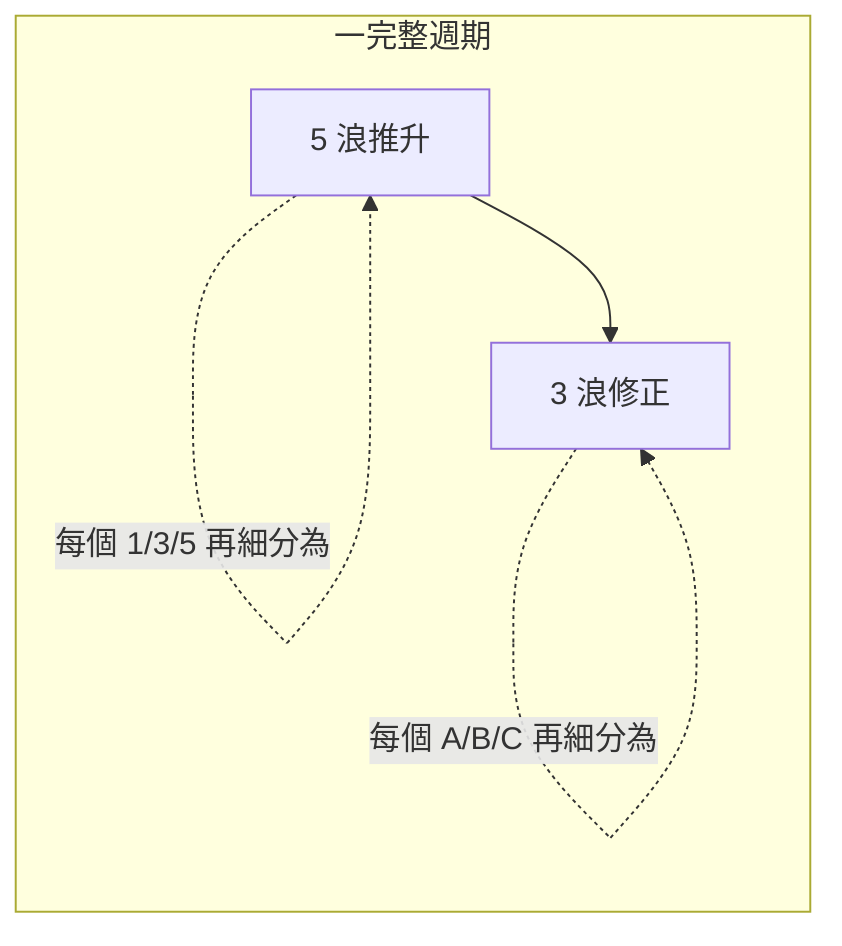
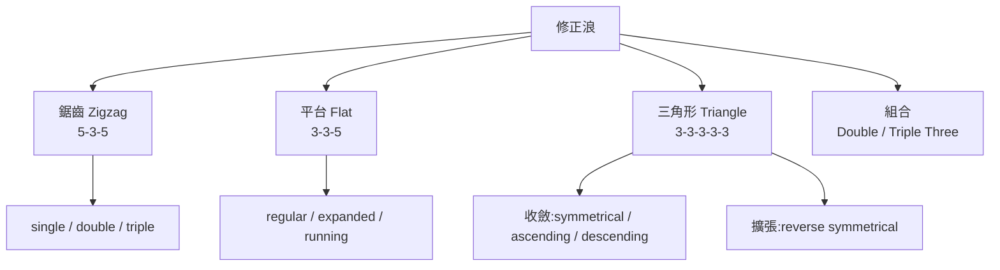
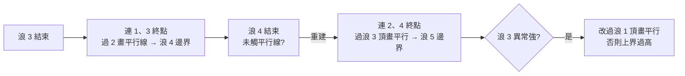

# Elliott 波浪原理 — 完整蒸餾

> **文件角色**:Traditional Core **規則層**(規則層 / 架構層分離,對齊 `neely_rules.md` 模式)。與原書同構、**不重編號**;`TradRuleId` 直接採用本檔附錄 A 的 `R1`–`R13` 與指引章節編碼。工程架構決策見 `traditional_core_architecture.md`,該文件**只引用本檔、不重述規則**。

> 基於 Frost & Prechter《Elliott Wave Principle: Key to Market Behavior》34 課課程教材的結構化蒸餾。原書 Copyright © 1978–1998 R.R. Prechter Jr. & A.J. Frost。本檔為實作導向之概念蒸餾,非原文重製。

> **修訂紀錄**
> - **rev2(2026-06-02)**:R8 引導對角細分依 EWI 現行立場放寬為 `5-3-5-3-5` 或 `3-3-3-3-3`、收斂或擴張(線上查證,異於原書印本,見 §L5 / §A);R2 標 `[待查證]`(公認三鐵律不含「浪 4 ≤ 浪 3 之 100%」,請對照原書附錄 A 確認);R3 註記為原書三鐵律之外的擴充規則。**不重編號**:R1–R13 維持原序以保書頁追溯。
> - rev1:初版蒸餾。

**蒸餾原則**:規則(rule,硬約束)與指引(guideline,傾向)嚴格分離;形態 → 子浪細分以表格定義;機率/案例壓縮為可操作結論。標記法採原書封面摘要表的規範記法(原以圈號標示之度數,本檔以方括號 `[ ]` 代替);**未**採 Lesson 3 的「orderly」表——該表在此 PDF 轉檔中 Cycle≡Primary、Minute≡Minuette 兩組列重複,屬缺陷。

---

## 目錄

- [0. 總綱(Capsule Summary)](#0-總綱capsule-summary)
- [詞彙表(Glossary)](#詞彙表glossary)
- **Part I — 波浪理論(L1–15)**
  - [L1–3 基本原則與結構](#l13-基本原則與結構)
  - [L4 推動浪 Motive Waves](#l4-推動浪-motive-waves)
  - [L5 對角三角形 Diagonal Triangles](#l5-對角三角形-diagonal-triangles)
  - [L6–9 修正浪 Corrective Waves](#l69-修正浪-corrective-waves)
  - [L10–13 指引:交替/深度/通道/量價](#l1013-指引交替深度通道量價)
  - [L14 浪性格 Wave Personality](#l14-浪性格-wave-personality)
  - [L15 實戰應用 Practical Application](#l15-實戰應用-practical-application)
- **Part II — 數學背景與應用(L16–34)**
  - [L16–19 Fibonacci 與 Phi](#l1619-fibonacci-與-phi)
  - [L20–25 比例分析 Ratio Analysis](#l2025-比例分析-ratio-analysis)
  - [L26–34 應用篇](#l2634-應用篇)
- **附錄(速查)**
  - [A. 規則 vs 指引 速查](#a-規則-vs-指引-速查)
  - [B. 形態 → 子浪細分 速查](#b-形態--子浪細分-速查)
  - [C. 比例關係 速查](#c-比例關係-速查)
  - [D. 浪數簽章(count signature)](#d-浪數簽章count-signature)

---

## 0. 總綱(Capsule Summary)

R.N. Elliott 發現:群眾(社會)行為以可辨識的形態趨勢與反轉。Elliott 分離出**十三種**運動形態(「waves」)——形態重複,但**時間與幅度不必重複**。波浪原理是「價格形態的目錄」+「這些形態在市場發展路徑上何處出現的說明」,本質是經驗導出的規則與指引,非主要為預測工具,而是對市場行為的描述。

**兩種模式(mode)**

| 模式 | 結構 | 方向 | 子浪標記 |
|---|---|---|---|
| 推動 Motive | 五浪 | 同大一級趨勢 | 數字 1 2 3 4 5 |
| 修正 Corrective | 三浪或其變體 | 逆大一級趨勢 | 字母 A B C |

**碎形遞迴(constant form within ever-changing degree)**



各級波浪數呈 Fibonacci:

| 層級 | 推動 + 修正 = 週期 |
|---|---|
| 最大浪 | 1 + 1 = 2 |
| 次細分 | 5 + 3 = 8 |
| 再細分 | 21 + 13 = 34 |
| 再細分 | 89 + 55 = 144 |

**為何是 5-3**(Elliott 未解釋成因,僅觀察):5-3 是「在線性運動中同時達成『波動』與『進展』的最小、最有效形式」。1 浪無波動;3 浪可波動但無淨進展;主趨勢至少 5 浪才能覆蓋比逆向 3 浪更多的距離又保有波動。

**九個度數(degree,大 → 小)**

```text
Grand Supercycle → Supercycle → Cycle → Primary →
Intermediate → Minor → Minute → Minuette → Subminuette
```

度數由**形態的相對大小與位置**決定,不由絕對價格/時間長度決定 → 即時判斷度數是難點,但成功預測通常只需相對度數。

---

## 詞彙表(Glossary)

| 術語 | 定義 |
|---|---|
| Alternation 交替(指引) | 浪 2 為陡峭修正,則浪 4 通常為橫向修正,反之亦然 |
| Apex 頂點 | 收斂三角形兩邊界線的交點 |
| Corrective wave 修正浪 | 逆大一級趨勢的三浪形態或其組合 |
| Diagonal Triangle (Ending) 結束對角 | 含重疊的楔形,僅見於第 5 或 C 浪;細分 3-3-3-3-3 |
| Diagonal Triangle (Leading) 引導對角 | 含重疊的楔形,僅見於第 1 或 A 浪;細分 5-3-5-3-5 **或 3-3-3-3-3**(EWI rev2),收斂或擴張 |
| Double Three 雙重三 | 兩個簡單橫向修正(W、Y),中間以修正浪 X 連接 |
| Double Zigzag 雙鋸齒 | 兩個鋸齒(W、Y),中間以修正浪 X 連接 |
| Equality 等長(指引) | 五浪序列中,當浪 3 最長時,浪 5 與浪 1 價長傾向相等 |
| Expanded Flat 擴張平台 | B 浪超越前推動浪價格極值的平台修正 |
| Failure 失敗 | 見 Truncated Fifth |
| Flat 平台 | 橫向修正 A-B-C;細分 3-3-5 |
| Impulse Wave 衝擊浪 | 細分 5-3-5-3-5、無重疊的五浪 |
| Impulsive Wave 推動性浪 | 任何有淨進展的五浪(衝擊浪或對角三角形) |
| Irregular Flat 不規則平台 | 見 Expanded Flat(原書用語,實際比 regular 更常見) |
| One-two, one-two | 五浪形態初期、浪 3 中段加速前的發展 |
| Overlap 重疊 | 浪 4 進入浪 1 價格領域;衝擊浪不允許 |
| Previous Fourth Wave 前四浪 | 前一同級推動浪內的第四浪;修正常終止於此區 |
| Sharp Correction 陡峭修正 | 不含「達到或超越前推動浪終點」價格極值的修正;與橫向修正交替 |
| Sideways Correction 橫向修正 | 含「達到或超越前推動浪」價格極值的修正;與陡峭修正交替 |
| Third of a Third 三之三 | 推動浪內最強的中段 |
| Thrust 衝刺 | 三角形完成後的推動浪 |
| Triangle (contracting) 收斂三角形 | 細分 3-3-3-3-3、標 a-b-c-d-e;見於浪 4、B、X(僅陡峭修正中)或 Y;邊界線收斂 |
| Triangle (expanding) 擴張三角形 | 同上但邊界線發散 |
| Triple Three 三重三 | 三個簡單橫向修正(W、Y、Z),各以 X 連接 |
| Triple Zigzag 三鋸齒 | 三個鋸齒(W、Y、Z),各以 X 連接 |
| Truncated Fifth 截斷第五浪 | 未超越第三浪價格極值的第五浪 |
| Zigzag 鋸齒 | 陡峭修正 A-B-C;細分 5-3-5 |

---

## L1–3 基本原則與結構

### 功能(function)vs 模式(mode)

每一浪兼具兩屬性:

| 屬性 | 取值 | 判定依據 |
|---|---|---|
| 功能 function | 行動 actionary / 反應 reactionary | **相對方向**:同大一級趨勢=行動;逆=反應 |
| 模式 mode | 推動 motive(五浪)/ 修正 corrective(三浪變體) | 結構發展方式 |

- 行動浪標記:**1 3 5 A C E W Y Z**(奇數+部分字母)
- 反應浪標記:**2 4 B D X**(偶數+部分字母)
- 所有反應浪皆為修正模式;**多數**行動浪為推動模式,少數為修正模式 → 稱「行動修正浪(actionary corrective)」(見 L9)。

### 完整週期


關鍵:推動浪不必向上、修正浪不必向下;**模式由相對方向決定,非絕對方向**。例:大修正 [2] 內,向下的 (a)(c) 是推動(順 [2] 方向),向上的 (b) 是修正。

### 度數標記法(整齊版)

| 度數 | 五浪(順勢) | 三浪(逆勢) |
|---|---|---|
| Grand Supercycle | [I] [II] [III] [IV] [V] | [A] [B] [C] |
| Supercycle | (I) (II) (III) (IV) (V) | (A) (B) (C) |
| Cycle | I II III IV V | A B C |
| Primary | [1] [2] [3] [4] [5] | [A] [B] [C] |
| Intermediate | (1) (2) (3) (4) (5) | (A) (B) (C) |
| Minor | 1 2 3 4 5 | A B C |
| Minute | [i] [ii] [iii] [iv] [v] | [a] [b] [c] |
| Minuette | (i) (ii) (iii) (iv) (v) | (a) (b) (c) |
| Subminuette | i ii iii iv v | a b c |

> 「Cycle」「Primary」僅為度數名稱,不隱含一般意義的「週期/主升段」。

---

## L4 推動浪 Motive Waves

### 硬規則(RULES — 絕不違反)

推動浪細分五浪、必順大一級趨勢。以下為**規則**,違反即非波浪分析:

- ✅ 浪 2 回撤**不超過** 浪 1 的 100%
- ⚠️ 浪 4 回撤**不超過** 浪 3 的 100% `[待查證 vs 原書附錄 A]` — 公認三鐵律不含此條;對衝擊浪它已被「浪 4 不重疊浪 1」涵蓋(嚴格度更高),無獨立來源。確認原書未列即降級
- ✅ 浪 3 **總是**超越浪 1 終點 `[原書三鐵律之外的擴充規則,EWI 常列]`
- ✅ 浪 3 在 1/3/5 中**永不最短**(以百分比計;通常算術亦成立)
- ✅(衝擊浪專屬)浪 4 **不進入**浪 1 價格領域(現金市場;期貨極端槓桿下偶見日內重疊,極罕見)

❌ 常被誤用而**不允許**的標記:

| 錯誤 | 為何不合法 | 正解 |
|---|---|---|
| 浪 4 與浪 1 頂重疊 | 違反不重疊規則 | 重標為「正在形成的延伸浪 (3)」 |
| 中間浪比浪 1、浪 5 都短 | 違反「浪 3 永不最短」 | 同上 → 多半是第三浪延伸的早期 |

> 即時計數最有用的單一指引:一旦疑似浪 3 不合法,幾乎總是重標為延伸第三浪初期。

衝擊浪內:1/3/5 本身為推動,且**浪 3 必為衝擊浪**(impulse)。

### 延伸 Extension(指引)

- 延伸=子浪被誇大拉長的推動浪。**絕大多數**衝擊浪在 1/3/5 中**僅一個**子浪延伸。
- 延伸可使序列呈 9 浪(同幅同時)而非 5 浪;9 與 5 技術意義相同。
- **股市最常延伸者為浪 3**。
- 預判用途:1、3 約等長 → 浪 5 可能延伸拉長;浪 3 延伸 → 浪 5 簡單,類似浪 1。
- 延伸中可再延伸(extended 3 的 3、extended 5 的 5)。延伸第五浪除商品多頭外少見。

### 截斷 Truncation(指引)

- 第五浪未超越第三浪終點(原書用 "failure",本書改稱 truncation)。
- 驗證:截斷的第五浪**仍含完整五子浪**。
- 常見於極強第三浪之後。

---

## L5 對角三角形 Diagonal Triangles

推動模式但非衝擊浪(含 1–2 個修正特徵),於特定位置替代衝擊浪。共通:無反應子浪完全回撤前行動子浪;第三浪永不最短;但**這是唯一順勢五浪結構中浪 4 幾乎總是與浪 1 重疊者**。罕見以極小幅度截斷收尾。

| 類型 | 子浪細分 | 出現位置 | 邊界 | 意涵 |
|---|---|---|---|---|
| 結束對角 Ending | **3-3-3-3-3** | 主要為浪 5;少數 C 浪;組合中僅作最終 C | 收斂楔形 | 終止訊號 → 戲劇性反轉 |
| 引導對角 Leading | **5-3-5-3-5 或 3-3-3-3-3** | 浪 1(衝擊浪中)或 A(鋸齒中) | 收斂**或擴張**楔形(浪 1、4 重疊) | 延續訊號 |

**結束對角要點**

- 各子浪(含 1/3/5)細分為「三」(本屬修正現象)。
- 第五浪常以「衝出(throw-over)」收尾:短暫突破連接浪 1、3 終點的趨勢線,伴隨相對高量。
- 上升對角看空(隨後常陡跌至少回到起點);下降對角看多(常引發向上衝刺)。
- 第五浪延伸、截斷第五、結束對角三者皆暗示同一件事:**前方戲劇性反轉**。

**引導對角辨識**(避免誤判為一連串 1-2 浪):第五子浪相對第三**明顯減速**;反之發展中的 1-2 浪通常短線加速、廣度擴張。

> 出處:引導對角**非 R.N. Elliott 原始發現**,係 Frost-Prechter 因其出現夠頻繁、橫跨期間夠長而確認其有效性後納入。
>
> **rev2 修訂(EWI 現行,異於原書印本)**:原書印本定引導對角細分為 `5-3-5-3-5`;EWI 現行 waveopedia 與業界共識已放寬——觀察到的細分**多半是 `3-3-3-3-3`**(`5-3-5-3-5` 反而較罕見),且引導對角**可呈擴張形**(非僅收斂)。引擎分類須同時容納兩種細分與兩種楔形;結束對角仍維持 `3-3-3-3-3`(擴張結束對角罕見且爭議,不列為硬性)。

---

## L6–9 修正浪 Corrective Waves

### 修正浪通則

- 逆大一級趨勢前進如「掙扎」→ 修正比推動更難辨識、更多變,常隨時間增減複雜度;完成前難歸類。
- **最重要規則:修正永遠不是五浪(corrections are never fives)。逆勢初始五浪 → 修正未完,只是其一部分。**
- 兩種風格:陡峭(steep)/ 橫向(sideways,含回到或超越起點的動作,整體呈橫向)。

四大類:



### 鋸齒 Zigzag(5-3-5)

- 三浪 A-B-C;**B 頂明顯低於 A 起點**(多頭中的修正)。
- 可連續 2–3 次(double/triple zigzag),各以中介「三」(X)分隔,類比衝擊浪延伸但較少見;多因首個鋸齒未達常態目標。
- 衝擊浪中:浪 2 常見鋸齒,浪 4 罕見。

> 標記修正:Elliott 原以 A-B-C-X-A-B-C 標雙重修正,錯誤指示了子浪度數。本書改用 **W-X-Y(-X-Z)**:W=第一形態、Y=第二、Z=三重之第三;X 為反應浪(必為修正,常為鋸齒)。各形態內 A/B/C/D/E 比整體修正小**兩**級。

### 平台 Flat(3-3-5)

A 浪力道不足(僅成三浪)→ B 浪缺逆勢壓力,終於 A 起點附近;C 浪通常僅略超 A 終點。

| 類型 | B 浪終點 | C 浪終點 | 備註 |
|---|---|---|---|
| Regular 規則 | ≈ A 起點 | 略超 A 終點 | |
| **Expanded 擴張**(最常見) | **超越** A 起點 | **明顯超越** A 終點 | 原書誤稱 "irregular" |
| Running 奔走(罕見) | 明顯超越 A 起點 | **未達** A 終點 | 僅見於極強快市場;切勿過早判定(十有九錯) |

- 平台回撤通常少於鋸齒;伴隨強大一級趨勢 → 幾乎總是緊鄰延伸浪之前/後。趨勢越強,平台越短。
- 衝擊浪中:浪 4 常見平台,浪 2 較少。
- 辨識 running flat 警告:若疑似 B 浪細分為**五浪**而非三浪,它更可能是大一級衝擊浪的第一浪。

### 三角形 Triangle(3-3-3-3-3)

- 反映力量平衡 → 橫向移動,通常伴隨量與波動性遞減。五重疊浪 a-b-c-d-e。
- 邊界線連接 a–c 與 b–d 終點;**浪 e 常穿越或不及 a-c 線**(實際更常如此)。
- 收斂三角形含三型(對稱/上升/下降),擴張型僅一種(reverse symmetrical,無變體)。
- Running triangle 極常見:浪 b 超越浪 a 起點;但所有三角形(含 running)在浪 e 結束時皆對前浪產生淨回撤。
- 多數子浪是鋸齒;偶有一子浪(常 c)較複雜(平台/多鋸齒);罕見一子浪(常 e)本身是三角形 → 整體展為九浪。

**位置規則**:三角形**幾乎總出現在大一級形態最終行動浪之前** → 即衝擊浪的浪 4、A-B-C 的 B、雙/三重修正或組合的最終 X。也可作修正組合的最終行動形態,但仍位於更大一級最終行動浪之前。

**衝刺 thrust**:浪 4 為三角形時,股市浪 5 常迅速、約走三角形最寬處距離(衝刺多為衝擊浪,可為結束對角)。強市無衝刺而是延長的第五浪。商品大級三角形後常為延伸的「噴出(blowoff)」。

> 收斂三角形邊界線交於頂點(apex)的時刻常與市場轉折一致。

**術語**:「horizontal triangle(水平/修正三角形)」對比「diagonal triangle(對角/推動三角形)」;簡稱可用「triangle / wedge」。

### 組合 Double / Triple Threes

- 簡單修正(鋸齒/平台,三角形可作最終成分)的橫向組合,標 W-X-Y(-X-Z);X 為反應浪(常鋸齒)。是平台修正延長橫向動作之法。
- 成分常**交替形式**(如 flat→triangle、flat→zigzag)。
- 多為水平特性;**一個組合中至多一個鋸齒、至多一個三角形**,且三角形僅作最終成分。
- 雙/三鋸齒 vs 雙/三重三的差異:

| | 雙/三鋸齒 | 雙/三重三 |
|---|---|---|
| 角度 | 較陡(非水平組合) | 水平 |
| 目標 | 首鋸齒常不足以充分修正 → 加倍以達足夠價格回撤 | 首形態常已充分修正 → 加倍主要為**延長時間**(達通道線/與另一修正取得親緣) |

### 浪數系列差異(計數判讀)

| 模式 | 浪數 | 重疊 |
|---|---|---|
| 推動(含延伸) | 5 → 9, 13, 17 | 少 |
| 修正(含組合) | 3 → 7, 11, 15 | 多 |
| 三角形 | 可算 11(如三重三) | 多 |
| 對角三角形 | — | 推動/修正混血,例外 |

### 正統頂底 Orthodox Top / Bottom

形態終點 ≠ 實際價格極值時,以**形態終點**為「正統」頂底(區別於形態內出現的真實高/低)。例:截斷第五浪後浪 5 終點為正統頂(雖浪 3 價更高);擴張平台中浪 A 起點為前多頭正統頂(雖浪 B 更高)。

> 重要性:正確標記依賴正確起點;比例分析的長度/時間**從正統終點量起**(L20–25)。

### 功能與模式調和(actionary corrective)

行動方向但以修正模式發展者:

| 形態 | 行動修正子浪 |
|---|---|
| 結束對角 | 浪 1、3、5 |
| 平台 | 浪 A |
| 三角形 | 浪 A、C、E |
| 雙鋸齒/雙重修正 | 浪 W、Y |
| 三鋸齒/三重修正 | 浪 Z |

> 在自由定價市場下,以上即廣義股市平均的全部可能形態;無其他形態。所有規則/指引針對**真實市場情緒**,非其記錄;政府定價(如 20 世紀部分時期的金銀)會使受限的浪無法登錄。

---

## L10–13 指引:交替/深度/通道/量價

> L10–15 指引以多頭為例說明;除特別排除外,空頭中倒置同樣適用。指引**非必然**,但告訴你「不該預期什麼」,極具實用價值。

### 交替 Alternation(L10)

**衝擊浪內**:浪 2 陡峭 → 預期浪 4 橫向,反之亦然。

| 修正風格 | 是否含新價格極值(超越前推動浪正統終點) | 典型形態 |
|---|---|---|
| 陡峭 sharp | 否 | 鋸齒(單/雙/三),偶為以鋸齒起頭的雙重三 |
| 橫向 sideways | 通常是 | 平台、三角形、雙/三重修正 |

> 核心:兩個修正過程中,一個會回到或超越前推動浪終點,另一個不會。對角三角形浪 2、4 **不**交替(通常皆鋸齒)。延伸本身亦是交替(短/長/短)。

**修正浪內**:A 為平台 → 預期 B 為鋸齒(反之亦然);A 為簡單鋸齒 → B 常更複雜(複雜度交替)。

### 修正深度 / 前四浪(L11)

- **主要指引**:修正(尤其本身為第四浪時)的最大回撤,傾向落在**前一小一級第四浪的行進區間內**,最常在其終點附近。
- 修正型修飾:若序列首浪延伸,則第五浪後的修正典型下限為**小一級第二浪的底部**。
- 偏離:平台/三角形(尤其延伸後)常略微不及第四浪區;鋸齒偶爾深入小一級第二浪區(幾乎僅當鋸齒本身為第二浪時,常形成「雙底」)。

**第五浪延伸後行為**(最重要經驗規則):第五浪為延伸 → 隨後修正**陡峭**,於該延伸浪**第二浪低點**找到支撐(常恰在大一級前四浪區附近),精確度顯著;且延伸第五後通常快速回撤 → 預先警告反轉至特定價位。此指引不單獨適用於「延伸第五的延伸第五」。

### 通道 Channeling + 等長 + 衝出(L12)

**等長 Equality**:五浪序列中兩推動浪傾向時間與幅度相等(尤指浪 3 為延伸時的兩個非延伸浪);若不相等,次可能關係為 .618。大於 Intermediate 度數須以百分比表述。

**通道技術**(平行趨勢通道常精確標出衝擊浪上下界):



**衝出 Throw-over**:第五浪接近上界——量縮 → 終點將觸及或不及;量增 → 可能突破(衝出)。常先有「衝下(throw-under)」(浪 4 或 5 之 2),反轉回線下確認。大度數衝出會使其內小度數浪難辨。

### 刻度 / 量 / 右側形態(L13)

**刻度 Scale**:度數越大越需半對數(semilog);但同度數浪只在「適當刻度」上才形成正確 Elliott 通道(1921–29 半對數完美、1932–37 算術完美)。需半對數至多表示該浪正在**加速**。實務:兩種刻度都用;落不進平行線就換刻度。

**量 Volume**:用於驗證計數與預判延伸。

| 情境 | 量的傾向 |
|---|---|
| 修正後期 | 量縮 = 賣壓減弱;量低點常逢轉折 |
| Primary 以下正常第五浪 | 量 < 第三浪 |
| 推進第五浪量 ≥ 第三浪(< Primary) | **第五浪延伸中**(尤其罕見的三、五皆延伸) |
| Primary 以上 | 多頭參與者自然增長 → 第五浪量常較高,頂部量常創新高 |
| 衝出處 | 量短暫尖峰 |

**右側形態 The "Right Look"**:整體外觀須符合該形態圖示。雖任何五浪可被硬塞成三浪(把前三段標為 A),但這會瓦解系統。內部計數是分類的指引,而正確外觀反過來常是正確內部計數的指引。**勿因情緒接受比例失調/變形的計數**。

---

## L14 浪性格 Wave Personality

群眾情緒(悲觀↔樂觀)的進程在波結構對應點產生相似情境;各浪性格不分度數皆顯現。當多個計數皆合規時,**性格知識可決定當下位置**。以下為多頭描述,空頭倒置。

| 浪 | 性格摘要 | 量/廣度 | 對計數的價值 |
|---|---|---|---|
| 1 | 約半數屬築底(常被浪 2 大幅修正);另半數自大底/向下失敗/極度壓縮而起,動態且僅中度回撤 | 量、廣度微增 | |
| 2 | 常回撤浪 1 大部分;恐懼濃厚,眾人認定空頭重臨;常現低量低波動「買點」 | 量縮 | |
| **3** | 強而廣,趨勢明確;基本面轉佳;**通常量價最大、最常延伸**;三之三為最強波動點 → 跳空、突破、廣度極佳 | 量最大、廣度佳 | **最有價值線索之一** |
| 4 | 深度與形態可預測(交替於浪 2);常橫向築底;落後股見頂下跌 → 為第五浪的非確認與弱勢埋下伏筆 | | |
| 5 | 廣度恆弱於浪 3;速度通常較慢(除非延伸,則五之三可超浪 3);樂觀極高但廣度收窄;股市**無**頂部最大加速史 | 量通常 < 浪 3(延伸除外) | |
| A | 世人多認為只是回檔;首現技術裂痕 | | 五浪 A → B 為鋸齒;三浪 A → B 為平台/三角形 |
| **B** | 「假貨」——多頭陷阱、投機者天堂、無確認、技術弱、終將被 C 完全回撤;X 浪、擴張三角形 D 浪同性格 | Intermediate 以下量縮;Primary 以上可能量更大(廣泛參與) | **最有價值線索之一**(「總覺得這市場不對勁」多半是 B) |
| C | 下跌 C 極具破壞力(具第三浪性格,廣而持續,僅現金可避);上升 C(大空頭中的上修)同樣強勁、以五浪展開易被誤認新升勢 | | |
| D | 非擴張三角形中常伴量增(混血,具部分第一浪性格);仍如 B 浪般「假」 | | |
| E | 看似新跌勢起點,常伴強利多消息與假突破三角形邊界 → 在該準備反向時加深看空 | | 如第五浪般情緒化 |

---

## L15 實戰應用 Practical Application

- 波浪原理提供「評估各未來路徑相對機率」的**客觀**手段;任一時點通常有 ≥ 2 個合規解讀,規則使合法替代解最少化。
- **首選計數(preferred)= 滿足最多指引者;次選(alternate)= 次多者。** 替代計數**不是「錯誤/被否決」的解讀**,而是被賦予較低機率的合法解讀,是投資的必備備案。
- 對機率順序可有把握,但**對單一結果無把握**;再高勝算的方法也會偶錯——仍優於其他方法。
- **內建轉念機制**:形態完成與否是客觀的。市場反向 → 抓到轉折;市場超越已完成形態所允許 → 結論錯,立即收回資金。一旦違反劇本,**次選即刻升為首選**。
- 無清楚首選時,「先掃到地毯下,等空氣清明」——後續浪幾乎總會以更大一級位置澄清前浪,轉折機率可驟升近 100%。
- 演繹法(排除不可能)是最佳途徑:「排除不可能後,剩下的即使再不可能也必是真相。」
- 預設目標的價值:作為監控市場實際路徑的背景;偏離即快速警示換解讀。但賺錢不必然需要事前目標——**市場即訊息**,行為改變即可改變觀點。

---

## L16–19 Fibonacci 與 Phi

Elliott 在《Nature's Law》中以 Fibonacci 數列為波浪原理的數學基礎。

### 數列性質

```text
1, 1, 2, 3, 5, 8, 13, 21, 34, 55, 89, 144, ...
相鄰兩數之和 = 下一數
```

### 黃金比例 Golden Ratio(phi, φ)

| 關係 | 值 |
|---|---|
| 任一數 ÷ 下一較高數 | ≈ .618 |
| 任一數 ÷ 下一較低數 | ≈ 1.618 |
| 隔一數之比 | ≈ .382(其倒數 2.618) |
| φ(極限) | .618034…(無理數) |

**φ 的獨特性**:唯一「加 1 後等於其倒數」之數 → `.618 + 1 = 1 ÷ .618`。加法與乘法的合一產生:

```text
.618² = 1 − .618
.618³ = .618 − .618²   ...
1.618² = 1 + 1.618
1.618³ = 1.618 + 1.618²  ...
```

> 1.618 是「短段 : 長段 = 長段 : 全長」的唯一比例,創造價格結構的「互鎖整體性」→ 故稱 Golden Ratio。

### 幾何與股市(摘)

黃金分割/黃金矩形/黃金螺線體現 φ 的自我相似;股市以「五上三下」展開,波數對應 Fibonacci 序,使 φ 貫穿價格與時間結構。常用比例:**2.618, 1.618, 1.00, .618, .382**。

---

## L20–25 比例分析 Ratio Analysis

> 比例分析=評估浪與浪在**時間與幅度**的比例關係。幅度關係遠比時間關係常見且可靠。**形態優先,比例為輔/指引**(Bolton:「Keep it simple」)。測量須從**正統終點**量起;基於非正統極值的比例通常不可靠。

### 回撤 Retracements

| 修正類型 | 傾向回撤比例 | 典型位置 |
|---|---|---|
| 陡峭 sharp | 61.8% 或 50% | 浪 2、大鋸齒的 B、多鋸齒的 X |
| 橫向 sideways | 38.2% | 浪 4 |

> 回撤僅是傾向(易測故被過度關注);**同向交替浪之間的關係更精確可靠**(見下)。

### 推動浪倍數 Motive Multiples

```text
三推動浪(1/3/5)常以 equality / 1.618 / 2.618 相關(倒數 .618 / .382),多以百分比。
浪 3 延伸時      → 浪 1 ≈ 浪 5,或 .618 關係
浪 5(非延伸)   → 常為「浪 1 起點→浪 3 終點」長度的 .382 或 .618(延伸第五則以該段倍數量)
浪 1 延伸(罕見) → 浪 2 常把整個衝擊浪分割為黃金分割
通則:除非浪 1 延伸,浪 4 常把衝擊浪價程分割為黃金分割
       └ 後段 = 全程 .382(浪 5 非延伸) / .618(浪 5 延伸)
       └ 分割點(浪 4 起/終/逆勢極值)略浮動 → 給出 2–3 個密集目標
```

> 此即「第五浪後的回撤目標常被『前四浪終點』與『.382 回撤點』雙重指示」之原因。

### 修正浪倍數 Corrective Multiples

| 形態 | 典型比例關係 |
|---|---|
| 鋸齒 | C 通常 = A(亦常 1.618A 或 .618A);雙鋸齒第二鋸齒對第一同理 |
| 規則平台 | A ≈ B ≈ C |
| 擴張平台 | C 常 1.618A(或 C 超 A 終點 .618A);罕見 2.618A;B 有時 1.236A 或 1.382A |
| 三角形(收斂/上升/下降) | 至少兩交替浪以 .618 相關:e=.618c、c=.618a、d=.618b |
| 三角形(擴張) | 上述倍數改為 1.618 |
| 雙/三重修正 | 各簡單形態淨幅常 equality;若含三角形則常 .618 |
| 浪 4 ↔ 浪 2 | 常以 equality 或 Fibonacci 相關(多以百分比) |

### 多重浪關係 Multiple Wave Relationships

所有度數同時作用 → 任一時點市場充滿各級 Fibonacci 關係。**創造多個 Fibonacci 關係交匯的價位,比僅一個關係者更可能標出轉折。**

理想 Elliott 浪的比例範例(示意):

```text
[2] = .618 × [1]
[4] = .382 × [3]
[5] = 1.618 × [1]
[5] = .618 × ([0]→[3])
[2] = .618 × [4]
[2] 內:(a)=(b)=(c)
[4] 內:(a)=(c)、(b)=.236 × (a)
```

> 目標價用途:在目標處反轉且計數合理 → 雙重顯著點;若市場跳空穿越 → 警示朝下一計算價位前進,且須重審首選計數。歷史驗證:1974–75 反彈恰回 61.8% 之 1973–74 跌幅;1976–78 跌幅恰 61.8% 之 1974–76 漲幅;Bolton 1960 年預測道指 ≈ 1000(1966 實際 995.82,誤差 < 1/3%)。

### Fibonacci 時間序列 Time Sequences

- **單以時間無法可靠預測**;但 Fibonacci 時間跨度常與波幅吻合,**作為轉折的可能時點**——尤其與價格目標、計數重合時。
- Elliott:「時間因素常『符合形態』」。時間排列可頂對頂、底對底、頂對底、底對頂 → 排列趨於無限,故只作輔助。
- 經驗:重要轉折間距常呈 Fibonacci 月/年數(8、13、21、34、55…);多個年份序列指向同一年時(如 1949+21=1970、1957+13=1970、1962+8=1970)更具意義。

---

## L26–34 應用篇

### 長期波浪與大循環(L26–27,摘)

- 1932 起為 Supercycle (V),其 Cycle 細分:I(1932–37)、II(1937–42 鋸齒)、III(1942–66 延伸,漲近 1000%)、IV(1966–74,A-B-C 或擴張三角形/雙重三)、V(1974–)。
- 範例驗證多項指引同時成立:浪 IV 守在浪 I 領域之上、浪 III 為延伸、浪 IV 三角形與浪 II 鋸齒交替、各 Primary [2] 鋸齒 / [4] 擴張平台呈交替。
- L34(1997):宣告 wave V 接近大循環頂點(實際突破原 3664–3885 目標逾 3000 點,以衝出觸及 18 年前畫的長期通道上界)。

### 個股 Individual Stocks(L28)

- **時機 > 選股**:Elliott 告訴你「賽道是否快」,不告訴你「哪匹馬贏」。基本面少為投資正當理由(1929 U.S. Steel $260→$22)。
- 個股計數常太模糊;對個股,傳統技術分析往往比硬套 Elliott 計數更有用。
- 原因:波浪原理只反映「各人決策中與群眾共享的部分」;個別公司特性互相抵消後,殘餘為群眾心理之鏡。
- 統計:約 75% 個股隨大盤上漲、90% 隨大盤下跌;封閉式基金、大型景氣循環股最貼近指數;新興成長股因強烈投資情緒,個別 Elliott 形態最清晰。
- 策略:除非清晰無誤的浪形浮現,否則勿逐檔分析;一旦浮現則果斷行動(無視大盤計數),忽視清晰形態比付保費更危險。

### 商品 Commodities(L29)

| 差異 | 股市 | 商品 |
|---|---|---|
| 多空市場重疊 | 否 | 有時重疊(五浪多頭可能未創新高,如黃豆) |
| 最高可觀察度數 | Grand Supercycle | 部分僅 Primary/Cycle(更高處原理「彎曲」) |
| 延伸常見位置 | 浪 3 | **第五浪**(Primary/Cycle 多頭) |
| 第五浪驅動情緒 | 希望 | **恐懼**(通膨/旱災/戰爭)→ 商品頂常像股市底 |
| 三角形後 | 衝刺「迅速而短」 | 大級三角形後常接延伸的噴出 |

> 最佳形態源自長期橫向基底的重要突破(1970 年代咖啡/黃豆/糖/金/銀)。比例投影(以「起點→浪 3 頂」長度為單位)在商品多頭精準。

### 與其他理論(L30)

| 理論 | 關係 |
|---|---|
| Dow 理論 | 波浪原理的「祖父」;互補。Elliott 計數可預警 Dow 的非確認(non-confirmation),Dow 非確認也提醒 Elliott 者重審計數。但 Dow 不能驗證波浪原理(後者有數學基礎、僅需單一指數、依特定結構展開)。Dow 三心理階段 ≈ Elliott 浪 1/3/5 性格 |
| 週期 Cycles | 有效但非市場本質;市場更像螺線(自然)而非圓(機器);固定週期週期性難驗證 |
| 新聞 News | **市場即新聞**;新聞**落後**市場一兩浪卻同步進程(浪 1-2 利空、浪 3 利多回歸、頂部基本面仍佳卻反轉)。重點非新聞本身,而是市場賦予新聞的重要性;意外事件(地震等)被快速消化且不反轉既有趨勢 |
| 隨機漫步 Random Walk | 被持續成功的專業操盤者證偽;市場有其本質,DJIA 逐時逐年完美契合 Elliott 基本原則,非無序遊走 |

### 與技術/經濟分析(L31)

波浪原理證明圖表分析有效,並協助判斷哪些形態真正重要。**傳統 TA 形態 → Elliott 對應**:

| 傳統 TA 形態 | Elliott 對應 |
|---|---|
| 楔形 wedge | 對角三角形(同義同意涵) |
| 旗形/三角旗 flags/pennants | 鋸齒與三角形 |
| 矩形 rectangle | 雙/三重三 |
| 雙頂 double top | 平台 |
| 雙底 double bottom | 截斷第五浪 |
| 頭肩頂 head & shoulders | 正常 Elliott 頂(浪 3 量最大、浪 5 較小、B 更小);「失敗的頭肩」常為擴張平台 |
| 突破 breakout(高量、跳空) | 多伴隨第三浪 |
| 支撐/壓力 | 正常浪進程;浪 4 壅塞區為後續下跌支撐 |

- **指標(indicators)**用法:情緒指標(放空、選擇權、民調)在 C 浪/浪 2/浪 5 末達極端;動能指標在浪 5、擴張平台 B 浪現背離。指標僅作輔助計數,勿凌駕明顯浪形。
- **經濟分析**:不聽市場而靠預測經濟來預測市場「注定失敗」;市場是經濟更可靠的預測者(反之不然)。經濟條件與股市的關係會無預警改變(衰退/通膨/利率與多空的關聯皆兩面)。波浪概念反可用於判斷利率、通膨率、貨幣數列等的轉折。

### 即時預測心法(L32–34)

- 中段(mid-pattern)決策最難;但當大形態完成、教科書圖景在眼前時(如 1974/12、1982/8),信念可升至 > 90%。
- 多重證據交匯(計數 + 比例目標 + 時間 + 與通縮道指/通道破線一致 + 經濟背景)時,結論最強。
- 三角形預示衝刺(約三角形最寬處距離)作為「第一站」,但第五浪總幅度由整個浪 IV 形態決定,非僅三角形。

---

## A. 規則 vs 指引 速查

> 引擎實作核心:**規則=硬約束(可作驗證/淘汰非法計數);指引=機率傾向(用於排序首選/次選,不可用於淘汰)。**

### 規則 RULES(絕不違反)

```text
[推動/衝擊浪]
R1  浪 2 回撤 ≤ 浪 1 之 100%
R2  浪 4 回撤 ≤ 浪 3 之 100%   [待查證 vs 原書附錄 A;衝擊浪已被 R5 涵蓋,無獨立來源 → 確認原書未列即降級]
R3  浪 3 必超越浪 1 終點        [原書三鐵律之外的擴充規則,EWI 常列;保留]
R4  浪 3 在 1/3/5 中永不最短
R5  (衝擊浪)浪 4 不重疊浪 1(現金市場)
R6  衝擊浪細分 5-3-5-3-5;浪 3 必為衝擊浪

[對角三角形]
R7  結束對角 = 3-3-3-3-3,收斂楔形,僅 5/C 浪(浪 1/4 重疊為原書「almost always」特徵,非絕對門檻)
R8  引導對角 = 5-3-5-3-5 或 3-3-3-3-3,收斂或擴張楔形,僅 1/A 浪 [rev2 EWI 現行;3-3-3-3-3 為較常觀察到者](浪 1/4 重疊同為特徵,非絕對門檻)
R9  對角:無反應子浪完全回撤前行動子浪;浪 3 永不最短

[修正]
R10 修正永遠不是五浪(逆勢五浪 → 修正未完)
R11 鋸齒 = 5-3-5;平台 = 3-3-5;三角形 = 3-3-3-3-3
R12 組合中至多一個鋸齒、至多一個三角形;三角形僅作最終成分
R13 三角形「nearly always」位於大一級最終行動浪之前(原書限定語,非絕對)
```

### 指引 GUIDELINES(典型傾向)

```text
延伸(股市多在浪 3、商品多在浪 5)、截斷、交替(浪 2 ↔ 浪 4)、
修正深度 ≈ 前四浪區、第五浪延伸後陡回至其浪 2 低點、
等長(兩非延伸推動浪)、通道、衝出、半對數刻度(大度數)、
量(驗證計數/預判延伸)、右側形態、浪性格、
回撤比例、推動/修正倍數、多重關係交匯、Fibonacci 時間序列
```

---

## B. 形態 → 子浪細分 速查

| 形態 | 細分 | 模式 | 出現位置 |
|---|---|---|---|
| 衝擊浪 Impulse | 5-3-5-3-5 | 推動 | 1/3/5/A/C |
| 結束對角 Ending Diagonal | 3-3-3-3-3 | 推動(混血) | 5/C(組合最終 C) |
| 引導對角 Leading Diagonal | 5-3-5-3-5 / 3-3-3-3-3 | 推動(混血) | 1(衝擊浪)/ A(鋸齒) |
| 鋸齒 Zigzag | 5-3-5 | 修正(陡峭) | 2/B/X;A 等 |
| 平台 Flat | 3-3-5 | 修正(橫向) | 4/B;X 等 |
| 三角形 Triangle | 3-3-3-3-3 | 修正(橫向) | 4/B/X(陡峭修正中)/Y |
| 雙重三 Double Three | 形態-X-形態 | 修正(橫向) | 4/B/X/Y |
| 三重三 Triple Three | 形態-X-形態-X-形態 | 修正(橫向) | 同上 |

---

## C. 比例關係 速查

```text
[回撤]  陡峭 → 61.8% / 50%(浪 2、B-of-zigzag、X)
        橫向 → 38.2%(浪 4)

[推動]  1/3/5 互相 equality / 1.618 / 2.618(倒數 .618 / .382)
        浪 3 延伸 → 浪 1 ≈ 浪 5 或 .618
        浪 4 分割衝擊浪為黃金分割(後段 .382 若浪 5 非延伸,.618 若延伸)

[鋸齒]  C = A(或 1.618A / .618A)
[規則平台] A ≈ B ≈ C
[擴張平台] C = 1.618A(或超 A 終點 .618A;罕 2.618A);B = 1.236A / 1.382A
[三角形] 收斂:e=.618c、c=.618a、d=.618b;擴張:×1.618
[浪 4 ↔ 浪 2] equality 或 Fibonacci

常用比例集:2.618、1.618、1.00、.618、.382、.236
測量起點:一律從「正統終點(orthodox)」量起
```

---

## D. 浪數簽章(count signature)

| 觀察計數 | 重疊 | 推論 |
|---|---|---|
| 5 / 9 / 13 / 17 | 少 | 推動 |
| 3 / 7 / 11 / 15 | 多 | 修正 |
| 11(亦可) | 多 | 三角形(視同三重三) |
| — | — | 對角三角形為推動/修正混血,屬例外 |
