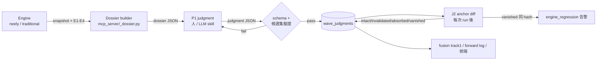
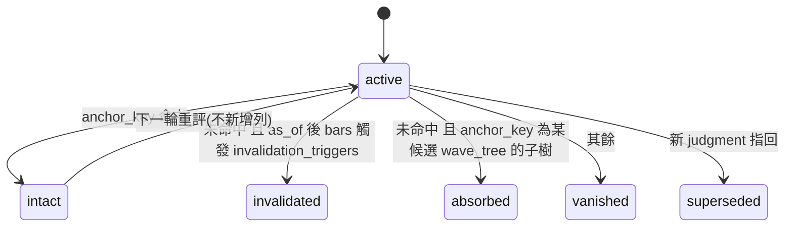

# wave_judgment_loop — 證據 → 判讀 → 錨定迴路

> 引擎只交證據、判讀者(人/LLM)交決定、決定落地成 PIT 資料;引擎下一輪只回報錨定計數的存續狀態。

**上位文件**:`neely_compaction_v2.md` r5(forest 不選 primary §8.2)、`neely_core_architecture.md` §4 容差、`proposal_progressive_settlement.md`(本案取代其引擎啟發式)、`neely_ch6_gate_running_fix.md`(M0 前置)
**基線**:neely 1.1.1 / traditional v3;讀者路徑 4 處替讀者選 primary:`fusion/_picker.py`、`track1._pick_primary`、`mcp_server/_forecast.py:254/400/890`

## TOC

1. 目標 / 非目標 · 2. 架構與 Chain 契約 · 3. 引擎 additive 契約 · 4. Dossier JSON 契約 · 5. wave_judgments · 6. J2 錨定 diff · 7. P1 判讀 skill · 8. 下游消費 · 9. 關鍵決策 · 10. 驗收條件 · 11. 邊界 · 12. 里程碑 · 13. 待議

## 1. 目標 / 非目標

| 目標 | 非目標 |
|---|---|
| 讀者面零 `primary`;所有選擇由 judgment 記錄承載 | 引擎內任何 confidence / ML 排序 |
| 判讀限定在引擎合法候選內;`no_fit` 是合法輸出並回饋引擎缺口 | LLM 自由計數 |
| 錨定計數以**日期**為鍵,跨 run 穩定 | 前端重設計(只加「選取→錨定」) |
| Neely「最小修改」以前次 judgment 為基準可計算 | 排程自動批次判讀(先 on-demand) |
| judgment 累積 = 第一份非自洽 ground truth | 回測 judgment 準確率(forward-only 紀律不變) |

## 2. 架構與 Chain 契約



| 階段 | 動作 | 輸入契約 | 輸出契約 |
|---|---|---|---|
| 1 Engine | run-all(既有)+ E1–E4 | bars | `structural_snapshots.snapshot` + `assumptions` |
| 2 Dossier | 三 timeframe 取最新 snapshot,抽 live-edge 候選、計算 `anchor_key`、traditional 一致性 | snapshot ×2 core ×3 tf、current_price、active judgment | §4 dossier JSON(無 primary) |
| 3 Judgment | 人或 LLM 依 §7 protocol | dossier | §5 judgment JSON |
| 4 Validate | schema + `accepted[].anchor_key ⊆ dossier.candidates` | judgment | INSERT 或拒絕原因 |
| 5 Diff | run-all 後對 `status='active'` 逐筆比對 | 新 snapshot + judgment | 新列(狀態變更)或無動作 |
| 6 Consume | track1 / forward log / 前端讀 active judgment | wave_judgments | Track1View / forecast rows |

## 3. 引擎 additive 契約(neely 1.3.0;traditional 同步 E1)

```rust
// diagnostics(整檔一次)
pub struct Assumption { name: String, value: f64, source: AssumptionSource } // Canon | Interpretation | Engineering
pub assumptions: Vec<Assumption>;          // E1:REVERSAL_ATR 0.5、NEUTRAL_ATR 1.0、±10%、±4%、Exception 10%、SB 0.382、touch 2%、POLYWAVE 3 …
pub assumption_hash: String;               // E1:name=value 排序後 sha256 前 16 hex
pub live_edge_ambiguity: LiveEdgeAmbiguity; // E4:{ count, kinds: Vec<String>, degree_level }
// Scenario
pub ch6_status: Ch6Status;                 // E3(ch6 spec):Confirmed | Pending | Deferred
pub robust: bool;                          // E2:全部 children 端點在 3 組偵測皆存在
```

| 項 | 規則 |
|---|---|
| E2 偵測組 | `REVERSAL_ATR ∈ {0.3, 0.5, 0.7}`,其餘常數不變;只重跑 `detect_monowaves` + neutrality,不重跑 compaction |
| E2 端點存在 | 同日期(±0 bar)出現在三組 monowave 端點集合;Neutral 合成葉端點視同存在 |
| E4 候選集 | `wave_tree.end ≥ last_bar − 3`(bars)且 `degree_level = max` 的 scenario;互斥 = `pattern_type` 不同或 `end` 不同 |
| E4 取代 | `reverse_logic::observe` 刪除;`ReverseLogicObservation` 欄保留一版標 deprecated,值恆 `None` |
| 版本 | 1.2.0(Ch6/Running)→ 1.3.0(E1–E4);`assumption_hash` 進 snapshot 頂層 |

## 4. Dossier JSON 契約(S1 / S2)

`neely_forecast` 工具與 `/{stock_id}/waves` 端點改回此結構;`primary_scenario`、`scenario_count`、`scenario_staleness` 三鍵**刪除**(非 rename)。

```json
{
  "stock_id": "2330", "as_of": "2026-08-28", "current_price": 1180.0,
  "engine": {"neely": "1.3.0", "traditional": "3.2.0", "assumption_hash": "9f3a…"},
  "assumptions": [{"name": "REVERSAL_ATR_MULTIPLIER", "value": 0.5, "source": "Engineering"}],
  "timeframes": {
    "daily": {
      "snapshot_ref": {"snapshot_date": "2026-08-28", "params_hash": "…"},
      "monowave_count": 84, "last_bar": "2026-08-28",
      "live_edge": {"ambiguity": {"count": 3, "kinds": ["Impulse", "Zigzag", "Flat"], "degree_level": 2}},
      "candidates": [ "<candidate>" ],
      "historical": {"count": 23, "note": "end < last_bar − 3;僅供脈絡,前端可展開"},
      "traditional": {"candidates": [ "<trad_candidate>" ],
                      "concordance": [{"neely": "<anchor_key>", "traditional": "<id>", "shared": "endpoints|direction|none"}]}
    },
    "weekly": {}, "monthly": {}
  },
  "cross_timeframe": {"direction_conflict": false, "notes": ["weekly 唯一候選為 :3 修正,daily 三候選中 2 個 :5"]},
  "active_judgment": null,
  "quality_caveat": "…既有邏輯…"
}
```

`<candidate>`(Scenario 子集,欄名對齊 `output.rs`):

| 區 | 欄 | 來源 |
|---|---|---|
| 身分 | `id`, `anchor_key`, `pattern_type`, `structure_label`, `degree_level`, `span{start,end}`, `age_bars`, `wave_tree` | Scenario / §6 |
| 證據 | `evidence{passed_rules, deferred_rules, ch6_status, robust, advisory_findings[{rule_id,severity,message}], complexity_level, triplexity_detected}` | Scenario |
| 前瞻 | `forward{power_rating, post_pattern_behavior, max_retracement, invalidation_triggers[{trigger_type,on_trigger,rule_reference}], expected_fib_zones, awaiting_l_label}` | Scenario;目前 0 消費者 |
| 機械狀態 | `is_invalidated`(`_scenario_is_invalidated` 既有)| `_forecast.py:380` |

排序:`degree_level desc, span.end desc, span.start asc` — **無分數鍵**。`<trad_candidate>` = `{id, pattern, direction, span, rules_failed, guidelines}`。

## 5. wave_judgments(J1)

```sql
CREATE TABLE wave_judgments (
  id              bigserial PRIMARY KEY,
  stock_id        text NOT NULL,
  timeframe       text NOT NULL CHECK (timeframe IN ('daily','weekly','monthly')),
  as_of           date NOT NULL,                 -- 判讀所見最後 bar
  judged_by       text NOT NULL,                 -- 'human' | 'llm:<model>'
  snapshot_date   date NOT NULL,                 -- + stock_id/timeframe/core_name/params_hash 定位 structural_snapshots
  params_hash     text NOT NULL,
  engine_version  text NOT NULL,
  assumption_hash text NOT NULL,
  accepted        jsonb NOT NULL,                -- [{anchor_key, role: preferred|alternate}],可為 []
  degree_read     text,
  rationale       jsonb NOT NULL,                -- {rule_refs[], emulation_considered[], prior_judgment_id, minimal_change, notes}
  invalidation    jsonb NOT NULL,                -- {price_levels:[{level, meaning}], time_limit_bar}
  confidence_class text NOT NULL CHECK (confidence_class IN ('single','contested','no_fit')),
  status          text NOT NULL DEFAULT 'active',-- active|intact|invalidated|absorbed|vanished|superseded
  supersedes_id   bigint REFERENCES wave_judgments(id),
  diff_detail     jsonb,                          -- J2 寫入:{rule, bar, price, parent_anchor_key, cause}
  created_at      timestamptz NOT NULL DEFAULT now()
);
CREATE INDEX ON wave_judgments (stock_id, timeframe, status);
-- PIT:禁 UPDATE/DELETE(trigger RAISE);狀態變更 = INSERT 新列 + supersedes_id
```

## 6. J2 錨定 diff

```python
def anchor_key(node: dict, pattern_tag: str | None = None) -> str:
    """日期鍵;不用 engine canonical(start_bar/end_bar 隨 1500-bar 視窗滑動)。"""
    head = f"{pattern_tag or node['label']}|{node['base_label']}|{node['start']}|{node['end']}"
    kids = ",".join(anchor_key(c) for c in node.get("children", []))
    return f"{head}[{kids}]"
```



| 判定順序 | 條件 | 動作 |
|---|---|---|
| 1 命中 | `anchor_key ∈ forest(latest)` | `intact`;不新增列(只更新記憶體視圖);連續 intact 不寫 |
| 2 失效 | 未命中 且 `bars(as_of, now]` 有 bar 跨越任一 `PriceBreakBelow/Above`,或 `TimeExceeds` 到期 | 新列 `invalidated`,`diff_detail{rule, bar, price}` |
| 3 吸收 | 未命中 且 `anchor_key` 是某候選 `wave_tree` 的嚴格子樹(同 pattern_tag/dates) | 新列 `absorbed`,`diff_detail{parent_anchor_key}`;dossier 下次標「Localized Label Change 候選:原判讀成為 parent 的 wave-{label}」 |
| 4 消失 | 其餘 | 新列 `vanished`;`assumption_hash` 或 `engine_version` 不同 → `cause=engine_changed`;相同 → `cause=engine_regression` **告警**(引擎在同假設下丟掉曾接受的合法候選 = bug) |
| 5 多錨 | `accepted` 多筆各自判定;整體狀態取最差(invalidated > vanished > absorbed > intact) | — |

## 7. P1 判讀 skill 骨架(`neely-judgment`,jarry-skill-ref 格式)

```text
neely-judgment/
├── SKILL.md              # 觸發:「判讀 <stock> 波浪」「neely judgment」;流程 mermaid;禁止清單
└── references/
    ├── qualitative-rules.md   # 不可程式化規則判讀清單(Proportion / Neutrality Aspect-2 / Emulation 7 型 /
    │                          #   Missing Wave 最少資料點表 / 人類語意 Reverse Logic / Localized Change)
    ├── dossier-reading.md     # §4 欄位怎麼讀;robust=false、ch6=Deferred、ambiguity 的含意
    └── output-schema.json     # judgment JSON schema(與 §5 欄位一一對應)
```

Protocol(SKILL.md 主流程):

| 步 | 動作 | 產物 |
|---|---|---|
| 0 | 讀 `assumptions`;列出本次判讀受哪些工程常數影響 | rationale.notes 第一段 |
| 1 | 由 monthly → weekly → daily 讀 degree 脈絡;daily 候選 degree 不得高於 weekly 能容納者 | degree_read |
| 2 | 對每個 live-edge 候選:`ch6_status` / `robust` / advisory 逐條評;`robust=false` 且 ambiguity 中有 robust 替代 → 降權 | 候選評註 |
| 3 | 套 `references/qualitative-rules.md`:Emulation 對照(候選是否為另一型的模仿)、Missing Wave 最少資料點表(引擎未實作,此處人工套)、Proportion(是否因刻度誤讀)、Reverse Logic 人類語意(剔除後餘幾個) | emulation_considered[] |
| 4 | 若有 `active_judgment`:先做最小修改判定(intact/absorbed 脈絡),不得無理由整棵換 | prior_judgment_id, minimal_change |
| 5 | 決定:`single`(1 preferred)/ `contested`(preferred + alternates)/ `no_fit`(accepted=[] + 缺什麼) | accepted, confidence_class |
| 6 | 失效條件必須是具體價位/日期,且與候選 `invalidation_triggers` 一致或更嚴 | invalidation |
| 7 | 輸出 JSON → 送 §2 階段 4 驗證 | judgment |

禁止(SKILL.md 明列):發明 dossier 外的計數;用「感覺」替代 rule_refs;為避免 `no_fit` 而硬選;把 `robust=false` 候選當 single;省略 invalidation。

```json
{"stock_id":"2330","timeframe":"daily","as_of":"2026-08-28","judged_by":"llm:<model>",
 "accepted":[{"anchor_key":"Impulse|Five|2026-03-04|2026-08-21[…]","role":"preferred"}],
 "degree_read":"Minor",
 "rationale":{"rule_refs":["Ch5_R1..R7 pass","Ch6:Deferred","Ch9_TimeRule advisory"],
              "emulation_considered":["DoubleZigzag-as-Impulse: 2/4 有交替,排除"],
              "prior_judgment_id":null,"minimal_change":null,"notes":"…"},
 "invalidation":{"price_levels":[{"level":1052.0,"meaning":"W4 低點;跌破 Impulse 失效"}],"time_limit_bar":"2026-10-15"},
 "confidence_class":"contested","no_fit_reason":null}
```

## 8. 下游消費(S3)

| 消費者 | 有 active judgment | 無 |
|---|---|---|
| `track1.py` | 用 `accepted[preferred]` 的候選(pattern、fib zones、失效價) | 計數無關特徵:`up_share`(live-edge 候選 `post_pattern_behavior` 方向為上的比例,等權)、`invalidation_band{min,max}`、`ambiguity.count`;`up_share ∉ [0.4,0.6]` 才給方向,否則 `undecided` |
| `neely_emitter`(forward log) | 依 judgment 發 `source='judgment'` 列;舊 picker 序列凍結唯讀 | 不發 |
| 前端 forest 頁 | 高亮 accepted、顯示 status 與 diff_detail;提供「選取 → 錨定」寫 §5 | 顯示候選 + 證據,不預選 |
| `_picker.py` | 刪除讀者路徑引用;保留函式一版供舊測試,標 deprecated | — |

## 9. 關鍵決策

| 決策 | 取捨 | Rationale |
|---|---|---|
| 錨定鍵用日期樹,不用 engine canonical | canonical(零改動)/ 日期(Python 重算) | canonical 含 bar index,視窗每日滑動即失效 |
| judgment append-only + supersedes | UPDATE / INSERT | 與 facts PIT 同紀律;判讀翻轉率本身是 J3 指標 |
| LLM 限於候選集,`no_fit` 合法 | 自由計數 / 受限 | 保住約束檢查價值;`no_fit` 累積 = 引擎缺口清單 |
| dossier 無分數、無 primary | 保留 top-k 排序 | 任何排序鍵都是偷做判讀 |
| E2 只重跑偵測不重跑 compaction | 全量 ×3 / 偵測 ×3 | 成本 ≈ +5%,已足以標出噪音門檻產物 |
| `vanished` 分 engine_changed / engine_regression | 一律 vanished | 同假設下丟合法候選是 bug,不是市場 |
| forward log 切到 judgment | 續用 picker | 否則實證量的是 picker |

## 10. 驗收條件

Dossier(S1/S2):
- [ ] 給定任一有 forest 的股票,當呼叫 `neely_forecast`,則回應無 `primary_scenario` / `scenario_count` / `scenario_staleness` 鍵
- [ ] 給定回應,則 `candidates ⊆ forest` 且每筆含 `anchor_key`、`evidence`、`forward` 三區;順序 = degree desc → end desc → start asc
- [ ] 給定 daily 含 `:5` 候選、weekly 僅 `:3` 候選且方向相反,則 `cross_timeframe.direction_conflict = true`
- [ ] 給定 traditional 候選與某 neely 候選 start/end 相同,則 `concordance.shared = "endpoints"`

錨定鍵 / J2:
- [ ] 給定同一形態出現在相鄰兩日 snapshot(視窗滑動 1 bar),則 `anchor_key` 相等
- [ ] 給定 active judgment 且鍵命中,當 diff,則不新增列
- [ ] 給定鍵未命中且 as_of 後有 bar 低於 `PriceBreakBelow`,則新列 `invalidated`、`diff_detail.rule` = 該 trigger 的 `rule_reference`
- [ ] 給定鍵未命中且為某候選 wave_tree 子樹,則 `absorbed` 且 `diff_detail.parent_anchor_key` 為該候選
- [ ] 給定鍵未命中、無觸發、`assumption_hash` 相同,則 `vanished` + `cause=engine_regression`,並產出告警
- [ ] 給定對 wave_judgments 執行 UPDATE 或 DELETE,則 trigger 拒絕

判讀驗證(階段 4):
- [ ] 給定 `accepted[].anchor_key ∉ dossier.candidates`,當送驗,則拒絕並回列出的合法鍵
- [ ] 給定 `confidence_class='single'` 但 `accepted` 多筆或 preferred 候選 `robust=false`,則拒絕
- [ ] 給定 `no_fit`,則 `accepted=[]` 且 `no_fit_reason` 非空,並寫入 `no_fit` 缺口表

引擎(E1–E4,neely 1.3.0):
- [ ] `assumptions` 至少涵蓋 §3 列出的 8 個常數,`source` 正確分類;`assumption_hash` 對同常數集跨 run 相等
- [ ] 給定某端點僅在 0.5 組出現,則含該端點的 scenario `robust=false`
- [ ] 給定 live edge 兩候選同 end 同 pattern_type(僅子結構不同),則 `ambiguity.count` 不重複計
- [ ] `cargo test --workspace` 全綠;ts 契約 diff 僅 additive

下游(S3):
- [ ] 給定無 active judgment 且 `up_share=0.5`,當 build track1,則 `direction='undecided'`
- [ ] 給定 active judgment,當 build track1,則 fib lines 來自 preferred 候選
- [ ] `grep -rn _pick_primary src mcp_server` 於讀者路徑 = 0

## 11. 邊界 / 例外

- forest 為空或全 `is_invalidated`:dossier `candidates=[]`,判讀只能 `no_fit`
- 1.1.1 舊 snapshot 缺 `ch6_status`/`robust`:dossier 補 `Deferred` / `null`(非 false);判讀 protocol 步 2 視 `null` 為未知
- weekly/monthly 60/300 bars 下 candidates 常為 0:`cross_timeframe.notes` 註明「資料窗不足,degree 脈絡不可用」,不視為衝突
- judgment 的 `as_of` 晚於最新 snapshot(判讀者看了盤中):拒絕,`as_of` 必須 ≤ snapshot_date
- 同一 (stock, timeframe) 多筆 active(人與 LLM 並存):允許;track1 取 `judged_by='human'` 優先,其次最新

## 12. 里程碑

| M | 內容 | 前置 |
|---|---|---|
| M0 | neely 1.2.0(Ch6 + Running)全市場重跑 | — |
| M1 | J1 表 + anchor_key + dossier builder;`neely_forecast`/`/waves` 切換;picker 退出讀者路徑 | M0 |
| M2 | E1/E3/E4 → neely 1.3.0;dossier 接 assumptions / ambiguity | M1 |
| M3 | P1 skill + 驗證器;六檔各三 timeframe 首批 judgment(人 + LLM 各一) | M2 |
| M4 | E2 robust;S3 track1 改線;J2 diff 進 run-all 後步驟 | M3 |
| M5 | J3 報告:候選含判讀率、人/LLM 一致率、判讀翻轉率、`no_fit` 缺口表 | M4 累積 ≥ 4 週 |

## 13. 待議

1. E2 是否加 `NEUTRAL_ATR {0.8,1.0,1.2}` 第二維(成本 ×3 → ×9)— 先看第一維翻轉率再定
2. `absorbed` 是否自動生成 `superseded` 新 judgment(parent 為新 preferred)— 傾向否,仍由判讀者確認
3. LLM judgment 排程化(每日對 watchlist)與模型版本作為 `judged_by` 的粒度
4. traditional 側 judgment 是否共用同表(`engine` 欄)— 傾向共用,`accepted` 內 anchor_key 前綴區分
